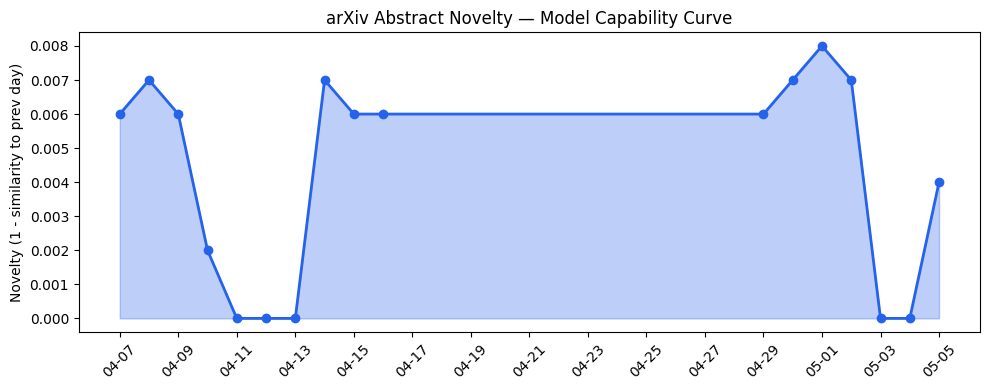
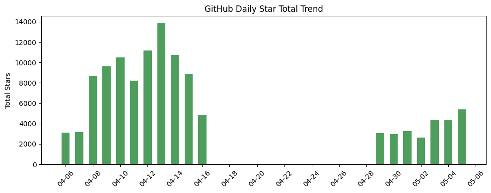
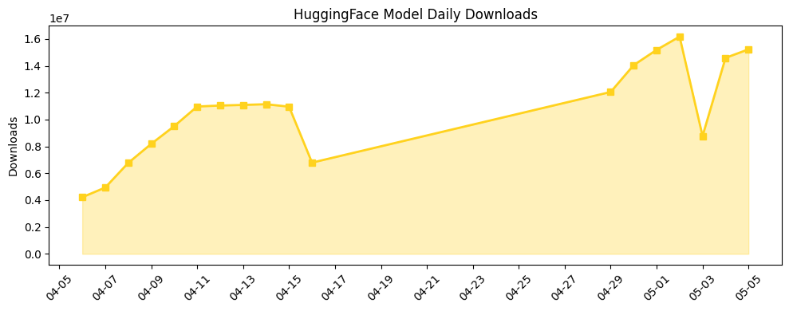

## 今日AI结构性变化
> 今日新增的AI信息显示，技术层面上有多篇论文发布，基础设施层面上有新硬件和算力趋势，应用层面上有新行业和场景的应用，资本层面上有多笔融资和投资，风险信号上有监管和伦理问题的讨论。
今日最值得注意的结构性变化是技术层面的重大突破，基础设施层面的渐进改善，应用层面的重大突破，以及资本层面的强信号。这些变化表明AI产业正在迅速发展，技术层面的进步推动了应用层面的创新，而资本层面的投资则为这些发展提供了支持。

## 技术层信号
🔴 重大突破

技术层面的重大突破主要体现在多篇新论文的发布，这些论文推进了LLM和其他AI模型的能力边界。例如，[Physically Native World Models: A Hamiltonian Perspective on Generative World Modeling](https://arxiv.org/abs/2605.00412)和[AEM: Adaptive Entropy Modulation for Multi-Turn Agentic Reinforcement Learning](https://arxiv.org/abs/2605.00425)等论文。这些进步不仅提高了AI模型的性能，也为新范式的提出提供了基础。

## 产业资本信号
🔴 强信号

资本层面的强信号主要体现在多笔融资和投资，这些投资推动了AI产业的发展。例如，[Altara secures $7M to bridge the data gap that’s slowing down physical sciences](https://techcrunch.com/2026/05/05/altara-secures-7m-to-bridge-the-data-gap-thats-slowing-down-physical-sciences)和[ElevenLabs lists BlackRock, Jamie Foxx, and Eva Longoria as new investors](https://techcrunch.com/2026/05/05/elevenlabs-lists-blackrock-jamie-foxx-and-eva-longoria-as-new-investors)等。这些投资不仅为AI公司提供了资金支持，也推动了AI产业的整合和发展。

## 潜在拐点判断
根据今日的结构性变化，AI产业可能正在经历一个重要的拐点。技术层面的重大突破和应用层面的创新可能会推动AI产业的快速发展，而资本层面的投资则为这些发展提供了支持。然而，风险信号上有监管和伦理问题的讨论，这可能会对AI产业的发展产生影响。

## 明日观察点
1. 技术层面的新进展，例如新论文的发布。
2. 应用层面的新创新，例如新行业和场景的应用。
3. 资本层面的新投资，例如新公司的融资。

## 长期趋势坐标
根据趋势对比报告，AI产业的长期趋势坐标主要体现在技术层面的进步，应用层面的创新，资本层面的投资，以及风险信号上的监管和伦理问题的讨论。这些趋势坐标表明AI产业正在迅速发展，技术层面的进步推动了应用层面的创新，而资本层面的投资则为这些发展提供了支持。

## 数据洞察
### arXiv 摘要对比 — 模型能力提升曲线
今日的arXiv摘要对比显示，模型能力提升曲线呈现延续趋势，表明AI模型的能力边界正在不断推进。
### GitHub Star 增速分析
GitHub Star 增速分析显示，[Rapid-MLX](https://github.com/raullenchai/Rapid-MLX)和[cocoindex](https://github.com/cocoindex-io/cocoindex)等仓库的Star数量增速较快，表明这些项目正在受到广泛关注。
### HuggingFace 模型下载量变化
HuggingFace 模型下载量变化显示，[google/gemma-4-31B-it](https://huggingface.co/google/gemma-4-31B-it)和[Qwen/Qwen3.6-35B-A3B](https://huggingface.co/Qwen/Qwen3.6-35B-A3B)等模型的下载量较高，表明这些模型正在被广泛使用。
### 趋势图

## 参考来源
- [Physically Native World Models: A Hamiltonian Perspective on Generative World Modeling](https://arxiv.org/abs/2605.00412)
- [AEM: Adaptive Entropy Modulation for Multi-Turn Agentic Reinforcement Learning](https://arxiv.org/abs/2605.00425)
- [Altara secures $7M to bridge the data gap that’s slowing down physical sciences](https://techcrunch.com/2026/05/05/altara-secures-7m-to-bridge-the-data-gap-thats-slowing-down-physical-sciences)
- [ElevenLabs lists BlackRock, Jamie Foxx, and Eva Longoria as new investors](https://techcrunch.com/2026/05/05/elevenlabs-lists-blackrock-jamie-foxx-and-eva-longoria-as-new-investors)