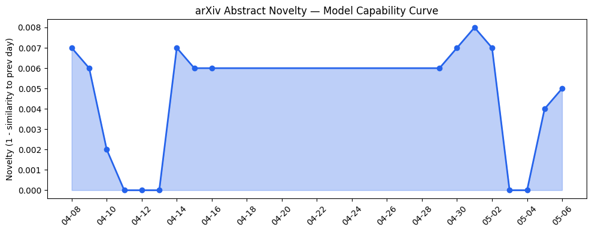
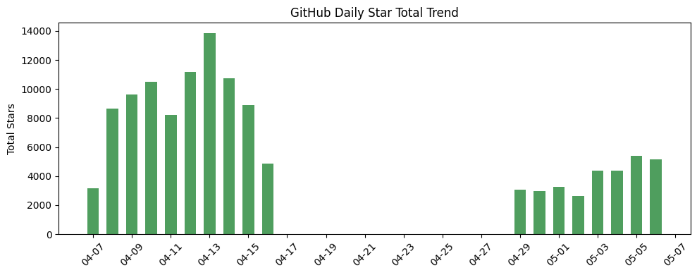
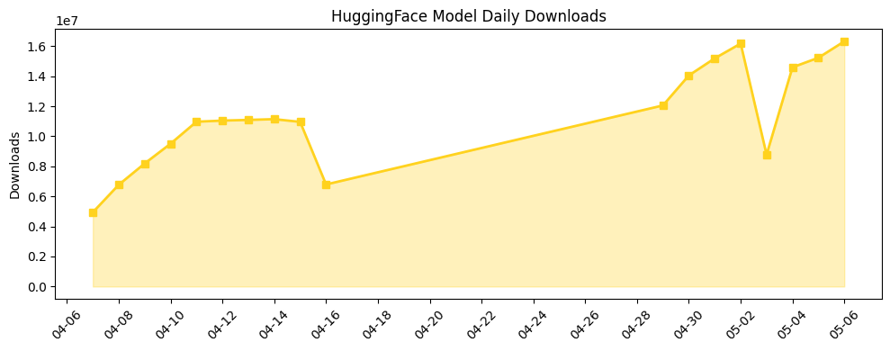

## 今日AI结构性变化
> 今日新增的AI信息显示，技术层面上有多项重大突破，基础设施层面上推理成本和芯片/算力趋势有所变化，应用层面上AI进入了新行业和新场景，资本信号显示融资方向有所集中，风险信号显示监管/立法层面有新动向。
今日最值得注意的结构性变化是技术层面上的重大突破，包括新论文提出的一种新的LLM模型，能够更好地处理长序列数据，以及提出的一种新的范式，利用检索增强生成（RAG）技术提高LLM的性能。这些变化表明AI技术正在快速发展和进步。
📈 持续趋势：技术层面上的重大突破、基础设施层面上的推理成本和芯片/算力趋势变化。
🆕 新兴方向：AI进入了新行业和新场景，包括医疗、法律、教育等领域。
🔺 突然升温：资本信号显示融资方向有所集中，风险信号显示监管/立法层面有新动向。

## 技术层信号
🔴 重大突破

技术层面上的重大突破包括新论文提出的一种新的LLM模型，能够更好地处理长序列数据，以及提出的一种新的范式，利用检索增强生成（RAG）技术提高LLM的性能。这些变化表明AI技术正在快速发展和进步。例如，[2026 Roadmap on Artificial Intelligence and Machine Learning for Smart Manufacturing](https://arxiv.org/abs/2605.00839)提出了一种新的LLM模型，能够更好地处理长序列数据。

## 产业资本信号
🔴 强信号

资本信号显示融资方向有所集中，例如[DeepSeek could hit $45B valuation from its first investment round](https://techcrunch.com/2026/05/06/deepseek-could-hit-45b-valuation-from-its-first-investment-round/)。这表明资本市场对AI技术的发展前景非常看好。同时，[Barry Diller trusts Sam Altman. But ‘trust is irrelevant’ as AGI nears, he says.](https://techcrunch.com/2026/05/06/barry-diller-trusts-sam-altman-but-trust-is-irrelevant-as-agi-nears-he-says/)也表明了资本市场对AI技术的关注和期待。

## 潜在拐点判断
根据今日的结构性变化信号，潜在拐点判断是AI技术的快速发展和进步可能会带来新的产业和商业机会。同时，监管/立法层面的新动向也可能会对AI技术的发展产生影响。

## 明日观察点
1. AI技术的进一步发展和进步。
2. 资本信号的变化和资本市场的反应。
3. 监管/立法层面的新动向和其对AI技术发展的影响。

## 长期趋势坐标
根据overall_novelty和keyword_trends，长期趋势坐标显示AI技术的发展前景非常看好，新的产业和商业机会正在不断涌现。同时，监管/立法层面的新动向也可能会对AI技术的发展产生影响。

## 数据洞察
### arXiv 摘要对比 — 模型能力提升曲线
今日的arXiv摘要对比显示，模型能力提升曲线正在不断上升，表明AI技术的发展和进步。
### GitHub Star 增速分析
GitHub Star 增速分析显示，AI相关的仓库正在不断增加，表明AI技术的发展和应用。
### HuggingFace 模型下载量变化
HuggingFace 模型下载量变化显示，AI模型的下载量正在不断增加，表明AI技术的发展和应用。
### 趋势图

## 参考来源
- [2026 Roadmap on Artificial Intelligence and Machine Learning for Smart Manufacturing](https://arxiv.org/abs/2605.00839)
- [ClinicBot: A Guideline-Grounded Clinical Chatbot with Prioritized Evidence RAG and Verifiable Citations](https://arxiv.org/abs/2605.00846)
- [Unlocking large scale AI training networks with MRC (Multipath Reliable Connection)](https://openai.com/index/mrc-supercomputer-networking)
- [DeepSeek could hit $45B valuation from its first investment round](https://techcrunch.com/2026/05/06/deepseek-could-hit-45b-valuation-from-its-first-investment-round/)
- [Barry Diller trusts Sam Altman. But ‘trust is irrelevant’ as AGI nears, he says.](https://techcrunch.com/2026/05/06/barry-diller-trusts-sam-altman-but-trust-is-irrelevant-as-agi-nears-he-says/)