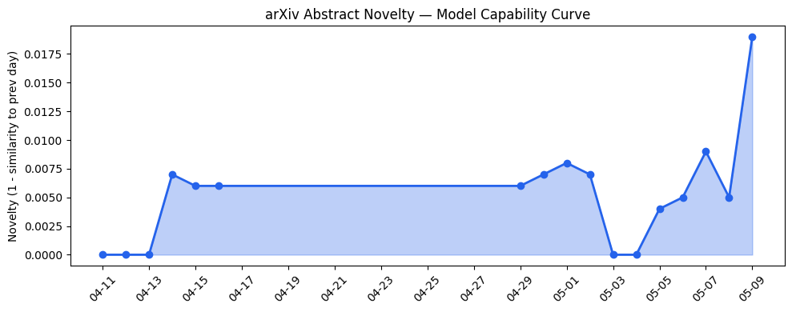
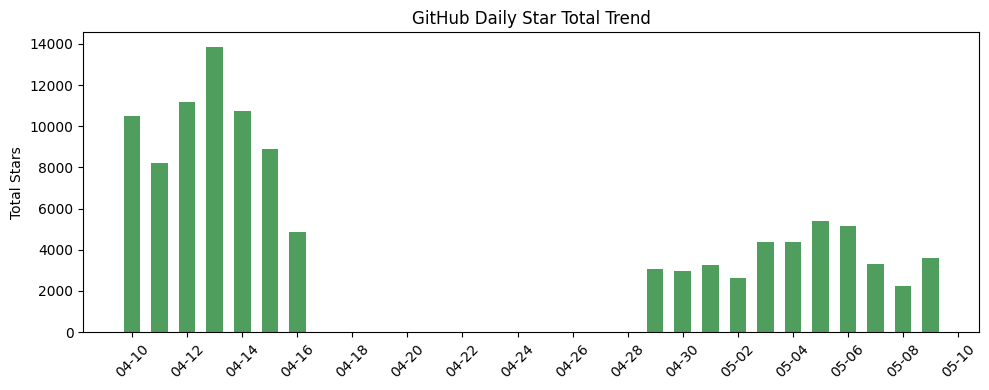
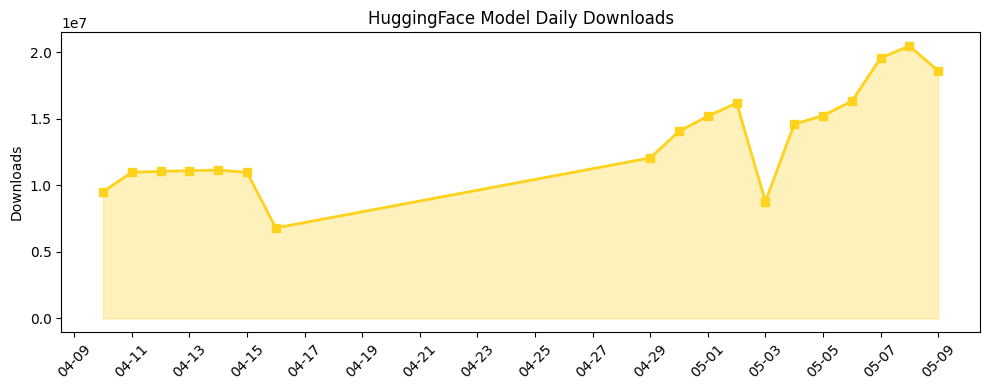

## 今日AI结构性变化
> 今日的 AI 研究和应用进展体现在多个维度，包括技术层面的模型能力边界推进、基础设施的高效推理方案、应用层面的新行业和新场景，以及资本层面的投资和行业动态。
今日最值得注意的结构性变化是技术层面的重大突破，包括 ZAYA1-8B 模型的提出和 BALAR 框架的引入，这些进展表明 AI 技术的快速发展和应用的广泛深入。同时，基础设施的渐进改善和应用层面的重大突破也体现了 AI 产业的蓬勃发展。
📈 持续趋势：技术层面的模型能力边界推进、基础设施的高效推理方案。
🆕 新兴方向：AI 在金融、教育和交通领域的应用。
🔺 突然升温：Nvidia 的投资和 Oracle 的裁员。
🔑 新关键词：LLM、MoE、RAG、AI 安全、Nvidia、Oracle、ViMax、CLAUD、HiDream、Qwopus。
📉 消退关键词：AI Agents、Enterprise AI。

## 技术层信号
🔴 重大突破

技术层面的模型能力边界推进是今日最值得注意的变化，包括 ZAYA1-8B 模型的提出和 BALAR 框架的引入，这些进展表明 AI 技术的快速发展和应用的广泛深入。[ZAYA1-8B Technical Report](https://arxiv.org/abs/2605.05365) 和 [BALAR : A Bayesian Agentic Loop for Active Reasoning](https://arxiv.org/abs/2605.05386) 是两个值得关注的研究成果。

## 产业资本信号
🔴 强信号

资本层面的投资和行业动态是今日另一个值得注意的变化，包括 Nvidia 的投资和 Oracle 的裁员，这些变化表明 AI 产业的资本流向和行业格局的变化。[Nvidia has already committed $40B to equity AI deals this year](https://techcrunch.com/2026/05/09/nvidia-has-already-committed-40b-to-equity-ai-deals-this-year/) 和 [Laid-off Oracle workers tried to negotiate better severance. Oracle said no.](https://techcrunch.com/2026/05/08/laid-off-oracle-workers-tried-to-negotiate-better-severance-oracle-said-no/) 是两个值得关注的新闻。

## 潜在拐点判断
今日的变化表明 AI 产业正在经历快速发展和应用的广泛深入，技术层面的模型能力边界推进和基础设施的高效推理方案是两个值得关注的方向。然而，资本层面的投资和行业动态也可能带来新的挑战和机遇，需要持续关注和分析。

## 明日观察点
1. 技术层面的模型能力边界推进。
2. 基础设施的高效推理方案。
3. 资本层面的投资和行业动态。

## 长期趋势坐标
月/季视角，AI 产业的发展趋势是快速发展和应用的广泛深入，技术层面的模型能力边界推进和基础设施的高效推理方案是两个值得关注的方向。[overall_novelty](https://arxiv.org/abs/2605.05365) 和 [keyword_trends](https://techcrunch.com/2026/05/09/nvidia-has-already-committed-40b-to-equity-ai-deals-this-year/) 是两个值得关注的指标。

## 数据洞察
### arXiv 摘要对比 — 模型能力提升曲线
今日的 arXiv 摘要对比数据表明，AI 模型的能力边界正在快速推进，包括 ZAYA1-8B 模型的提出和 BALAR 框架的引入。

### GitHub Star 增速分析
今日的 GitHub Star 增速分析数据表明，AI 相关的 GitHub 仓库的 Star 数量正在快速增加，包括 [HKUDS/AI-Trader](https://github.com/HKUDS/AI-Trader) 和 [sgl-project/sglang](https://github.com/sgl-project/sglang)。

### HuggingFace 模型下载量变化
今日的 HuggingFace 模型下载量变化数据表明，AI 模型的下载量正在快速增加，包括 [google/gemma-4-31B-it](https://huggingface.co/google/gemma-4-31B-it) 和 [Qwen/Qwen3.6-35B-A3B](https://huggingface.co/Qwen/Qwen3.6-35B-A3B)。

## 参考来源
- [ZAYA1-8B Technical Report](https://arxiv.org/abs/2605.05365)
- [BALAR : A Bayesian Agentic Loop for Active Reasoning](https://arxiv.org/abs/2605.05386)
- [Nvidia has already committed $40B to equity AI deals this year](https://techcrunch.com/2026/05/09/nvidia-has-already-committed-40b-to-equity-ai-deals-this-year/)
- [Laid-off Oracle workers tried to negotiate better severance. Oracle said no.](https://techcrunch.com/2026/05/08/laid-off-oracle-workers-tried-to-negotiate-better-severance-oracle-said-no/)