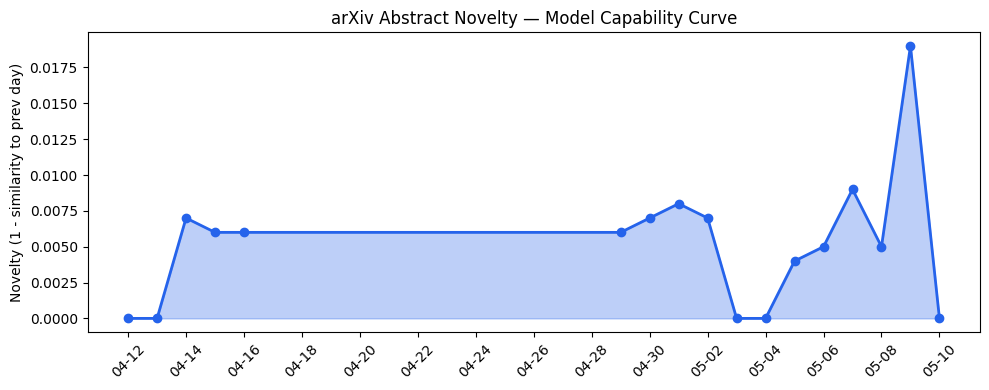
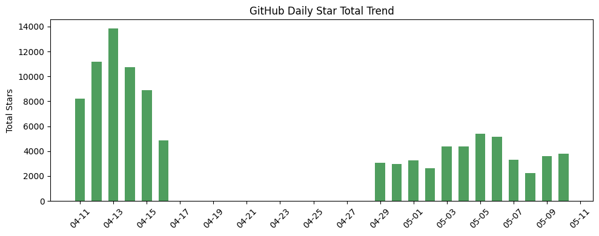
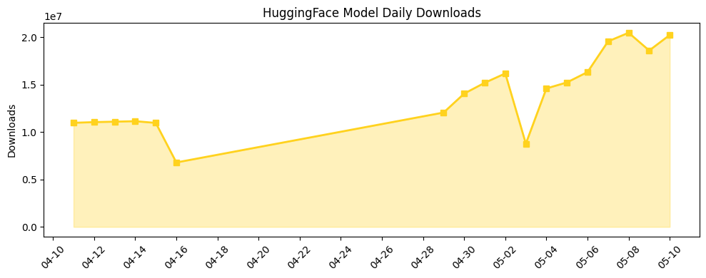

## 今日AI结构性变化
> 今日开源生态中出现了Memori项目，一个LLM-agnostic的层，能够将agent执行和对话转化为结构化的持久状态；同时，资本动向方面，xAI与Anthropic的合作引起了关注。
今日最值得注意的结构性变化是Memori项目的出现，这意味着AI开源生态中出现了新的技术层次。同时，xAI与Anthropic的合作也引起了关注，这可能会对AI资本动向产生影响。其他值得注意的变化包括Voice AI在印度市场的应用，传统办公方式可能被AI驱动的办公方式所替代。
- 📈 持续趋势：基础设施的话题向量在最近8天内呈现持续增强趋势。
- 🆕 新兴方向：技术层、应用层、资本信号出现全新话题。
- 🔺 突然升温：Memori项目、xAI与Anthropic的合作。

## 技术层信号
🟡 渐进改善

Memori项目的出现意味着AI技术层次的推进，这个LLM-agnostic的层能够将agent执行和对话转化为结构化的持久状态。同时，[Memori](https://github.com/MemoriLabs/Memori) 项目的开源也意味着AI技术的进一步民主化。其他技术层信号包括[Get ready for the whisper-filled office of the future](https://techcrunch.com/2026/05/10/get-ready-for-the-whisper-filled-office-of-the-future/)，这意味着AI技术将进一步改变办公方式。

## 产业资本信号
🟡 中等信号

xAI与Anthropic的合作意味着AI资本动向的变化，这可能会对SpaceX产生影响。同时，[We’re feeling cynical about xAI’s big deal with Anthropic](https://techcrunch.com/2026/05/10/were-feeling-cynical-about-xais-big-deal-with-anthropic/) 也意味着AI资本动向的进一步变化。其他产业资本信号包括[Voice AI in India is hard. Wispr Flow is betting on it anyway.](https://techcrunch.com/2026/05/09/voice-ai-in-india-is-hard-wispr-flow-is-betting-on-it-anyway/)，这意味着AI技术在印度市场的应用将进一步推进。

## 潜在拐点判断
今日观察到Memori项目的出现和xAI与Anthropic的合作，这可能意味着AI技术和资本动向的进一步变化。同时，Voice AI在印度市场的应用也可能意味着AI技术在新兴市场的进一步推进。

## 明日观察点
1. Memori项目的进一步发展。
2. xAI与Anthropic的合作的进一步影响。
3. Voice AI在印度市场的应用的进一步推进。

## 长期趋势坐标
从月/季视角来看，AI技术的进一步推进和资本动向的变化将是长期趋势的主要坐标。同时，[overall_novelty](https://techcrunch.com/2026/05/10/get-ready-for-the-whisper-filled-office-of-the-future/) 和 [keyword_trends](https://techcrunch.com/2026/05/10/were-feeling-cynical-about-xais-big-deal-with-anthropic/) 也将是长期趋势的重要参考。

## 数据洞察
### arXiv 摘要对比 — 模型能力提升曲线
今日无 arXiv 摘要数据。
### GitHub Star 增速分析
GitHub Star 增速分析显示，今日的增长速度较慢，[jundot/omlx](https://github.com/jundot/omlx) 和 [open-webui/open-webui](https://github.com/open-webui/open-webui) 的Star增长速度较快。
### HuggingFace 模型下载量变化
HuggingFace 模型下载量变化显示，[google/gemma-4-31B-it](https://huggingface.co/google/gemma-4-31B-it) 和 [Qwen/Qwen3.6-35B-A3B](https://huggingface.co/Qwen/Qwen3.6-35B-A3B) 的下载量较高。
### 趋势图

## 参考来源
- [Memori](https://github.com/MemoriLabs/Memori)
- [Get ready for the whisper-filled office of the future](https://techcrunch.com/2026/05/10/get-ready-for-the-whisper-filled-office-of-the-future/)
- [We’re feeling cynical about xAI’s big deal with Anthropic](https://techcrunch.com/2026/05/10/were-feeling-cynical-about-xais-big-deal-with-anthropic/)
- [Voice AI in India is hard. Wispr Flow is betting on it anyway.](https://techcrunch.com/2026/05/09/voice-ai-in-india-is-hard-wispr-flow-is-betting-on-it-anyway/)