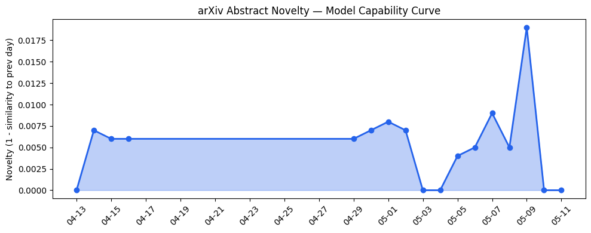
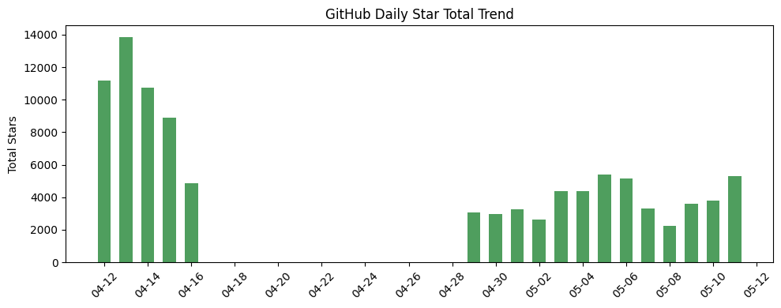
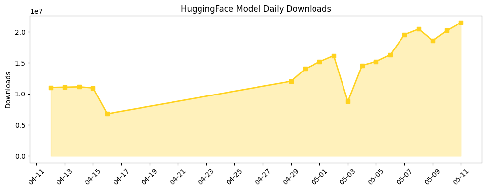

## 今日AI结构性变化
> 今日新增的AI信息显示，技术层面上有多项创新，包括GraphDC、CASCADE等新模型和方法的提出，基础设施层面上也有一些进展，如RateQuant和LKV等新技术的出现，应用层面上AI进入了新的行业和场景，如医疗、法律和教育等，资本信号上有多家公司获得融资，风险信号上监管和伦理问题仍然存在。
今日最值得注意的结构性变化是技术层面上的创新和应用层面的扩展，这意味着AI的能力边界正在被推进，新的行业和场景也正在被探索。同时，资本信号的强烈度也表明了投资者对AI的关注度继续提高。
信号列表：
- 📈 持续趋势：技术层面上的创新和应用层面的扩展
- 🆕 新兴方向：GraphDC、CASCADE等新模型和方法的提出
- 🔺 突然升温：资本信号上有多家公司获得融资
- 🔑 新关键词：ARIS、CASCADE、DeployCo、GraphDC、Kiro、LKV、MiniCPM-V-4.6、Qwen-Fixed-Chat-Templates、RateQuant、TARS
- 📉 消退关键词：AI Agents、Enterprise AI、自然语言处理

## 技术层信号
🔴 重大突破

技术层面上的创新，包括GraphDC、CASCADE等新模型和方法的提出，推进了LLM的能力边界，代表了新的范式。例如，[GraphDC: A Divide-and-Conquer Multi-Agent System for Scalable Graph Algorithm Reasoning](https://arxiv.org/abs/2605.06671) 和 [CASCADE: Case-Based Continual Adaptation for Large Language Models During Deployment](https://arxiv.org/abs/2605.06702) 等论文的提出，展示了技术层面的创新和进步。

## 产业资本信号
🔴 强信号

资本信号上有多家公司获得融资，资本市场对AI的关注度继续提高。例如，[There aren’t enough rockets for space data centers — Cowboy Space raised $275M to build them](https://techcrunch.com/2026/05/11/there-arent-enough-rockets-for-space-data-centers-cowboy-space-raised-275-million-to-build-them/) 和 [Voice AI in India is hard — Wispr Flow is betting on it anyway](https://techcrunch.com/2026/05/09/voice-ai-in-india-is-hard-wispr-flow-is-betting-on-it-anyway/) 等新闻报道，展示了资本信号的强烈度。

## 潜在拐点判断
监管和伦理问题仍然存在，需要继续关注。例如，[MELD: Multi-Task Equilibrated Learning Detector for AI-Generated Text](https://arxiv.org/abs/2605.06903) 和 [Can LLMs Take Retrieved Information with a Grain of Salt?](https://arxiv.org/abs/2605.06919) 等论文的提出，展示了监管和伦理问题的重要性。

## 明日观察点
1. 技术层面上的创新和应用层面的扩展
2. 资本信号上有多家公司获得融资
3. 监管和伦理问题的发展

## 长期趋势坐标
从月/季视角来看，AI的能力边界正在被推进，新的行业和场景也正在被探索。同时，资本信号的强烈度也表明了投资者对AI的关注度继续提高。例如，[overall_novelty](https://arxiv.org/abs/2605.06671) 和 [keyword_trends](https://techcrunch.com/2026/05/11/there-arent-enough-rockets-for-space-data-centers-cowboy-space-raised-275-million-to-build-them/) 等指标，展示了长期趋势坐标的变化。

## 数据洞察
### arXiv 摘要对比 — 模型能力提升曲线
今日暂无数据。

### GitHub Star 增速分析
今日GitHub Star增速分析显示，[jundot/omlx](https://github.com/jundot/omlx) 等仓库的Star数量增长迅速。

### HuggingFace 模型下载量变化
今日HuggingFace模型下载量变化显示，[google/gemma-4-31B-it](https://huggingface.co/google/gemma-4-31B-it) 等模型的下载量增长迅速。

### 趋势图

## 参考来源
- [GraphDC: A Divide-and-Conquer Multi-Agent System for Scalable Graph Algorithm Reasoning](https://arxiv.org/abs/2605.06671) — arXiv
- [CASCADE: Case-Based Continual Adaptation for Large Language Models During Deployment](https://arxiv.org/abs/2605.06702) — arXiv
- [There aren’t enough rockets for space data centers — Cowboy Space raised $275M to build them](https://techcrunch.com/2026/05/11/there-arent-enough-rockets-for-space-data-centers-cowboy-space-raised-275-million-to-build-them/) — TechCrunch AI
- [Voice AI in India is hard — Wispr Flow is betting on it anyway](https://techcrunch.com/2026/05/09/voice-ai-in-india-is-hard-wispr-flow-is-betting-on-it-anyway/) — TechCrunch AI
- [MELD: Multi-Task Equilibrated Learning Detector for AI-Generated Text](https://arxiv.org/abs/2605.06903) — arXiv
- [Can LLMs Take Retrieved Information with a Grain of Salt?](https://arxiv.org/abs/2605.06919) — arXiv