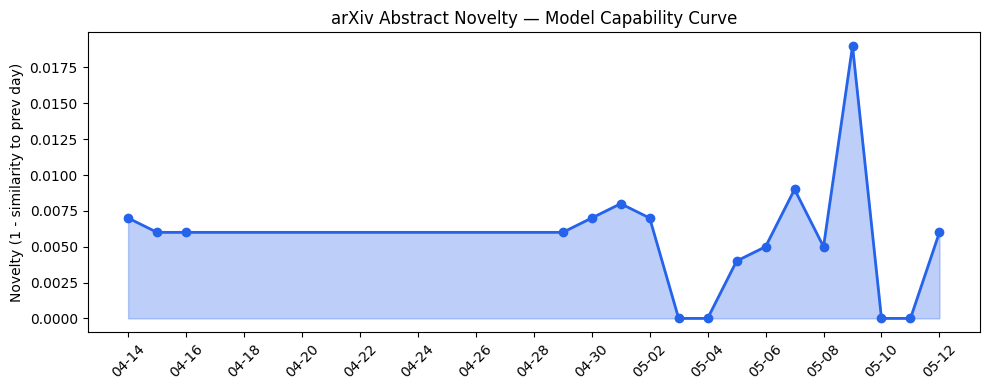
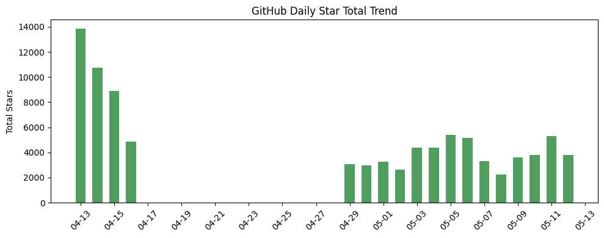
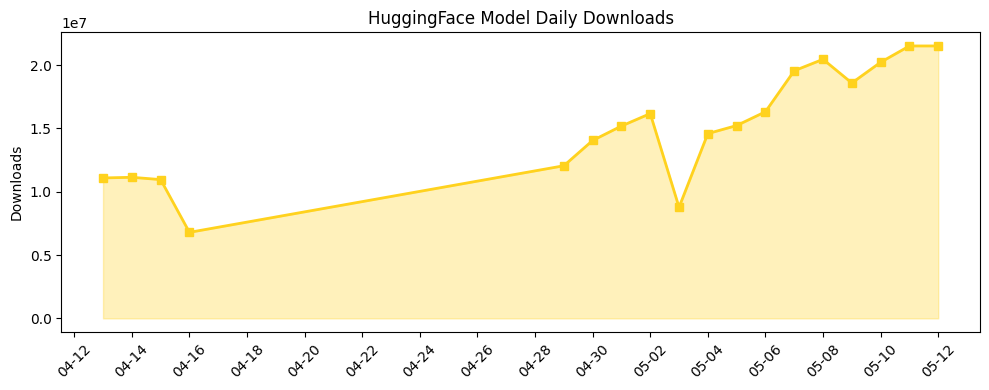

## 今日AI结构性变化
> 今日新增的AI信息中，技术层面出现了多项创新，包括新型语言模型、图神经网络和强化学习算法的提出，而基础设施层面则出现了对数据中心和云计算的讨论，资本信号方面，多家公司宣布了与AI相关的投资和合作。
今天最值得注意的结构性变化是技术层面的创新和基础设施层面的讨论，这些变化可能会对AI产业产生深远影响。同时，资本信号的变化也表明了AI产业的投资和合作正在升温。
以下是今日结构性变化的信号：
* 📈 持续趋势：技术层面的创新和基础设施层面的讨论
* 🆕 新兴方向：图神经网络和强化学习算法
* 🔺 突然升温：资本信号方面的投资和合作

## 技术层信号
🔴 重大突破

技术层面的创新包括新型语言模型、图神经网络和强化学习算法的提出，这些创新可能会推动AI技术的发展。例如，[Where Reliability Lives in Vision-Language Models](https://arxiv.org/abs/2605.08200) 和 [Spatial Priming Outperforms Semantic Prompting](https://arxiv.org/abs/2605.08220) 等论文表明了技术层面的创新。
同时，图神经网络和强化学习算法的提出也可能会带来新的应用场景和商业机会。

## 产业资本信号
🔴 强信号

资本信号方面，多家公司宣布了与AI相关的投资和合作，这些投资和合作可能会推动AI产业的发展。例如，[Dessn raises $6M for its production-focused design tool](https://techcrunch.com/2026/05/12/dessn-raises-6m-for-its-production-focused-design-tool/) 和 [European AI Funding Is Growing](https://news.crunchbase.com/venture/european-ai-funding-startups-recursive-ineffable-advanced-machine-intelligence/) 等新闻表明了资本信号的变化。
同时，基础设施层面的讨论也可能会带来新的投资和合作机会。

## 潜在拐点判断
根据今日结构性变化的信号，可以判断潜在拐点如下：
* 技术层面的创新可能会带来新的应用场景和商业机会
* 基础设施层面的讨论可能会带来新的投资和合作机会
* 资本信号的变化可能会推动AI产业的发展

## 明日观察点
1. 技术层面的创新是否会继续升温
2. 基础设施层面的讨论是否会带来新的投资和合作机会
3. 资本信号的变化是否会继续推动AI产业的发展

## 长期趋势坐标
根据趋势对比报告，可以看到以下长期趋势坐标：
* 技术层面的创新是长期趋势
* 基础设施层面的讨论是长期趋势
* 资本信号的变化是长期趋势

## 数据洞察
### arXiv 摘要对比 — 模型能力提升曲线
今日结构性变化的信号表明，技术层面的创新可能会带来新的应用场景和商业机会。
### GitHub Star 增速分析
今日结构性变化的信号表明，资本信号的变化可能会推动AI产业的发展。
### HuggingFace 模型下载量变化
今日结构性变化的信号表明，技术层面的创新可能会带来新的应用场景和商业机会。

## 参考来源
- [Where Reliability Lives in Vision-Language Models](https://arxiv.org/abs/2605.08200)
- [Spatial Priming Outperforms Semantic Prompting](https://arxiv.org/abs/2605.08220)
- [Dessn raises $6M for its production-focused design tool](https://techcrunch.com/2026/05/12/dessn-raises-6m-for-its-production-focused-design-tool/)
- [European AI Funding Is Growing](https://news.crunchbase.com/venture/european-ai-funding-startups-recursive-ineffable-advanced-machine-intelligence/)