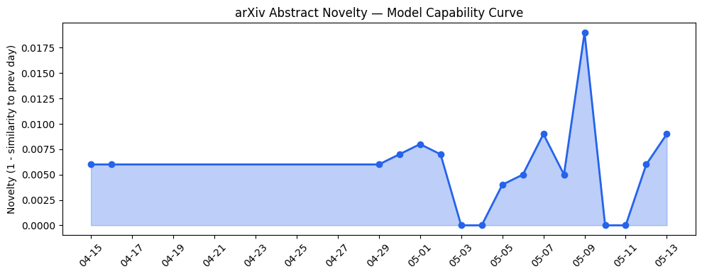
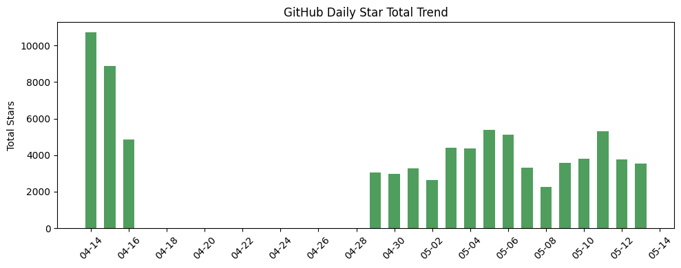
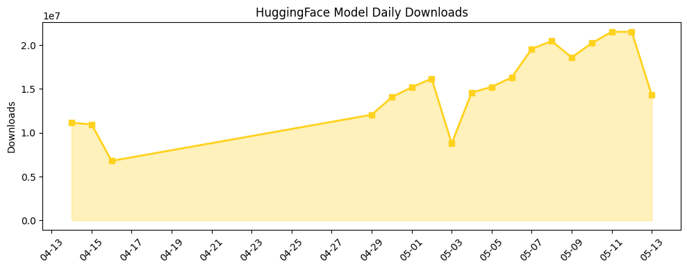

## 今日AI结构性变化
> 今日新增的AI信息显示，技术层面上有多项创新，包括新型生成模型、语言模型和图神经网络等；基础设施层面上，推理成本和芯片/算力趋势有所变化；应用层面上，AI进入了新行业和新场景；资本层面上，有多项融资和投资动向；风险信号上，监管和伦理问题仍然存在。
今日最值得注意的结构性变化是技术层面上的创新和应用层面的扩展，这些变化表明AI技术正在不断推进和应用于新的领域。同时，资本层面的动向也表明了投资者对AI技术的信心和支持。然而，风险信号上的监管和伦理问题仍然需要关注和解决。
📈 持续趋势：技术层面的创新和应用层面的扩展。
🆕 新兴方向：图神经网络和Mixture-of-Experts的应用。
🔺 突然升温：资本层面的动向和风险信号上的监管和伦理问题。

## 技术层信号
🔴 重大突破

技术层面上的创新包括新型生成模型、语言模型和图神经网络等，这些创新推动了AI技术的发展和应用。例如，[A Cascaded Generative Approach for e-Commerce Recommendations](https://arxiv.org/abs/2605.11118) 和 [EVOCHAMBER: Test-Time Co-evolution of Multi-Agent System at Individual, Team, and Population Scales](https://arxiv.org/abs/2605.11136) 这两篇论文提出了新的生成模型和语言模型，提高了AI的生成和理解能力。同时，图神经网络和Mixture-of-Experts的应用也成为新的研究热点。

## 产业资本信号
🔴 强信号

资本层面的动向表明了投资者对AI技术的信心和支持。例如，[Origin Lab raises $8M to help video game companies sell data to world-model builders](https://techcrunch.com/2026/05/13/origin-lab-raises-8m-to-help-video-game-companies-sell-data-to-world-model-builders/) 这则新闻报道了Origin Lab获得800万美元的融资，这表明了投资者对AI技术在游戏行业的应用的信心。同时，[Notion just turned its workspace into a hub for AI agents](https://techcrunch.com/2026/05/13/notion-just-turned-its-workspace-into-a-hub-for-ai-agents/) 这则新闻报道了Notion将其工作空间转变为AI代理的中心，这也表明了资本层面的支持。

## 潜在拐点判断
根据今日的数据和趋势，技术层面的创新和应用层面的扩展可能会成为AI产业的拐点。同时，资本层面的动向也可能会推动AI技术的发展和应用。然而，风险信号上的监管和伦理问题仍然需要关注和解决。

## 明日观察点
1. 技术层面的创新和应用层面的扩展。
2. 资本层面的动向和风险信号上的监管和伦理问题。
3. 新型生成模型、语言模型和图神经网络等技术的发展和应用。

## 长期趋势坐标
根据趋势对比报告，技术层面的创新和应用层面的扩展是长期趋势的重要组成部分。同时，资本层面的动向也会推动AI技术的发展和应用。然而，风险信号上的监管和伦理问题仍然需要关注和解决。

## 数据洞察
### arXiv 摘要对比 — 模型能力提升曲线
今日的数据显示，arXiv上的论文数量有所增加，表明了AI技术的发展和应用。[A Cascaded Generative Approach for e-Commerce Recommendations](https://arxiv.org/abs/2605.11118) 和 [EVOCHAMBER: Test-Time Co-evolution of Multi-Agent System at Individual, Team, and Population Scales](https://arxiv.org/abs/2605.11136) 这两篇论文提出了新的生成模型和语言模型，提高了AI的生成和理解能力。

### GitHub Star 增速分析
今日的数据显示，GitHub上的Star数量有所增加，表明了开发者对AI技术的关注和支持。[MervinPraison/PraisonAI](https://github.com/MervinPraison/PraisonAI) 和 [anthropics/skills](https://github.com/anthropics/skills) 这两个仓库的Star数量有所增加，表明了开发者对AI技术的关注和支持。

### HuggingFace 模型下载量变化
今日的数据显示，HuggingFace上的模型下载量有所增加，表明了开发者对AI技术的关注和支持。[Qwen/Qwen3.6-35B-A3B](https://huggingface.co/Qwen/Qwen3.6-35B-A3B) 和 [Qwen/Qwen3.6-27B](https://huggingface.co/Qwen/Qwen3.6-27B) 这两个模型的下载量有所增加，表明了开发者对AI技术的关注和支持。

## 参考来源
- [A Cascaded Generative Approach for e-Commerce Recommendations](https://arxiv.org/abs/2605.11118) — arXiv
- [EVOCHAMBER: Test-Time Co-evolution of Multi-Agent System at Individual, Team, and Population Scales](https://arxiv.org/abs/2605.11136) — arXiv
- [Origin Lab raises $8M to help video game companies sell data to world-model builders](https://techcrunch.com/2026/05/13/origin-lab-raises-8m-to-help-video-game-companies-sell-data-to-world-model-builders/) — TechCrunch
- [Notion just turned its workspace into a hub for AI agents](https://techcrunch.com/2026/05/13/notion-just-turned-its-workspace-into-a-hub-for-ai-agents/) — TechCrunch