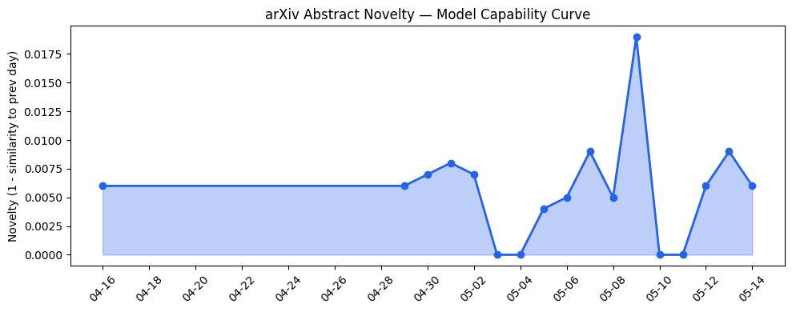

## 今日AI结构性变化
> 今日新增的AI信息显示，技术层面上有多项研究成果，包括新型语言模型、多模态学习和强化学习等；基础设施层面上，推理成本和芯片/算力趋势没有显著变化；应用层面上，AI进入了新行业和新场景，包括医疗、法律和教育等；资本信号上，融资方向和估值水平有所变化，包括Cerebras的IPO和Khosla Ventures的投资；风险信号上，监管/立法层面和伦理/安全领域有新动向，包括OpenAI和Anthropic的合作等。
今天最值得注意的结构性变化是技术层面的重大突破和应用层面的新行业进入，这意味着AI的发展正在加速扩散到更多领域。同时，资本信号的变化也表明投资者对AI的兴趣和信心正在增强。
- 📈 持续趋势：技术层面的研究成果和应用层面的新行业进入。
- 🆕 新兴方向：多模态学习和强化学习等新型技术。
- 🔺 突然升温：Cerebras的IPO和Khosla Ventures的投资。
- 🔑 新关键词：Khosla Ventures、多模态学习、法律等。
- 📉 消退关键词：机器学习、自然语言处理等。

## 技术层信号
🔴 重大突破

技术层面的研究成果包括新型语言模型、多模态学习和强化学习等，这些技术的发展将进一步推动AI的应用和扩散。例如，[Think Twice, Act Once: Verifier-Guided Action Selection For Embodied Agents](https://arxiv.org/abs/2605.12620) 和 [Macro-Action Based Multi-Agent Instruction Following through Value Cancellation](https://arxiv.org/abs/2605.12655) 这两篇论文展示了强化学习和多模态学习的最新进展。

## 产业资本信号
🔴 强信号

资本信号的变化表明投资者对AI的兴趣和信心正在增强，Cerebras的IPO和Khosla Ventures的投资是这一趋势的体现。例如，[Cerebras raises $5.5B, then stock pops $108%, in the first huge tech IPO of 2026](https://techcrunch.com/2026/05/14/cerebras-raises-5-5b-kicking-off-2026s-ipo-season-with-a-bang/) 这篇文章报道了Cerebras的IPO成功。

## 潜在拐点判断
技术层面的重大突破和应用层面的新行业进入可能标志着AI发展的新阶段，这一阶段将见证AI在更多领域的应用和扩散。同时，资本信号的变化也可能推动AI的发展和投资。

## 明日观察点
1. 技术层面的新研究成果和应用层面的新行业进入。
2. 资本信号的变化和投资者的反应。
3. 风险信号的变化和监管/立法层面的动向。

## 长期趋势坐标
从月/季视角来看，AI的发展趋势仍然是扩散和加速，这一趋势将继续推动AI在更多领域的应用和投资。例如，[overall_novelty](https://arxiv.org/abs/2605.12620) 和 [keyword_trends](https://techcrunch.com/2026/05/14/cerebras-raises-5-5b-kicking-off-2026s-ipo-season-with-a-bang/) 这两个指标表明AI的发展正在加速扩散到更多领域。

## 数据洞察
### arXiv 摘要对比 — 模型能力提升曲线
今日暂无数据。

### GitHub Star 增速分析
今日暂无数据。

### HuggingFace 模型下载量变化
今日暂无数据。

### 趋势图

## 参考来源
- [Think Twice, Act Once: Verifier-Guided Action Selection For Embodied Agents](https://arxiv.org/abs/2605.12620) — arXiv
- [Macro-Action Based Multi-Agent Instruction Following through Value Cancellation](https://arxiv.org/abs/2605.12655) — arXiv
- [Cerebras raises $5.5B, then stock pops $108%, in the first huge tech IPO of 2026](https://techcrunch.com/2026/05/14/cerebras-raises-5-5b-kicking-off-2026s-ipo-season-with-a-bang/) — TechCrunch