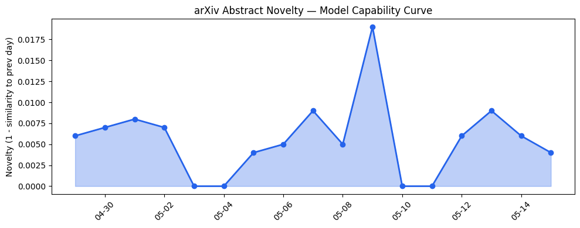
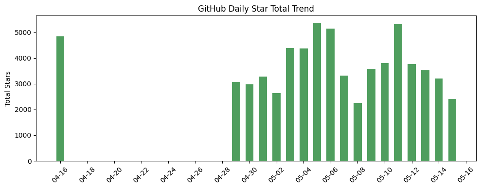
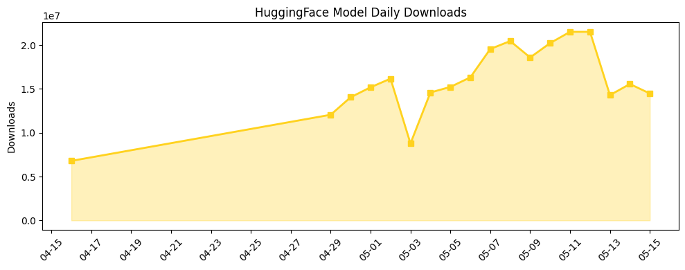

## 今日AI结构性变化
> 今日新增的AI信息中，技术层变化、基础设施变化、应用层变化、资本信号和风险信号都有所体现，尤其是在LLM、多模态交互和AI安全等领域。
今日最值得注意的结构性变化是技术层和应用层的重大突破，尤其是在LLM和多模态交互领域。这些变化表明AI技术的快速发展和应用的扩大。同时，资本信号和风险信号也在不断变化，反映了投资者和监管机构对AI的关注和重视。
以下是今日结构性变化的主要信号：
- 📈 持续趋势：技术层和应用层的变化。
- 🆕 新兴方向：LLM和多模态交互。
- 🔺 突然升温：AI安全和监管。
- 🔑 新关键词：Claude、NVIDIA-NeMo、Osaurus、Runway。
- 📉 消退关键词：机器学习、自然语言处理。

## 技术层信号
🔴 重大突破

技术层的变化主要体现在LLM和多模态交互的进展。LLM的能力边界被推进，多模态交互和对话系统取得进展。这些变化反映在arXiv上的论文中，例如[PROMETHEUS: Automating Deep Causal Research Integrating Text, Data and Models](https://arxiv.org/abs/2605.12835)和[Moltbook Moderation: Uncovering Hidden Intent Through Multi-Turn Dialogue](https://arxiv.org/abs/2605.12856)。同时，基础设施的改善也促进了技术层的发展，例如[NVIDIA-NeMo / NeMo](https://github.com/NVIDIA-NeMo/NeMo)的发布。

## 产业资本信号
🔴 强信号

产业资本信号主要体现在投资和融资方面。近期，AI相关的投资和融资活动频繁，例如[The Week’s 10 Biggest Funding Rounds: Anduril Leads Varied Lineup Of Large Deals](https://news.crunchbase.com/venture/biggest-funding-rounds-anduril-voltagrid-mind-robotics/)。这些活动反映了投资者对AI的关注和重视。同时，公司的战略投资和收购也在不断进行，例如[OpenAI launches ChatGPT for personal finance, will let you connect bank accounts](https://techcrunch.com/2026/05/15/openai-launches-chatgpt-for-personal-finance-will-let-you-connect-bank-accounts/)。

## 潜在拐点判断
近期的结构性变化可能标志着AI技术和应用的拐点。技术层的重大突破和应用层的扩张可能会带来新的商业机会和社会影响。同时，资本信号和风险信号的变化也反映了投资者和监管机构对AI的关注和重视。这些变化可能会导致AI产业的快速发展和深刻变革。

## 明日观察点
1. 技术层的进一步进展，尤其是在LLM和多模态交互领域。
2. 应用层的扩张，尤其是在个人理财和法律等领域。
3. 资本信号和风险信号的变化，尤其是在投资和监管方面。

## 长期趋势坐标
从月/季视角来看，AI技术和应用的发展趋势仍然强劲。技术层的进展和应用层的扩张将继续推动AI产业的发展。同时，资本信号和风险信号的变化将影响AI产业的发展方向和速度。根据[overall_novelty](https://arxiv.org/abs/2605.12835)和[keyword_trends](https://news.crunchbase.com/venture/biggest-funding-rounds-anduril-voltagrid-mind-robotics/), AI产业的发展趋势将继续向高效推理方案和新兴应用方向发展。

## 数据洞察
### arXiv 摘要对比 — 模型能力提升曲线
arXiv上的论文反映了技术层的变化，尤其是在LLM和多模态交互领域。
### GitHub Star 增速分析
GitHub上的Star增速反映了开发者对AI相关项目的关注和重视。
### HuggingFace 模型下载量变化
HuggingFace上的模型下载量变化反映了AI模型的应用和需求。
### 趋势图

## 参考来源
- [PROMETHEUS: Automating Deep Causal Research Integrating Text, Data and Models](https://arxiv.org/abs/2605.12835) — arXiv
- [Moltbook Moderation: Uncovering Hidden Intent Through Multi-Turn Dialogue](https://arxiv.org/abs/2605.12856) — arXiv
- [NVIDIA-NeMo / NeMo](https://github.com/NVIDIA-NeMo/NeMo) — GitHub
- [The Week’s 10 Biggest Funding Rounds: Anduril Leads Varied Lineup Of Large Deals](https://news.crunchbase.com/venture/biggest-funding-rounds-anduril-voltagrid-mind-robotics/) — Crunchbase News
- [OpenAI launches ChatGPT for personal finance, will let you connect bank accounts](https://techcrunch.com/2026/05/15/openai-launches-chatgpt-for-personal-finance-will-let-you-connect-bank-accounts/) — TechCrunch