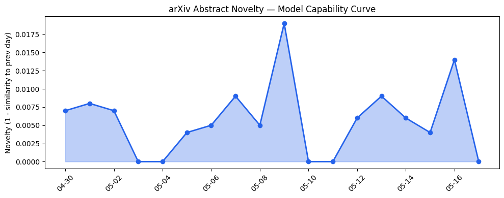
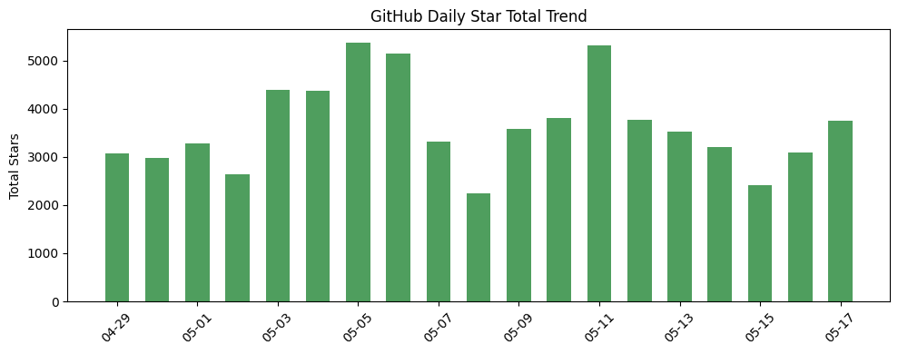
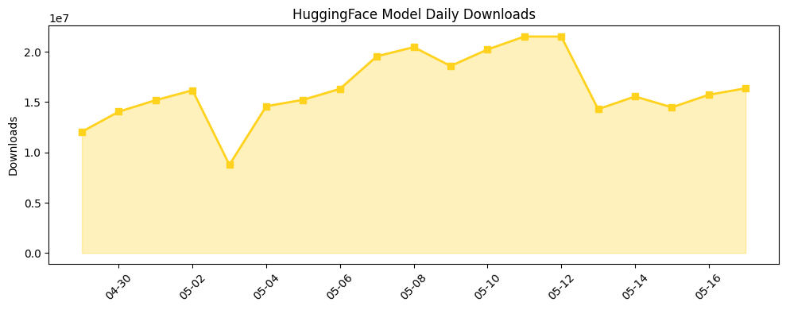

## 今日AI结构性变化
> 开源生态的蓬勃发展和资本信号的变化，共同推动了AI技术和应用的多元化进展。
今天最值得注意的结构性变化是开源生态的蓬勃发展和资本信号的变化，这些变化推动了AI技术和应用的多元化进展。开源项目如DreamServer、Langflow和Sana推动了LLM和图像生成的边界，新项目如whichllm提供了实时的硬件适配性评估。同时，资本信号的变化也表明了大厂如Apple和OpenAI的战略动向值得关注。
- 📈 持续趋势：开源生态的发展和资本信号的变化。
- 🆕 新兴方向：LLM和图像生成的边界推进。
- 📉 消退关键词：机器学习、自然语言处理。

## 技术层信号
🟡 渐进改善

模型能力边界如何推进？有何新范式？开源项目如DreamServer、Langflow和Sana推动了LLM和图像生成的边界，新项目如whichllm提供了实时的硬件适配性评估。这些变化表明AI技术的进步和多元化发展。

## 产业资本信号
🟡 中等信号

资本信号的变化表明了大厂如Apple和OpenAI的战略动向值得关注。同时，[TechCrunch](https://techcrunch.com/) 的报道也表明了汽车行业面临AI技能竞赛的挑战，传统解决方案被AI-native产品所替代。

## 潜在拐点判断
开源生态的蓬勃发展和资本信号的变化可能会导致AI技术和应用的多元化进展加速。同时，汽车行业的AI技能竞赛也可能会带来新的机遇和挑战。

## 明日观察点
1. 开源生态的发展和资本信号的变化。
2. LLM和图像生成的边界推进。
3. 汽车行业的AI技能竞赛。

## 长期趋势坐标
开源生态的发展和资本信号的变化可能会导致AI技术和应用的多元化进展加速。同时，汽车行业的AI技能竞赛也可能会带来新的机遇和挑战。[overall_novelty](https://github.com/Andyyyy64/whichllm) 和 [keyword_trends](https://techcrunch.com/) 的变化也表明了AI技术的进步和多元化发展。

## 数据洞察
### arXiv 摘要对比 — 模型能力提升曲线
今日无 arXiv 摘要数据。
### GitHub Star 增速分析
GitHub Star 增速分析表明，开源项目如DreamServer、Langflow和Sana推动了LLM和图像生成的边界。
### HuggingFace 模型下载量变化
HuggingFace 模型下载量变化表明，开源项目如Qwen/Qwen3.6-35B-A3B和Qwen/Qwen3.6-27B推动了LLM和图像生成的边界。
### 趋势图

## 参考来源
- [DreamServer](https://github.com/Light-Heart-Labs/DreamServer)
- [whichllm](https://github.com/Andyyyy64/whichllm)
- [Sana](https://github.com/NVlabs/Sana)
- [TechCrunch](https://techcrunch.com/)
- [Apple](https://www.apple.com/)
- [OpenAI](https://www.openai.com/)