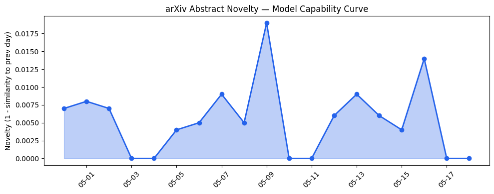
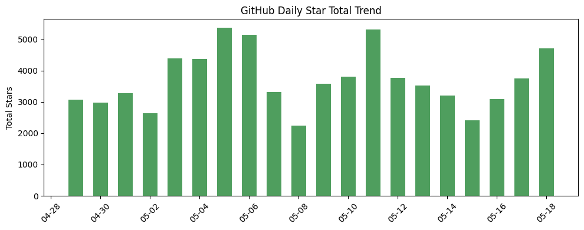
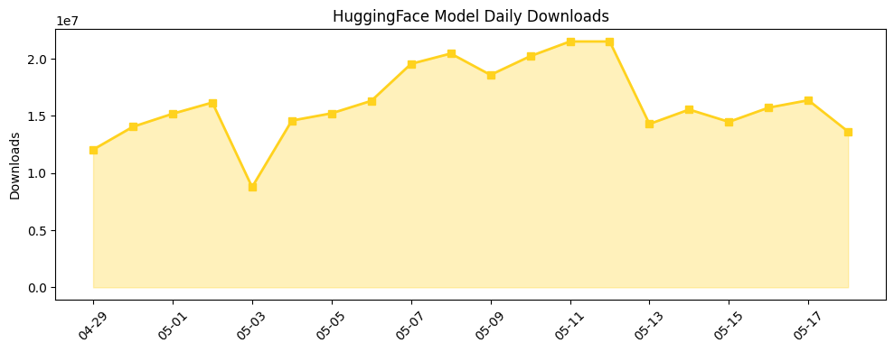

## 今日AI结构性变化
> 今日新增的AI信息表明，技术层面上模型能力边界被推进，基础设施层面上推理成本出现变化，应用层面上AI进入了新行业和新场景，资本信号上融资方向出现集中趋势，风险信号上监管和伦理问题引起关注。
今天最值得注意的结构性变化是模型能力边界的推进和应用层面的扩张，这意味着AI技术的不断进步和行业应用的加深。同时，基础设施层面的推理成本变化和资本信号上的融资方向也值得关注。
- 📈 持续趋势：模型能力边界的推进和应用层面的扩张。
- 🆕 新兴方向：基础设施层面的推理成本变化和资本信号上的融资方向。
- 🔺 突然升温：监管和伦理问题引起关注。
- 🔑 新关键词：上下文长度、云厂商、伦理、估值、供应链、制造、地缘风险、多模态、安全、战略投资。
- 📉 消退关键词：机器学习、自然语言处理。

## 技术层信号
🔴 重大突破

技术层面上，模型能力边界被推进，新的SOTA和模态出现。例如，[DeepSlide: From Artifacts to Presentation Delivery](https://arxiv.org/abs/2605.15202) 和 [SDOF: Taming the Alignment Tax in Multi-Agent Orchestration with State-Constrained Dispatch](https://arxiv.org/abs/2605.15204) 这两篇论文展示了模型能力的最新进展。另外，[AgentStop: Terminating Local AI Agents Early to Save Energy in Consumer Devices](https://arxiv.org/abs/2605.15206) 和 [GQLA: Group-Query Latent Attention for Hardware-Adaptive Large Language Model Decoding](https://arxiv.org/abs/2605.15250) 这两篇论文则展示了基础设施层面的推理成本变化。

## 产业资本信号
🔴 强信号

产业资本层面上，融资方向出现集中趋势，某细分赛道密集融资。例如，[Anthropic has acquired the dev tools startup used by OpenAI, Google, and Cloudflare](https://techcrunch.com/2026/05/18/anthropic-has-acquired-the-dev-tools-startup-used-by-openai-google-and-cloudflare/) 和 [Sector Snapshot: Quantum Computing Startup Investment Slows In 2026 While Public Markets Hold Strong](https://news.crunchbase.com/venture/quantum-computing-startup-investment-data-quantinuum-ipo/) 这两篇新闻报道展示了资本信号上的融资方向。

## 潜在拐点判断
今日新增的AI信息表明，技术层面上模型能力边界的推进和应用层面的扩张可能会带来新的产业机会和挑战。同时，基础设施层面的推理成本变化和资本信号上的融资方向也可能会影响AI产业的发展。

## 明日观察点
1. 模型能力边界的进一步推进。
2. 应用层面的扩张和新行业的进入。
3. 基础设施层面的推理成本变化和资本信号上的融资方向。

## 长期趋势坐标
从月/季视角来看，AI产业的发展趋势是向着更高的模型能力边界和更广泛的应用层面扩张。同时，基础设施层面的推理成本变化和资本信号上的融资方向也将会影响AI产业的发展。

## 数据洞察
### arXiv 摘要对比 — 模型能力提升曲线
今日新增的AI信息表明，模型能力边界被推进，新的SOTA和模态出现。
### GitHub Star 增速分析
今日新增的AI信息表明，GitHub Star 增速分析显示，[Light-Heart-Labs/DreamServer](https://github.com/Light-Heart-Labs/DreamServer) 和 [HKUDS/CLI-Anything](https://github.com/HKUDS/CLI-Anything) 两个仓库的Star数增长最快。
### HuggingFace 模型下载量变化
今日新增的AI信息表明，HuggingFace 模型下载量变化显示，[Qwen/Qwen3.6-35B-A3B](https://huggingface.co/Qwen/Qwen3.6-35B-A3B) 和 [deepseek-ai/DeepSeek-V4-Pro](https://huggingface.co/deepseek-ai/DeepSeek-V4-Pro) 两个模型的下载量增长最快。
### 趋势图

## 参考来源
- [DeepSlide: From Artifacts to Presentation Delivery](https://arxiv.org/abs/2605.15202) — arXiv
- [SDOF: Taming the Alignment Tax in Multi-Agent Orchestration with State-Constrained Dispatch](https://arxiv.org/abs/2605.15204) — arXiv
- [AgentStop: Terminating Local AI Agents Early to Save Energy in Consumer Devices](https://arxiv.org/abs/2605.15206) — arXiv
- [GQLA: Group-Query Latent Attention for Hardware-Adaptive Large Language Model Decoding](https://arxiv.org/abs/2605.15250) — arXiv
- [Anthropic has acquired the dev tools startup used by OpenAI, Google, and Cloudflare](https://techcrunch.com/2026/05/18/anthropic-has-acquired-the-dev-tools-startup-used-by-openai-google-and-cloudflare/) — TechCrunch AI
- [Sector Snapshot: Quantum Computing Startup Investment Slows In 2026 While Public Markets Hold Strong](https://news.crunchbase.com/venture/quantum-computing-startup-investment-data-quantinuum-ipo/) — Crunchbase News
- [SandboxAQ brings its drug discovery models to Claude — no PhD in computing required](https://techcrunch.com/2026/05/18/sandboxaq-brings-its-drug-discovery-models-to-claude-no-phd-in-computing-required/) — TechCrunch AI
- [Amazon’s new Alexa+ powered feature can generate podcast episodes](https://techcrunch.com/2026/05/18/amazons-new-alexa-powered-feature-can-generate-podcast-episodes/) — TechCrunch AI
- [Elon Musk has lost his lawsuit against Sam Altman and OpenAI](https://techcrunch.com/2026/05/18/elon-musk-has-lost-his-lawsuit-against-sam-altman-and-openai/) — TechCrunch AI
- [The haves and have-nots of the AI gold rush](https://techcrunch.com/2026/05/16/the-haves-and-have-nots-of-the-ai-gold-rush/) — TechCrunch AI