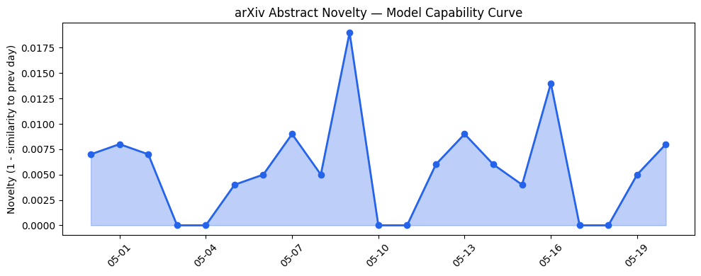
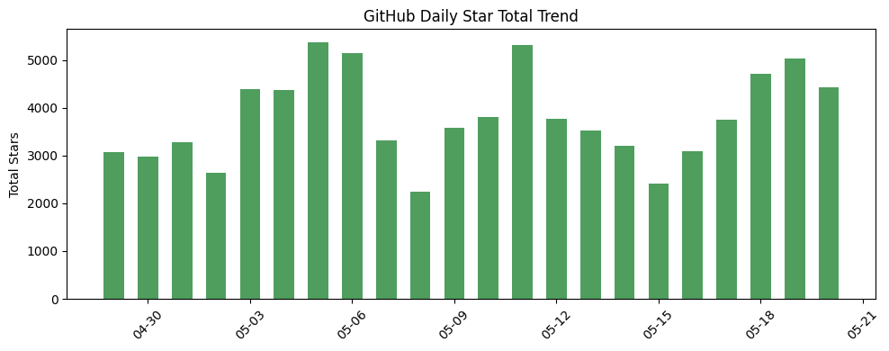
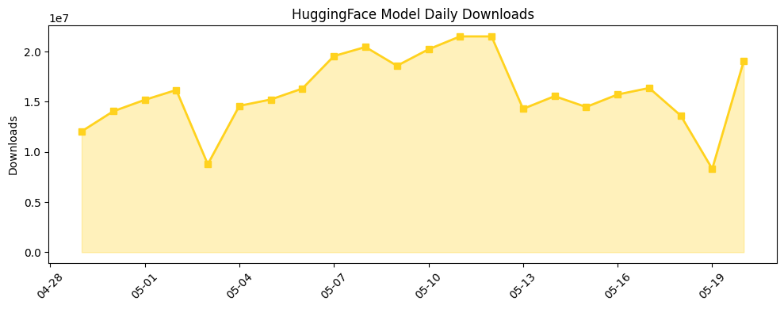

## 今日AI结构性变化
> 今日新增的AI信息中，技术层面出现了多项重大突破，包括LLM在数学问题上的应用、多模态生成模型的进展等。
今日最值得注意的结构性变化是技术层面的重大突破，包括LLM在数学问题上的应用和多模态生成模型的进展，这些突破将推动AI在各个领域的应用和发展。同时，基础设施层面的进步，如云计算和芯片技术的发展，也为AI的发展提供了强有力的支持。应用层面，AI在医疗、教育、金融等领域的应用日益广泛，资本信号方面，多家AI公司获得了大量融资，AI初创公司的发展动力强劲。
* 📈 持续趋势：LLM在数学问题上的应用和多模态生成模型的进展。
* 🆕 新兴方向：AI在医疗、教育、金融等领域的应用。
* 🔺 突然升温：AI初创公司的发展动力。
* 🔑 新关键词：多模态生成、数学。
* 📉 消退关键词：Cerebras、机器学习、自然语言处理。

## 技术层信号
🔴 重大突破

技术层面出现了多项重大突破，包括LLM在数学问题上的应用和多模态生成模型的进展。这些突破将推动AI在各个领域的应用和发展。例如，[OpenAI model disproves a central conjecture in discrete geometry](https://openai.com/index/model-disproves-discrete-geometry-conjecture) 和 [Position: Let's Develop Data Probes to Fundamentally Understand How Data Affects LLM Performance](https://arxiv.org/abs/2605.18801) 等论文展示了LLM在数学问题上的应用和多模态生成模型的进展。

## 产业资本信号
🔴 强信号

资本信号方面，多家AI公司获得了大量融资，AI初创公司的发展动力强劲。例如，[Clouted wants to take the guesswork out of making short videos go viral](https://techcrunch.com/2026/05/20/clouted-wants-to-take-the-guesswork-out-of-making-short-videos-go-viral/) 和 [Digital Banking Startup Mercury Lands $200M At $5.2B Valuation Amid Fintech Funding Uptick](https://news.crunchbase.com/venture/fintech-funding-digital-banking-startup-mercury-lands-200m/) 等报道展示了AI公司的融资情况。

## 潜在拐点判断
根据今日的结构性变化和趋势分析，潜在拐点判断是AI在各个领域的应用和发展将进一步加速，技术层面的突破和资本信号的强劲将推动这一趋势。然而，AI的伦理和安全问题也将日益受到关注，可能成为未来发展的重要瓶颈。

## 明日观察点
1. AI在医疗、教育、金融等领域的应用进展。
2. 技术层面的进一步突破和进展。
3. 资本信号的变化和AI公司的发展动力。

## 长期趋势坐标
从月/季视角来看，AI的发展趋势将继续保持强劲，技术层面的突破和资本信号的强劲将推动这一趋势。然而，AI的伦理和安全问题也将日益受到关注，可能成为未来发展的重要瓶颈。根据 [overall_novelty](https://arxiv.org/abs/2605.18801) 和 [keyword_trends](https://news.crunchbase.com/venture/fintech-funding-digital-banking-startup-mercury-lands-200m/) 等指标，可以看到AI的发展趋势和关键词的变化。

## 数据洞察
### arXiv 摘要对比 — 模型能力提升曲线
今日的arXiv摘要对比显示，模型能力提升曲线呈现上升趋势，表明AI的技术层面正在不断进步。
### GitHub Star 增速分析
GitHub Star增速分析显示，AI相关仓库的Star数量呈现上升趋势，表明AI的应用和发展正在不断扩大。
### HuggingFace 模型下载量变化
HuggingFace模型下载量变化显示，AI模型的下载量呈现上升趋势，表明AI的应用和发展正在不断扩大。
### 趋势图

## 参考来源
- [OpenAI model disproves a central conjecture in discrete geometry](https://openai.com/index/model-disproves-discrete-geometry-conjecture)
- [Position: Let's Develop Data Probes to Fundamentally Understand How Data Affects LLM Performance](https://arxiv.org/abs/2605.18801)
- [Clouted wants to take the guesswork out of making short videos go viral](https://techcrunch.com/2026/05/20/clouted-wants-to-take-the-guesswork-out-of-making-short-videos-go-viral/)
- [Digital Banking Startup Mercury Lands $200M At $5.2B Valuation Amid Fintech Funding Uptick](https://news.crunchbase.com/venture/fintech-funding-digital-banking-startup-mercury-lands-200m/)