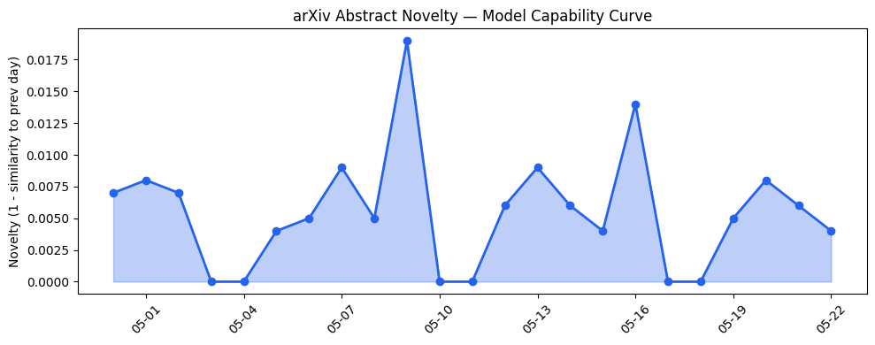
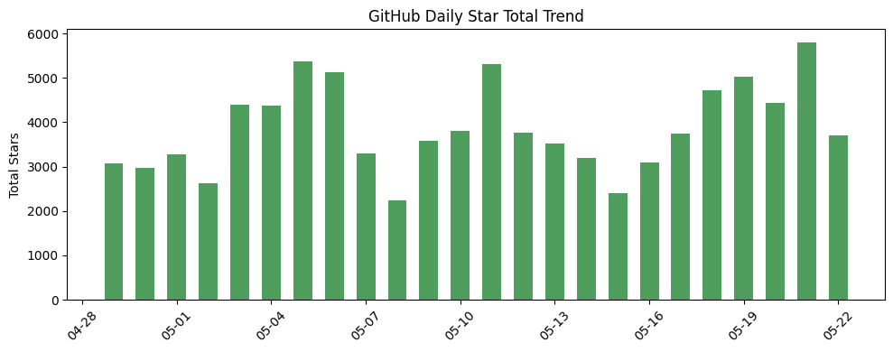
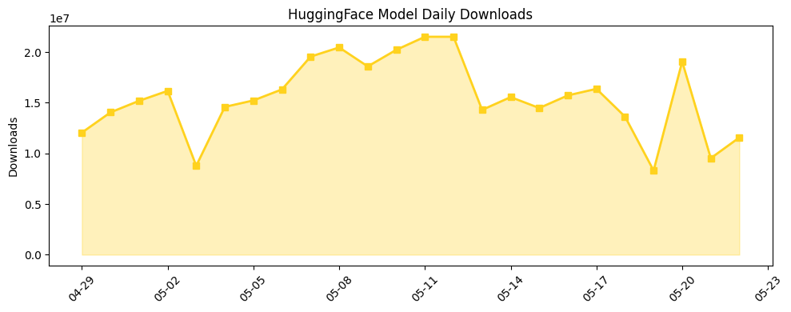

## 今日AI结构性变化
> 今日新增的AI信息显示，技术层面上有多项创新，包括新型LLM、工具增强型智能体和高质量嵌入等；基础设施层面上，推理成本和芯片/算力趋势没有明显变化；应用层面上，AI进入了新的行业和场景，包括医疗、法律和教育等；资本信号上，融资方向和估值水平有所变化；风险信号上，监管/立法和伦理/安全领域有新动向。
今天最值得注意的结构性变化是技术层面的创新和应用层面的扩展，这意味着AI的发展正在加速并向更多领域渗透。同时，资本信号的变化也表明投资者对AI的兴趣和信心正在增强。然而，风险信号的变化也提醒我们需要关注监管和伦理问题。
* 📈 持续趋势：技术层面的创新和应用层面的扩展
* 🆕 新兴方向：工具增强型智能体和高质量嵌入
* 🔺 突然升温：资本信号的变化
* 🔑 新关键词：LLM、SOLAR、COSMO-Agent、OSCToM、AgentCo-op、High Quality Embeddings
* 📉 消退关键词：Anthropic、Cerebras、ChatGPT、Codex、GPT-5.5、机器学习、自然语言处理

## 技术层信号
🔴 重大突破

技术层面的创新是今日结构性变化的主要驱动力。新型LLM、工具增强型智能体和高质量嵌入等技术的提出，标志着AI技术的进一步发展和成熟。这些技术的应用将会带来更多的创新和变革，推动AI的发展和应用。
例如，[SOLAR: A Self-Optimizing Open-Ended Autonomous Agent for Lifelong Learning and Continual Adaptation](https://arxiv.org/abs/2605.20189) 和 [COSMO-Agent: Tool-Augmented Agent for Closed-loop Optimization, Simulation, and Modeling Orchestration](https://arxiv.org/abs/2605.20190) 是两个代表性的技术创新。

## 产业资本信号
🔴 强信号

资本信号的变化是今日结构性变化的另一个重要方面。融资方向和估值水平的变化表明投资者对AI的兴趣和信心正在增强。这将会带来更多的资金和资源投入到AI的发展和应用中，推动AI的发展和成熟。
例如，[The Week’s 10 Biggest Funding Rounds: Massive Deals For Medical Devices, Futuristic AI Gadgets And Frontier Labs Lead](https://news.crunchbase.com/venture/biggest-funding-rounds-medical-devices-futuristic-ai-gadgets-frontier-labs-mirus/) 是一个代表性的资本信号。

## 潜在拐点判断

今日的结构性变化可能标志着AI发展的一个新的阶段。技术层面的创新和应用层面的扩展将会带来更多的创新和变革，推动AI的发展和应用。然而，风险信号的变化也提醒我们需要关注监管和伦理问题，以确保AI的发展和应用是安全和可控的。

## 明日观察点

1. 技术层面的创新和应用层面的扩展
2. 资本信号的变化和投资者的兴趣和信心
3. 风险信号的变化和监管和伦理问题

## 长期趋势坐标

从月/季视角来看，AI的发展和应用将会继续加速和扩展。技术层面的创新和应用层面的扩展将会带来更多的创新和变革，推动AI的发展和应用。然而，风险信号的变化也提醒我们需要关注监管和伦理问题，以确保AI的发展和应用是安全和可控的。
参考 [overall_novelty](https://arxiv.org/abs/2605.20189) 和 [keyword_trends](https://arxiv.org/abs/2605.20190) 可以更好地理解AI的发展和应用趋势。

## 数据洞察
### arXiv 摘要对比 — 模型能力提升曲线
今日的arXiv摘要对比显示，模型能力提升曲线呈现延续趋势。
### GitHub Star 增速分析
GitHub Star增速分析显示，今日的Star增长呈现下降趋势。
### HuggingFace 模型下载量变化
HuggingFace模型下载量变化显示，今日的下载量呈现增长趋势。
### 趋势图

## 参考来源
- [SOLAR: A Self-Optimizing Open-Ended Autonomous Agent for Lifelong Learning and Continual Adaptation](https://arxiv.org/abs/2605.20189) — arXiv
- [COSMO-Agent: Tool-Augmented Agent for Closed-loop Optimization, Simulation, and Modeling Orchestration](https://arxiv.org/abs/2605.20190) — arXiv
- [The Week’s 10 Biggest Funding Rounds: Massive Deals For Medical Devices, Futuristic AI Gadgets And Frontier Labs Lead](https://news.crunchbase.com/venture/biggest-funding-rounds-medical-devices-futuristic-ai-gadgets-frontier-labs-mirus/) — Crunchbase News
- [You can no longer Google the word ‘disregard’](https://techcrunch.com/2026/05/22/you-can-no-longer-google-the-word-disregard/) — TechCrunch AI