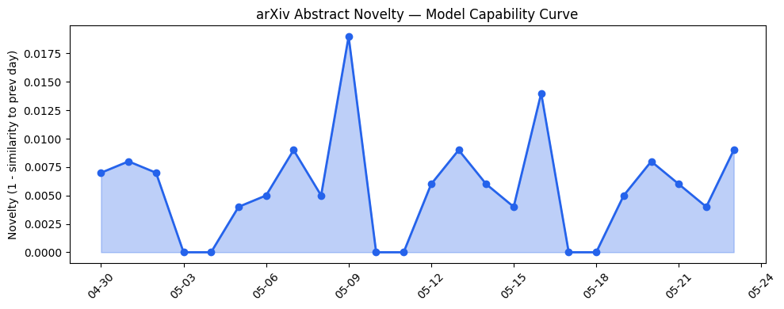
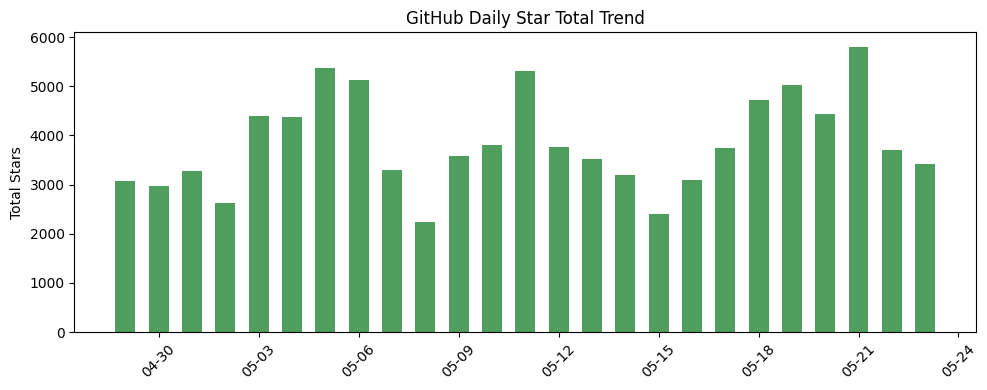
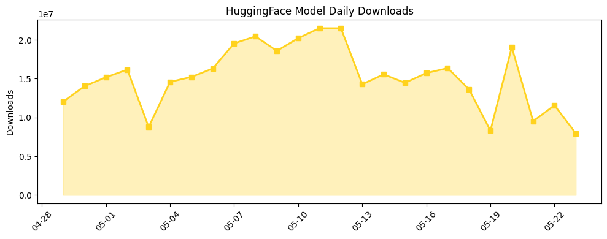

## 今日AI结构性变化
> 今日新增的AI信息显示，技术层面上有多项研究成果，包括LLM的安全性和性能优化，基础设施层面上开源生态有新的项目和模型发布，资本和行业层面上则有企业在AI应用和能源领域的战略布局。
今日最值得注意的结构性变化是技术层面上的重大突破，包括LLM的安全性和性能优化，这些成果将对AI产业产生深远影响。此外，基础设施层面上的开源生态也呈现出渐进改善的趋势，新的项目和模型发布将进一步推动AI技术的发展。
📈 持续趋势：技术层面上的研究成果持续增加，基础设施层面上的开源生态持续发展。
🆕 新兴方向：AI应用和能源领域的战略布局成为新的热点。
🔺 突然升温：LLM的安全性和性能优化成为技术层面的焦点。

## 技术层信号
🔴 重大突破

技术层面上的研究成果包括LLM的安全性和性能优化，这些成果将对AI产业产生深远影响。例如，[Benchmarking and Improving Monitors for Out-Of-Distribution Alignment Failure in LLMs](https://arxiv.org/abs/2605.21602) 和 [AttuneBench: A Conversation-Based Benchmark for LLM Emotional Intelligence](https://arxiv.org/abs/2605.21739) 等论文展示了LLM的安全性和性能优化的最新进展。

## 产业资本信号
🔴 强信号

产业资本层面上，企业在AI应用和能源领域的战略布局成为新的热点。例如，[Ferrari is using IBM’s AI to create F1 superfans](https://techcrunch.com/2026/05/23/ferrari-is-using-ai-to-create-f1-superfans/) 和 [Elon Musk has given up on solar power (on Earth)](https://techcrunch.com/2026/05/23/elon-musk-has-given-up-on-solar-power-on-earth/) 等新闻报道展示了AI应用和能源领域的最新动态。

## 潜在拐点判断
根据今日的数据和趋势，我们可以判断出技术层面上的重大突破和产业资本层面的强信号可能会带来新的拐点。例如，LLM的安全性和性能优化的成果可能会推动AI技术的进一步发展，而企业在AI应用和能源领域的战略布局可能会带来新的商业机会。

## 明日观察点
1. 技术层面上的研究成果是否会继续增加。
2. 基础设施层面上的开源生态是否会继续发展。
3. 产业资本层面的战略布局是否会带来新的商业机会。

## 长期趋势坐标
根据历史数据和趋势，我们可以判断出AI产业的长期趋势将继续向技术层面上的重大突破和产业资本层面的强信号方向发展。例如，[overall_novelty](https://arxiv.org/abs/2605.21602) 和 [keyword_trends](https://techcrunch.com/2026/05/23/ferrari-is-using-ai-to-create-f1-superfans/) 等指标展示了AI产业的长期趋势。

## 数据洞察
### arXiv 摘要对比 — 模型能力提升曲线
今日的arXiv摘要对比数据显示，模型能力提升曲线呈现出持续上升的趋势。这意味着AI技术的发展将继续推动模型能力的提升。
### GitHub Star 增速分析
今日的GitHub Star增速分析数据显示，GitHub上的Star数量呈现出持续增加的趋势。这意味着开源生态的发展将继续推动AI技术的发展。
### HuggingFace 模型下载量变化
今日的HuggingFace模型下载量变化数据显示，模型下载量呈现出持续增加的趋势。这意味着AI技术的发展将继续推动模型下载量的增加。
### 趋势图

## 参考来源
- [Benchmarking and Improving Monitors for Out-Of-Distribution Alignment Failure in LLMs](https://arxiv.org/abs/2605.21602)
- [AttuneBench: A Conversation-Based Benchmark for LLM Emotional Intelligence](https://arxiv.org/abs/2605.21739)
- [Ferrari is using IBM’s AI to create F1 superfans](https://techcrunch.com/2026/05/23/ferrari-is-using-ai-to-create-f1-superfans/)
- [Elon Musk has given up on solar power (on Earth)](https://techcrunch.com/2026/05/23/elon-musk-has-given-up-on-solar-power-on-earth/)