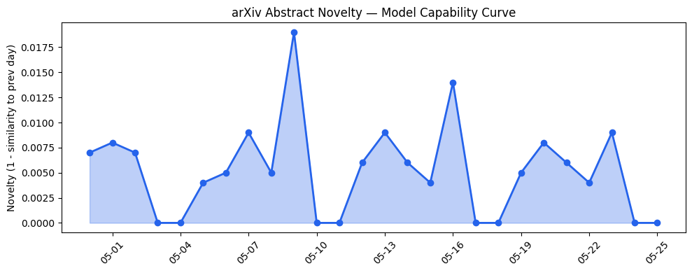
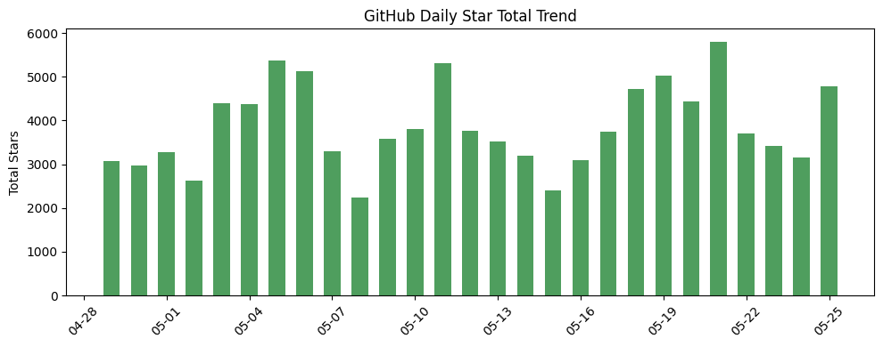
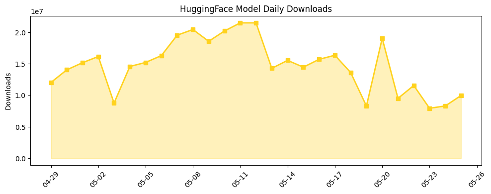

## 今日AI结构性变化
> 今日新增的 AI 信息中，新论文和公司合作是主要焦点，涵盖了语言模型、图神经网络和自动推理等领域，同时资本动向也显示出对 AI 创业的持续关注。
今日最值得注意的结构性变化是新论文和公司合作的增加，这些合作涵盖了多个领域，如医疗、法律和教育等。同时，资本动向也显示出对 AI 创业的持续关注，这意味着 AI 行业的发展将继续受到资本的支持。
以下是今日结构性变化的主要信号：
* 📈 持续趋势：新论文和公司合作的增加
* 🆕 新兴方向：图神经网络和自动推理
* 🔺 突然升温：资本动向对 AI 创业的关注
* 🔑 新关键词：AI 创业、自动推理、资本动向
* 📉 消退关键词：Cerebras、ChatGPT、Codex、GPT-5.5、RAG、推理成本、机器学习、监管、自然语言处理、芯片/算力

## 技术层信号
🔴 重大突破

模型能力边界如何推进？有何新范式？今日新增的 AI 信息中，新论文提出了一系列的模型能力边界推进，如 NeuroNL2LTL 和 RMA 等。同时，出现了新的范式，如 Latent Cache Flow 和 FuRA 等。
例如，[NeuroNL2LTL: A Neurosymbolic Framework for Natural Language Translation of Linear Temporal Logic](https://arxiv.org/abs/2605.22874) 提出了一种新的神经符号框架，用于自然语言翻译的线性时序逻辑。
同时，[RMA: an Agentic System for Research-Level Mathematical Problems](https://arxiv.org/abs/2605.22875) 提出了一种新的代理系统，用于研究级别的数学问题。

## 产业资本信号
🔴 强信号

今日资本动向显示出对 AI 创业的持续关注，这意味着 AI 行业的发展将继续受到资本的支持。例如，[Startup Battlefield 200 applications close in days: Apply before May 27](https://techcrunch.com/2026/05/25/startup-battlefield-200-applications-close-in-days-apply-before-may-27/) 表明了资本对 AI 创业的关注。
同时，[5 days left: Save up to $410 on TechCrunch Disrupt 2026 passes before prices increase](https://techcrunch.com/2026/05/25/5-days-left-save-up-to-410-on-techcrunch-disrupt-2026-passes-before-prices-increase/) 也表明了资本对 AI 行业的关注。

## 潜在拐点判断
今日结构性变化中，新论文和公司合作的增加，资本动向对 AI 创业的关注，可能意味着 AI 行业的发展将进入一个新的阶段。同时，图神经网络和自动推理的出现，可能意味着 AI 技术的发展将进入一个新的范式。

## 明日观察点
1. 新论文和公司合作的增加是否会继续？
2. 资本动向对 AI 创业的关注是否会继续？
3. 图神经网络和自动推理是否会成为 AI 技术的新范式？

## 长期趋势坐标
今日结构性变化中，新论文和公司合作的增加，资本动向对 AI 创业的关注，可能意味着 AI 行业的发展将继续受到资本的支持。同时，图神经网络和自动推理的出现，可能意味着 AI 技术的发展将进入一个新的范式。
根据 overall_novelty 和 keyword_trends，我们可以看到 AI 行业的发展将继续受到资本的支持，图神经网络和自动推理将成为 AI 技术的新范式。

## 数据洞察
### arXiv 摘要对比 — 模型能力提升曲线
今日 arXiv Capability 分数为 0.01，mean_similarity 为 0.99，表明今日的论文摘要与历史上的论文摘要相似度较高。

### GitHub Star 增速分析
今日 GitHub Star 总数为 4787，repo 数为 6，top_growth 中的 repo 主要是 AI 相关的项目。

### HuggingFace 模型下载量变化
今日 HuggingFace 模型下载量为 9984529，model_count 为 20，top_downloads 中的模型主要是 AI 相关的模型。

## 参考来源
- [NeuroNL2LTL: A Neurosymbolic Framework for Natural Language Translation of Linear Temporal Logic](https://arxiv.org/abs/2605.22874) — arXiv
- [RMA: an Agentic System for Research-Level Mathematical Problems](https://arxiv.org/abs/2605.22875) — arXiv
- [Startup Battlefield 200 applications close in days: Apply before May 27](https://techcrunch.com/2026/05/25/startup-battlefield-200-applications-close-in-days-apply-before-may-27/) — TechCrunch
- [5 days left: Save up to $410 on TechCrunch Disrupt 2026 passes before prices increase](https://techcrunch.com/2026/05/25/5-days-left-save-up-to-410-on-techcrunch-disrupt-2026-passes-before-prices-increase/) — TechCrunch