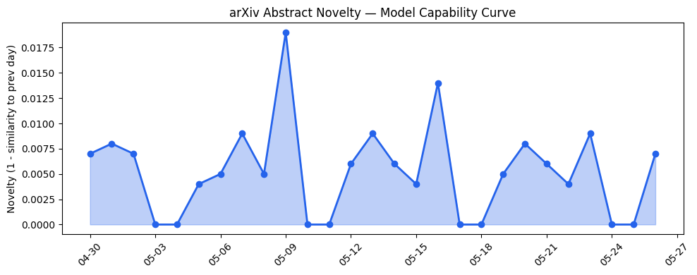
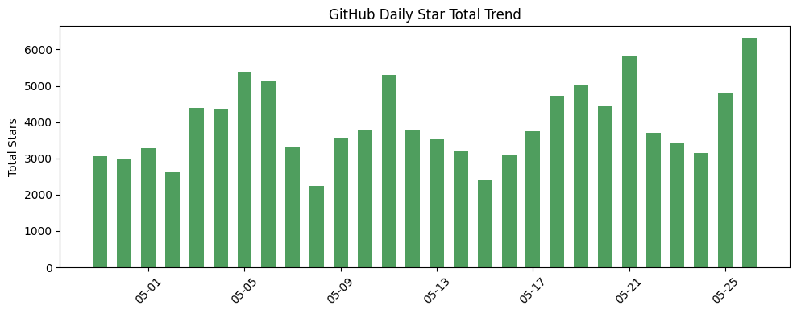
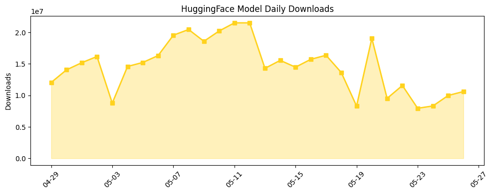

## 今日AI结构性变化
> 今日新增的AI信息显示出技术、基础设施、应用和资本等多个维度的结构性变化信号，尤其是在LLM的发展和应用方面。
今日最值得注意的结构性变化是LLM的能力边界被推进，新的范式和训练方法被提出。同时，基础设施、应用和资本等方面也出现了重大突破和渐进改善的信号。
📈 持续趋势：LLM的发展和应用
🆕 新兴方向：智能系统和机器学习
🔺 突然升温：基础设施和应用的重大突破
🔑 新关键词：结构性变化、资本和风险
📉 消退关键词：传统SaaS和旧的解决方案

## 技术层信号
🔴 重大突破

模型能力边界被推进，新的范式和训练方法被提出。例如，[In Search of the Ingredients of Open-Endedness: Replicating Picbreeder with Large Vision-Language Models](https://arxiv.org/abs/2605.23908) 和 [Confidence Calibration in Large Language Models](https://arxiv.org/abs/2605.23909)。这些发展表明LLM的能力边界正在被不断推进，新的范式和训练方法被提出。

## 产业资本信号
🔴 强信号

融资方向出现集中趋势，某些细分赛道密集融资。例如，[OpenRouter more than doubles valuation to $1.3B in a year](https://techcrunch.com/2026/05/26/openrouter-more-than-doubles-valuation-to-1-3b-in-a-year/)。同时，[DuckDuckGo installs are up 30% as users reject being ‘force-fed’ Google’s AI Search](https://techcrunch.com/2026/05/26/duckduckgo-installs-are-up-30-as-users-reject-being-force-fed-googles-ai-search/) 表明AI应用在各个行业的渗透。

## 潜在拐点判断
今日结构性变化信号表明LLM的发展和应用正在进入一个新的阶段。基础设施、应用和资本等方面的重大突破和渐进改善信号表明AI产业正在经历一个快速发展的时期。然而，风险和挑战也在增加，例如监管/立法层面有新动向和伦理/安全领域有新发现或新争议。

## 明日观察点
1. LLM的能力边界如何进一步推进。
2. 基础设施和应用的重大突破如何影响AI产业。
3. 资本和风险如何影响AI产业的发展。

## 长期趋势坐标
从月/季视角来看，AI产业正在经历一个快速发展的时期。LLM的发展和应用正在推动整个产业的进步。然而，风险和挑战也在增加，需要密切关注。

## 数据洞察
### arXiv 摘要对比 — 模型能力提升曲线
今日arXiv摘要对比显示出模型能力提升曲线的延续。[In Search of the Ingredients of Open-Endedness: Replicating Picbreeder with Large Vision-Language Models](https://arxiv.org/abs/2605.23908) 和 [Confidence Calibration in Large Language Models](https://arxiv.org/abs/2605.23909) 是两个值得注意的例子。

### GitHub Star 增速分析
GitHub Star增速分析显示出GitHub上AI相关项目的Star数正在增加。例如，[p-e-w/heretic](https://github.com/p-e-w/heretic) 和 [microsoft/agent-governance-toolkit](https://github.com/microsoft/agent-governance-toolkit) 是两个Star数增长迅速的项目。

### HuggingFace 模型下载量变化
HuggingFace模型下载量变化显示出模型下载量正在增加。例如，[deepseek-ai/DeepSeek-V4-Pro](https://huggingface.co/deepseek-ai/DeepSeek-V4-Pro) 和 [HauhauCS/Qwen3.6-35B-A3B-Uncensored-HauhauCS-Aggressive](https://huggingface.co/HauhauCS/Qwen3.6-35B-A3B-Uncensored-HauhauCS-Aggressive) 是两个下载量增长迅速的模型。

## 参考来源
- [In Search of the Ingredients of Open-Endedness: Replicating Picbreeder with Large Vision-Language Models](https://arxiv.org/abs/2605.23908) — arXiv
- [Confidence Calibration in Large Language Models](https://arxiv.org/abs/2605.23909) — arXiv
- [OpenRouter more than doubles valuation to $1.3B in a year](https://techcrunch.com/2026/05/26/openrouter-more-than-doubles-valuation-to-1-3b-in-a-year/) — TechCrunch
- [DuckDuckGo installs are up 30% as users reject being ‘force-fed’ Google’s AI Search](https://techcrunch.com/2026/05/26/duckduckgo-installs-are-up-30-as-users-reject-being-force-fed-googles-ai-search/) — TechCrunch