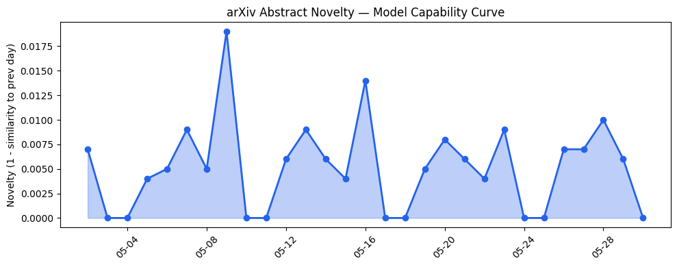
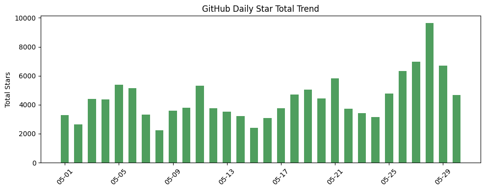
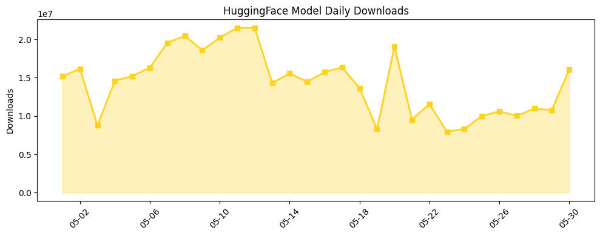

## 今日AI结构性变化
> 今日AI领域动态主要集中在开源模型的发布、资本投资以及行业发展，特别是软银在法国数据中心的投资和Meta开发AI挂饰等。
今日最值得注意的结构性变化是开源模型的发布，如Step-3.7-Flash和LFM2.5-8B-A1B-GGUF，表明模型能力的不断改进。同时，软银计划投资高达75亿欧元建造法国数据中心，表明数据中心建设的加速。另外，Meta开发AI挂饰，Google推出Gemini Spark等，表明AI在新行业和新场景的应用。
- 📈 持续趋势：开源模型的发布和数据中心建设的加速。
- 🆕 新兴方向：AI在新行业和新场景的应用。
- 🔺 突然升温：软银在法国数据中心的投资。
- 🔑 新关键词：AI挂饰、Gemini Spark。
- 📉 消退关键词：Cerebras、伦理、医疗等。

## 技术层信号
🟡 渐进改善

模型能力边界如何推进？有何新范式？开源模型的发布，如Step-3.7-Flash和LFM2.5-8B-A1B-GGUF，表明模型能力的不断改进。[Step-3.7-Flash](https://huggingface.co/stepfun-ai/Step-3.7-Flash) 和 [LFM2.5-8B-A1B-GGUF](https://huggingface.co/LiquidAI/LFM2.5-8B-A1B-GGUF) 是两个值得注意的模型。

## 产业资本信号
🔴 强信号

今日资本信号主要集中在软银计划投资高达75亿欧元建造法国数据中心，表明资本对AI和数据中心的投资热情。[软银计划投资高达75亿欧元建造法国数据中心](https://techcrunch.com/2026/05/30/softbank-says-it-will-invest-up-to-e75-billion-to-build-french-data-centers/)。

## 潜在拐点判断
今日观察到潜在拐点是Github Copilot的新token-based billing模式引起开发者争议，可能涉及伦理和安全问题。

## 明日观察点
1. 开源模型的发布和更新。
2. 资本对AI和数据中心的投资动向。
3. AI在新行业和新场景的应用。

## 长期趋势坐标
月/季视角，今日的趋势图路径为 ["charts/2026-05-30_arxiv_capability.png", "charts/2026-05-30_github_stars.png", "charts/2026-05-30_hf_downloads.png"]，表明开源模型的发布和数据中心建设的加速是长期趋势的重要组成部分。

## 数据洞察
### arXiv 摘要对比 — 模型能力提升曲线
今日无 arXiv 摘要数据。
### GitHub Star 增速分析
今日GitHub Star总数为4665，repo数量为7，增长最快的repo是[anthropics/claude-code](https://github.com/anthropics/claude-code)。
### HuggingFace 模型下载量变化
今日HuggingFace模型下载量为16036624，模型数量为20，下载量最大的模型是[deepseek-ai/DeepSeek-V4-Pro](https://huggingface.co/deepseek-ai/DeepSeek-V4-Pro)。
### 趋势图

## 参考来源
- [Step-3.7-Flash](https://huggingface.co/stepfun-ai/Step-3.7-Flash) — HuggingFace
- [LFM2.5-8B-A1B-GGUF](https://huggingface.co/LiquidAI/LFM2.5-8B-A1B-GGUF) — HuggingFace
- [软银计划投资高达75亿欧元建造法国数据中心](https://techcrunch.com/2026/05/30/softbank-says-it-will-invest-up-to-e75-billion-to-build-french-data-centers/) — TechCrunch
- [Github Copilot的新token-based billing模式引起开发者争议](https://techcrunch.com/2026/05/30/what-a-joke-github-copilots-new-token-based-billing-spurs-consternation-among-devs/) — TechCrunch