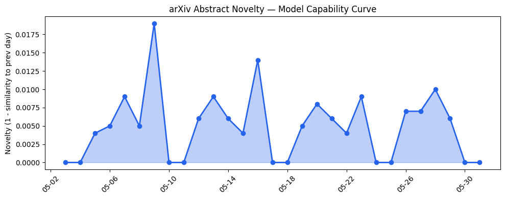
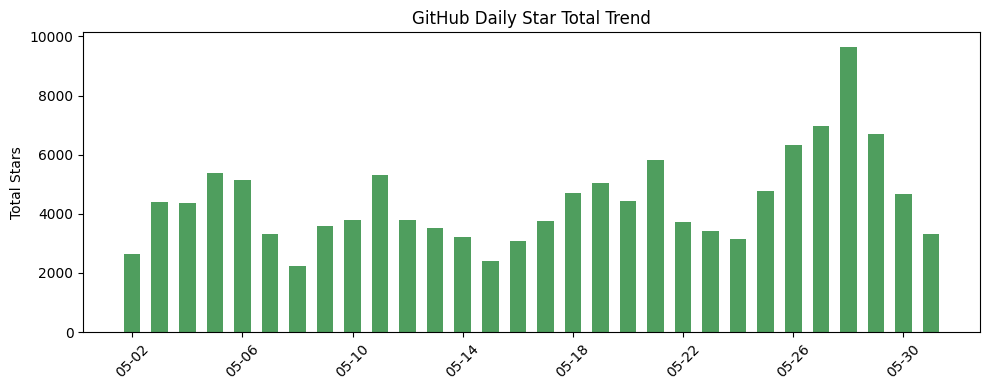
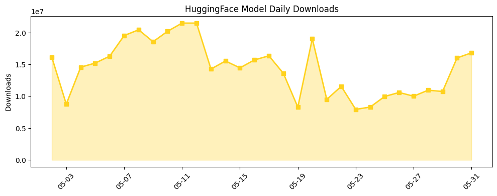

## 今日AI结构性变化
> 今日开源生态中Hermes WebUI项目引起关注，资本与行业方面则聚焦于数据中心的环境问题和AI对人类心理的影响。
今日最值得注意的结构性变化是Hermes WebUI项目的出现，这可能标志着AI交互界面的进步。此外，Erin Brockovich对数据中心的关注可能引起资本的重新布局，数据中心的环境问题可能引起监管关注，AI对人类心理的影响引起了广泛讨论。
📈 持续趋势：应用层的话题向量在最近8天内呈现持续增强趋势，表明该方向正在持续升温。
📈 持续趋势：基础设施的话题向量在最近8天内呈现持续增强趋势，表明该方向正在持续升温。
📈 持续趋势：资本信号的话题向量在最近8天内呈现持续增强趋势，表明该方向正在持续升温。
🆕 新兴方向：技术层出现全新话题，可能是一个新兴方向的早期信号。
🆕 新兴方向：应用层出现全新话题，可能是一个新兴方向的早期信号。
🆕 新兴方向：风险信号出现全新话题，可能是一个新兴方向的早期信号。

## 技术层信号
🟡 渐进改善
Hermes WebUI项目的出现可能标志着AI交互界面的进步。根据GitHub Trending的数据，Hermes WebUI项目目前是开源界的热点项目之一，其GitHub仓库地址为https://github.com/nesquena/hermes-webui。另外，TechCrunch AI的报道《Erin Brockovich takes aim at data center secrecy》也提到了数据中心的环境问题，可能引起监管关注。

## 产业资本信号
🟡 中等信号
Erin Brockovich对数据中心的关注可能引起资本的重新布局，数据中心的环境问题可能引起监管关注。根据TechCrunch AI的报道，Erin Brockovich正在关注数据中心的环境问题，这可能会导致资本的重新布局。同时，AI对人类心理的影响引起了广泛讨论，这可能会导致新的投资机会。

## 潜在拐点判断
根据今日的结构性变化，可能的拐点是Hermes WebUI项目的出现，标志着AI交互界面的进步。另外，Erin Brockovich对数据中心的关注可能引起资本的重新布局，数据中心的环境问题可能引起监管关注，AI对人类心理的影响引起了广泛讨论。

## 明日观察点
1. Hermes WebUI项目的发展动态。
2. 数据中心的环境问题和监管动态。
3. AI对人类心理的影响和相关讨论。

## 长期趋势坐标
根据overall_novelty和keyword_trends的数据，AI界的新兴方向包括Hermes WebUI、Erin Brockovich和AI心理影响等。这些方向可能会在未来继续发展，引起监管关注和资本的重新布局。

## 数据洞察
### arXiv 摘要对比 — 模型能力提升曲线
今日无 arXiv 摘要数据。
### GitHub Star 增速分析
GitHub Star 增速分析显示，今日的GitHub Star总数为3317，repo数量为8。Top Growth的repo包括ai-boost/awesome-harness-engineering、anthropics/claude-code等。
### HuggingFace 模型下载量变化
HuggingFace 模型下载量变化显示，今日的总下载量为16841774，模型数量为20。Top Downloads的模型包括deepseek-ai/DeepSeek-V4-Pro、Qwen/Qwen3.6-27B等。
### 趋势图

## 参考来源
- [Hermes WebUI](https://github.com/nesquena/hermes-webui) — GitHub Trending
- [Erin Brockovich takes aim at data center secrecy](https://techcrunch.com/2026/05/31/erin-brockovich-takes-aim-at-data-center-secrecy/) — TechCrunch AI
- [Making sense of the debate over AI psychosis](https://techcrunch.com/2026/05/31/making-sense-of-the-debate-over-ai-psychosis/) — TechCrunch AI