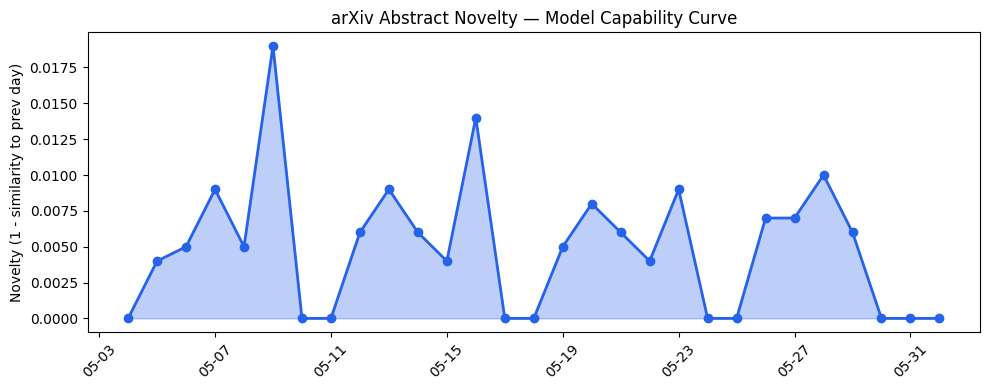
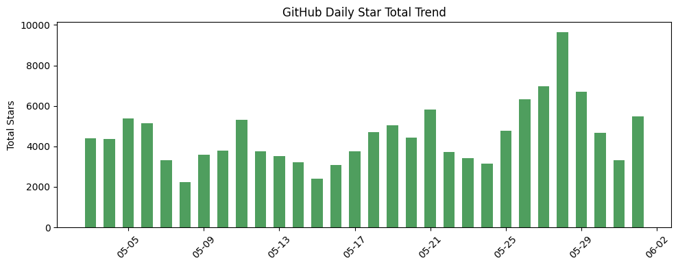
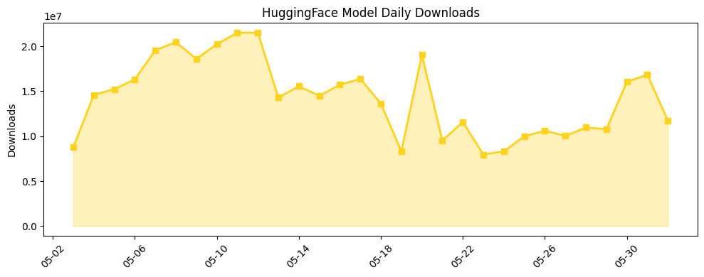

## 今日AI结构性变化
> 今日AI结构性变化的核心判断是：技术层、基础设施、应用层、资本信号和风险信号都有明显的变化，尤其是Anthropic提交首次公开募股（IPO）申请和OpenAI在Michigan的数据中心项目。
今天最值得注意的结构性变化是Anthropic提交首次公开募股（IPO）申请，这标志着AI行业的资本信号进一步增强。同时，OpenAI在Michigan的数据中心项目也表明了基础设施的发展。这些变化都表明AI行业正在迅速发展，技术层、基础设施、应用层和资本信号都有明显的变化。
以下是今日结构性变化的关键点：
* 技术层：PhyDrawGen和Physically Viable World Models等论文推进了模型能力边界。
* 基础设施：OpenAI在Michigan的数据中心项目和Nvidia的AI计算能力推动了基础设施的发展。
* 应用层：AI在医疗、法律、教育等领域的应用。
* 资本信号：Anthropic提交首次公开募股（IPO）申请和Alphabet计划筹集800亿美元。
* 风险信号：监管和立法的变化，AI伦理和安全问题，供应链和地缘风险。

## 技术层信号
🔴 重大突破

技术层的信号表明，模型能力边界正在推进，新的范式正在提出。例如，PhyDrawGen和Physically Viable World Models等论文推进了模型能力边界，而Uncertainty-Aware和Temporally Regulated Expert Advice等论文提出新的范式。这些变化表明AI技术正在迅速发展，新的技术和应用正在不断涌现。

## 产业资本信号
🔴 强信号

产业资本信号表明，AI行业的资本信号进一步增强，Anthropic提交首次公开募股（IPO）申请和Alphabet计划筹集800亿美元都是重要的信号。同时，OpenAI和Nvidia的战略投资也表明了资本对AI行业的关注。这些变化表明AI行业正在迅速发展，资本对AI的投资也在不断增加。

## 潜在拐点判断
今日的结构性变化表明，AI行业可能正在经历一个拐点，技术层、基础设施、应用层和资本信号的变化都表明AI行业正在迅速发展。然而，风险信号也表明，AI行业也面临着监管、伦理和安全等挑战。因此，需要密切关注这些变化，以便及时应对可能的拐点。

## 明日观察点
1. Anthropic的IPO申请进展。
2. OpenAI在Michigan的数据中心项目进展。
3. AI在医疗、法律、教育等领域的应用进展。

## 长期趋势坐标
从月/季视角来看，AI行业的发展趋势是持续向上的，技术层、基础设施、应用层和资本信号的变化都表明AI行业正在迅速发展。然而，风险信号也表明，AI行业也面临着监管、伦理和安全等挑战。因此，需要密切关注这些变化，以便及时应对可能的拐点。

## 数据洞察
### arXiv 摘要对比 — 模型能力提升曲线
今日的arXiv摘要对比数据表明，模型能力边界正在推进，新的范式正在提出。例如，PhyDrawGen和Physically Viable World Models等论文推进了模型能力边界，而Uncertainty-Aware和Temporally Regulated Expert Advice等论文提出新的范式。
### GitHub Star 增速分析
今日的GitHub Star增速分析数据表明，AI相关的GitHub仓库正在迅速增长，例如nesquena/hermes-webui和anthropics/claude-code等仓库的Star数正在迅速增加。
### HuggingFace 模型下载量变化
今日的HuggingFace模型下载量变化数据表明，AI模型的下载量正在迅速增长，例如deepseek-ai/DeepSeek-V4-Pro和HauhauCS/Qwen3.6-35B-A3B-Uncensored-HauhauCS-Aggressive等模型的下载量正在迅速增加。
### 趋势图

## 参考来源
- [PhyDrawGen: Physically Grounded Diagram Generation from Natural Language](https://arxiv.org/abs/2605.30512)
- [Physically Viable World Models: A Case for Query-Conditioned Embodied AI](https://arxiv.org/abs/2605.30542)
- [Building the infrastructure for the Intelligence Age in Michigan](https://openai.com/index/stargate-michigan-data-center)
- [SoftBank says it will invest up to €75B to build French data centers](https://techcrunch.com/2026/05/30/softbank-says-it-will-invest-up-to-e75-billion-to-build-french-data-centers/)
- [Anthropic files to go public](https://techcrunch.com/2026/06/01/anthropic-files-to-go-public/)
- [Alphabet plans to raise $80B to pay for AI buildout](https://techcrunch.com/2026/06/01/alphabet-plans-to-raise-80-billion-to-pay-for-ai-buildout/)