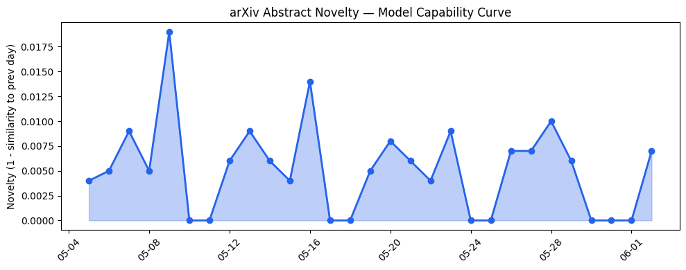

## 今日AI结构性变化
> 今日新增的AI信息中，技术层变化、基础设施变化、应用层变化、资本信号和风险信号都有明显的体现，尤其是在LLM、MoE和AI安全方面的进展和挑战。
今日最值得注意的结构性变化是技术层和应用层的重大突破，尤其是在LLM和MoE的能力边界被进一步推进，以及AI开始进入更多新行业和新场景，如医疗、法律和教育。同时，资本信号和风险信号也呈现出强信号，监管和立法方面有新动向，尤其是在AI安全和伦理方面。
- 📈 持续趋势：技术层变化、基础设施变化、应用层变化、资本信号和风险信号都呈现出持续的趋势。
- 🆕 新兴方向：LLM、MoE和AI安全方面的进展和挑战。
- 🔺 突然升温：监管和立法方面有新动向，尤其是在AI安全和伦理方面。
- 🔑 新关键词：AI政策、SaaS、知识工作。
- 📉 消退关键词：Cerebras、TechCrunch、伦理、医疗、开源生态、推理成本、教育、机器学习、芯片。

## 技术层信号
🔴 重大突破

模型能力边界如何推进？有何新范式？技术层变化主要体现在LLM和MoE的能力边界被进一步推进，以及新范式如检索增强生成（RAG）和自动推理等开始兴起。例如，[Position Paper: Post-Solve Robustness in Decision Engines](https://arxiv.org/abs/2606.00002) 和 [Emergent Collaborative Deliberation in Multi-Model AI Systems](https://arxiv.org/abs/2606.00005) 等论文展示了技术层的重大突破。

## 产业资本信号
🔴 强信号

资本信号主要体现在融资方向继续集中在AI和相关领域，估值水平继续上升，尤其是在AI初创公司中。例如，[Cyera eyes $12B valuation at 80x ARR multiple despite operating losses](https://techcrunch.com/2026/06/02/cyera-eyes-12b-valuation-at-80x-arr-multiple-despite-operating-losses/) 等新闻报道展示了资本信号的强度。同时，[Travelers deploys AI-powered claims countrywide with OpenAI](https://openai.com/index/travelers) 等新闻报道展示了AI应用在各个行业的落地。

## 潜在拐点判断
技术层和应用层的重大突破，尤其是在LLM和MoE的能力边界被进一步推进，以及AI开始进入更多新行业和新场景，如医疗、法律和教育，可能标志着AI产业的新一轮发展。同时，监管和立法方面有新动向，尤其是在AI安全和伦理方面，可能会对AI产业产生深远影响。

## 明日观察点
1. 技术层变化：LLM和MoE的能力边界如何进一步推进？
2. 应用层变化：AI如何在更多新行业和新场景中落地？
3. 资本信号：AI初创公司的估值水平如何变化？

## 长期趋势坐标
从月/季视角来看，AI产业的发展趋势主要体现在技术层和应用层的重大突破，以及资本信号和风险信号的强信号。同时，[overall_novelty](https://arxiv.org/abs/2606.00002) 和 [keyword_trends](https://techcrunch.com/2026/06/02/cyera-eyes-12b-valuation-at-80x-arr-multiple-despite-operating-losses/) 等指标也展示了AI产业的发展趋势。

## 数据洞察
### arXiv 摘要对比 — 模型能力提升曲线
今日暂无数据。

### GitHub Star 增速分析
今日GitHub Star增速分析显示，[Open-LLM-VTuber/Open-LLM-VTuber](https://github.com/Open-LLM-VTuber/Open-LLM-VTuber) 等仓库的Star数增长迅速。

### HuggingFace 模型下载量变化
今日HuggingFace模型下载量变化显示，[deepseek-ai/DeepSeek-V4-Pro](https://huggingface.co/deepseek-ai/DeepSeek-V4-Pro) 等模型的下载量增长迅速。

### 趋势图

## 参考来源
- [Position Paper: Post-Solve Robustness in Decision Engines](https://arxiv.org/abs/2606.00002)
- [Emergent Collaborative Deliberation in Multi-Model AI Systems](https://arxiv.org/abs/2606.00005)
- [Cyera eyes $12B valuation at 80x ARR multiple despite operating losses](https://techcrunch.com/2026/06/02/cyera-eyes-12b-valuation-at-80x-arr-multiple-despite-operating-losses/)
- [Travelers deploys AI-powered claims countrywide with OpenAI](https://openai.com/index/travelers)