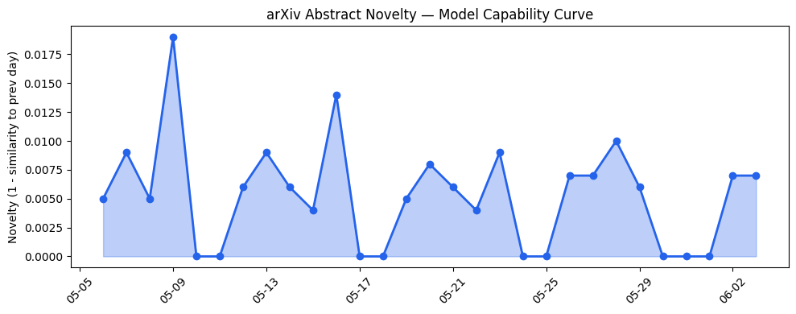
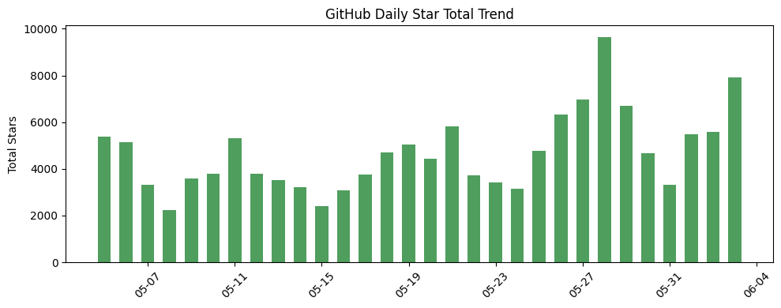
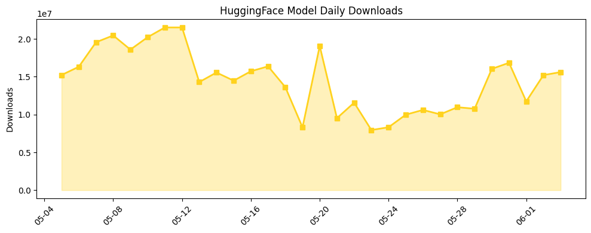

## 今日AI结构性变化
> Anthropic 获得 650 亿美元融资，估值近 1 万亿美元，AI 行业资本信号强烈，技术层面上 LLMs 的能力边界继续被推进。
今天最值得注意的结构性变化是 Anthropic 获得 650 亿美元融资，估值近 1 万亿美元，这意味着 AI 行业的资本信号强烈，技术层面上 LLMs 的能力边界继续被推进。同时，技术层面上新的范式如 Geometry-Aware Tabular Diffusion 和 ReLoRA 等的提出，也表明了 AI 技术的持续进步。
- 📈 持续趋势：LLMs 的能力边界被进一步推进，例如 Visual Graph Scaffolds 和 AURA 等新技术的提出。
- 🆕 新兴方向：新的范式如 Geometry-Aware Tabular Diffusion 和 ReLoRA 等的提出。
- 🔺 突然升温：Anthropic 获得 650 亿美元融资，估值近 1 万亿美元。
- 🔑 新关键词：LLMs，技术进步，行业趋势。
- 📉 消退关键词：Cerebras，TechCrunch，伦理，医疗，推理成本，教育，机器学习，芯片。

## 技术层信号
🔴 重大突破

模型能力边界如何推进？有何新范式？技术层面上 LLMs 的能力边界继续被推进，例如 [Visual Graph Scaffolds](https://arxiv.org/abs/2606.02673) 和 [AURA](https://arxiv.org/abs/2606.02775) 等新技术的提出。新的范式如 [Geometry-Aware Tabular Diffusion](https://arxiv.org/abs/2606.02802) 和 ReLoRA 等的提出，也表明了 AI 技术的持续进步。

## 产业资本信号
🔴 强信号

Anthropic 获得 650 亿美元融资，估值近 1 万亿美元，这意味着 AI 行业的资本信号强烈。同时，[Google 和 Anthropic 的合作](https://news.crunchbase.com/ai/anthropic-nears-1t-valuation-65b-seriesh/) 也表明了大厂战略动向。

## 潜在拐点判断
Anthropic 获得 650 亿美元融资，估值近 1 万亿美元，意味着 AI 行业的资本信号强烈，这可能是一个拐点，表明 AI 行业的发展进入了一个新的阶段。

## 明日观察点
1. Anthropic 获得 650 亿美元融资的后续影响。
2. LLMs 的能力边界如何继续被推进。
3. 新的范式如 Geometry-Aware Tabular Diffusion 和 ReLoRA 等的发展。

## 长期趋势坐标
从月/季视角来看，AI 行业的发展趋势强烈，技术层面上 LLMs 的能力边界继续被推进，新的范式如 Geometry-Aware Tabular Diffusion 和 ReLoRA 等的提出，也表明了 AI 技术的持续进步。同时，[overall_novelty](https://arxiv.org/abs/2606.02673) 和 [keyword_trends](https://news.crunchbase.com/ai/anthropic-nears-1t-valuation-65b-seriesh/) 也表明了 AI 行业的发展趋势。

## 数据洞察
### arXiv 摘要对比 — 模型能力提升曲线
今日 arXiv 有 45 篇论文，capability_score 为 0.009，mean_similarity 为 0.991，trend 为延续。
### GitHub Star 增速分析
今日 GitHub 有 10 个仓库，total_stars_today 为 7922，repo_count 为 10，top_growth 为 [Open-LLM-VTuber/Open-LLM-VTuber](https://github.com/Open-LLM-VTuber/Open-LLM-VTuber)。
### HuggingFace 模型下载量变化
今日 HuggingFace 有 20 个模型，total_downloads 为 15608704，model_count 为 20，top_downloads 为 [deepseek-ai/DeepSeek-V4-Pro](https://huggingface.co/deepseek-ai/DeepSeek-V4-Pro)。
### 趋势图

## 参考来源
- [Visual Graph Scaffolds for Structural Reasoning in Large Language Models](https://arxiv.org/abs/2606.02673) — arXiv
- [AURA: Action-Gated Memory for Robot Policies at Constant VRAM](https://arxiv.org/abs/2606.02775) — arXiv
- [Anthropic Nears $1T Valuation And Leapfrogs OpenAI On Unicorn Board With Massive Funding Round](https://news.crunchbase.com/ai/anthropic-nears-1t-valuation-65b-seriesh/) — Crunchbase News
- [ChatHealthAI: Aligning Electronic Health Record Representations with Large Language Models for Grounded Clinical Reasoning](https://arxiv.org/abs/2606.02802) — arXiv