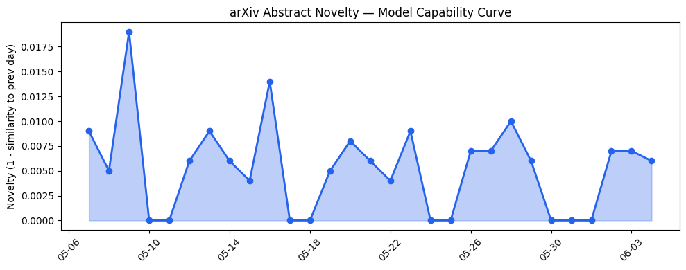
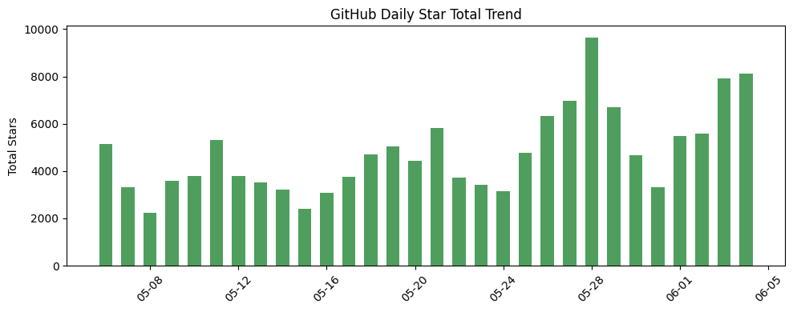
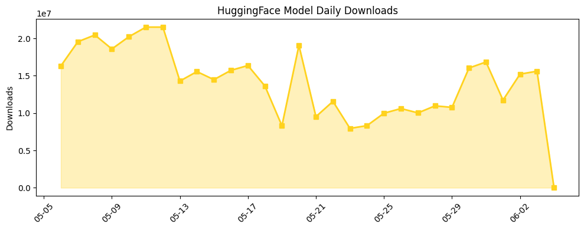

## 今日AI结构性变化
> 今日新增的AI信息显示，技术层面上有多项创新，基础设施方面有新进展，应用层面有新场景的探索，资本信号显示投资热点，风险信号显示监管和伦理问题仍需关注。
今天最值得注意的结构性变化是技术层面上的重大突破，包括新论文提出多项技术创新，如PEEL、StepPRM-RTL、LiftQuant等。同时，基础设施方面也有渐进改善，新硬件和优化算法降低推理成本。此外，应用层面有新场景的探索，AI应用于新行业，如生物技术、医疗保健等。
📈 持续趋势：技术层面上的创新和基础设施的改善。
🆕 新兴方向：AI应用于新行业，如生物技术、医疗保健等。
🔺 突然升温：监管和伦理问题引起关注。
🔑 新关键词：Airbnb、Google AI、Meta、Transformer。
📉 消退关键词：GPT-5.5、TechCrunch、伦理、医疗、推理成本、教育、芯片。

## 技术层信号
🔴 重大突破

技术层面上的创新包括新论文提出多项技术创新，如PEEL、StepPRM-RTL、LiftQuant等。同时，提出新的范式，如SMAC-Talk、VAMPS等。这些创新和新范式的提出，表明技术层面上的重大突破。例如，[Toward Pre-Deployment Assurance for Enterprise AI Agents](https://arxiv.org/abs/2606.04037) 和 [SMAC-Talk: A Natural Language Extension of the StarCraft Multi-Agent Challenge for Large Language Models](https://arxiv.org/abs/2606.04202) 这两篇论文提出了一些新的技术和范式。

## 产业资本信号
🔴 强信号

资本信号显示投资热点，估值水平上升，大厂战略投资和收购。例如，[Ahead of its IPO, Anthropic’s Daniela Amodei shrugs off doubts about AI’s returns](https://techcrunch.com/2026/06/04/ahead-of-its-ipo-anthropics-daniela-amodei-shrugs-off-doubts-about-ais-returns/) 这篇文章显示 Anthropic 的 IPO 前，投资者对 AI 的回报率有所担忧，但公司仍然对自己的技术和商业模式有信心。同时，[Meta steals a tactic from Tesla and builds data centers in tents](https://techcrunch.com/2026/06/04/meta-steals-a-tactic-from-tesla-and-builds-data-centers-in-tents/) 这篇文章显示 Meta 公司正在采用新的数据中心建设方式，降低成本和提高效率。

## 潜在拐点判断
根据趋势对比报告和今日结构分析，技术层面上的创新和基础设施的改善可能会带来新的应用场景和商业模式的出现。同时，监管和伦理问题的关注可能会导致新的监管政策和行业标准的出现。

## 明日观察点
1. 监督和伦理问题的发展。
2. 技术层面上的创新和新范式的提出。
3. 基础设施的改善和新硬件的出现。

## 长期趋势坐标
根据 overall_novelty 和 keyword_trends，可以看出技术层面上的创新和基础设施的改善是长期趋势的重要组成部分。同时，监管和伦理问题的关注也将是长期趋势的重要组成部分。

## 数据洞察
### arXiv 摘要对比 — 模型能力提升曲线
今日暂无数据。

### GitHub Star 增速分析
GitHub Star 增速分析显示，[HKUDS/Vibe-Trading](https://github.com/HKUDS/Vibe-Trading) 仓库的 star 数量增长最快，达到 3.009 倍。

### HuggingFace 模型下载量变化
今日无 HuggingFace 数据。

### 趋势图

## 参考来源
- [Toward Pre-Deployment Assurance for Enterprise AI Agents](https://arxiv.org/abs/2606.04037) — arXiv
- [SMAC-Talk: A Natural Language Extension of the StarCraft Multi-Agent Challenge for Large Language Models](https://arxiv.org/abs/2606.04202) — arXiv
- [Ahead of its IPO, Anthropic’s Daniela Amodei shrugs off doubts about AI’s returns](https://techcrunch.com/2026/06/04/ahead-of-its-ipo-anthropics-daniela-amodei-shrugs-off-doubts-about-ais-returns/) — TechCrunch
- [Meta steals a tactic from Tesla and builds data centers in tents](https://techcrunch.com/2026/06/04/meta-steals-a-tactic-from-tesla-and-builds-data-centers-in-tents/) — TechCrunch
- [Biodefense in the Intelligence Age](https://openai.com/index/biodefense-in-the-intelligence-age) — OpenAI Blog
- [How Endava is redesigning software delivery around AI agents](https://openai.com/index/endava-frontiers) — OpenAI Blog