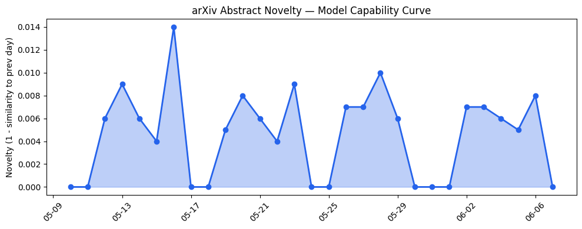
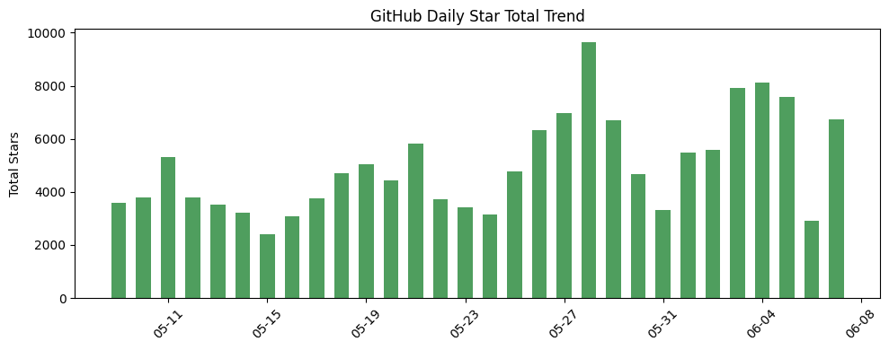
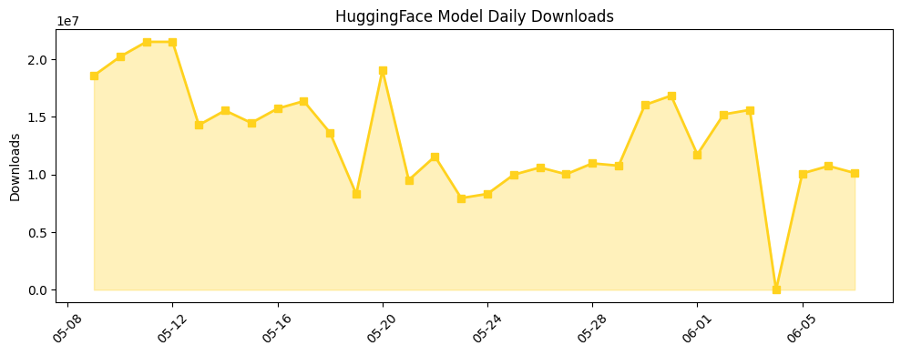

## 今日AI结构性变化
> 今日开源生态中，TurboVec 和 KaliGPT 等项目引起了广泛关注，同时资本市场预计大型 AI 公司即将上市，引发了 Tokenpocalypse 的讨论。
今日最值得注意的结构性变化是开源生态中的项目 TurboVec 和 KaliGPT 的兴起，这意味着 AI 技术的进步和应用层面的创新。同时，资本市场对大型 AI 公司上市的预期也引发了 Tokenpocalypse 的讨论，这意味着 AI 行业可能面临新的挑战和机遇。
信号列表：
- 📈 持续趋势：开源生态中的项目 TurboVec 和 KaliGPT 的兴起。
- 🆕 新兴方向：Tokenpocalypse 的讨论。
- 🔺 突然升温：资本市场对大型 AI 公司上市的预期。
- 🔑 新关键词：TurboVec、KaliGPT、Tokenpocalypse。
- 📉 消退关键词：无。

## 技术层信号
🔴 渐进改善

模型能力边界如何推进？有何新范式？开源项目 TurboVec 和 KaliGPT 展示了对现有技术的改进和扩展，但无明显新范式。项目如 Memanto 和 500-AI-Agents-Projects 展示了 AI 应用的多样性。
更多信息见 [RyanCodrai / turbovec](https://github.com/RyanCodrai/turbovec) 和 [SudoHopeX / KaliGPT](https://github.com/SudoHopeX/KaliGPT)。

## 产业资本信号
🟡 中等信号

资本市场预计大型 AI 公司即将上市，可能引发 Tokenpocalypse。这意味着 AI 行业可能面临新的挑战和机遇。OpenAI 正在开发超级应用，这可能是 AI 行业的一个新方向。
更多信息见 [Is this the dawn of the Tokenpocalypse?](https://techcrunch.com/2026/06/07/is-this-the-dawn-of-the-tokenpocalypse/) 和 [OpenAI is still working on that ‘super app’](https://techcrunch.com/2026/06/07/openai-is-still-working-on-that-super-app/)。

## 潜在拐点判断
今日的结构性变化和趋势信号表明，AI 行业可能面临新的挑战和机遇。Tokenpocalypse 的讨论和 OpenAI 的超级应用开发可能是 AI 行业的一个新方向。

## 明日观察点
1. 开源生态中的项目 TurboVec 和 KaliGPT 的发展。
2. 资本市场对大型 AI 公司上市的预期。
3. Tokenpocalypse 的讨论和影响。

## 长期趋势坐标
从月/季视角来看，AI 行业的发展趋势仍然是向前推进的。开源生态中的项目和资本市场的预期都表明，AI 行业可能面临新的挑战和机遇。

## 数据洞察
### arXiv 摘要对比 — 模型能力提升曲线
今日无 arXiv 摘要数据。
### GitHub Star 增速分析
GitHub 今日总星数为 6717，共有 14 个仓库。增长最快的仓库是 [roboflow/supervision](https://github.com/roboflow/supervision)。
### HuggingFace 模型下载量变化
HuggingFace 今日总下载量为 10130525，共有 20 个模型。下载量最大的模型是 [deepseek-ai/DeepSeek-V4-Pro](https://huggingface.co/deepseek-ai/DeepSeek-V4-Pro)。
### 趋势图

## 参考来源
- [RyanCodrai / turbovec](https://github.com/RyanCodrai/turbovec) — GitHub
- [SudoHopeX / KaliGPT](https://github.com/SudoHopeX/KaliGPT) — GitHub
- [Is this the dawn of the Tokenpocalypse?](https://techcrunch.com/2026/06/07/is-this-the-dawn-of-the-tokenpocalypse/) — TechCrunch
- [OpenAI is still working on that ‘super app’](https://techcrunch.com/2026/06/07/openai-is-still-working-on-that-super-app/) — TechCrunch