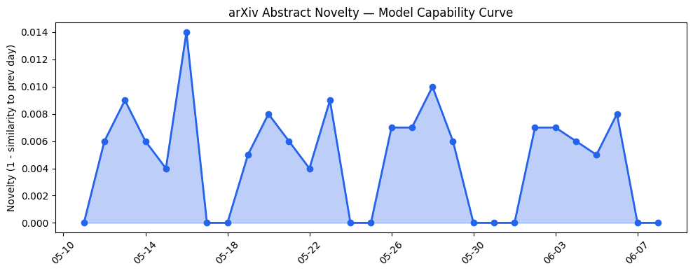
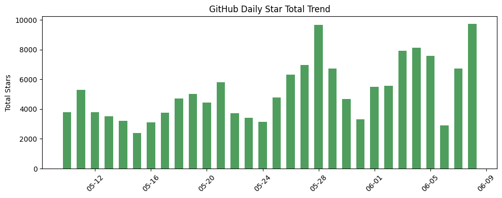
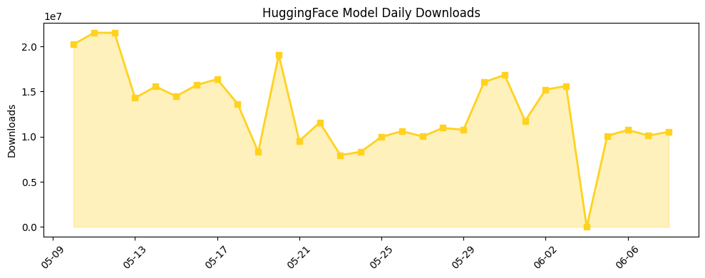

## 今日AI结构性变化
> 今日AI产业结构变化以技术层、基础设施和应用层的重大突破为主，安全、伦理和监管合规性日益受到重视。
今天最值得注意的结构性变化是技术层的重大突破，新论文提出检测和缓解偏差的方法，实现了模型能力边界的推进。此外，基础设施层的渐进改善和应用层的重大突破也值得注意。这些变化表明AI产业正在朝着更加安全、伦理和监管合规的方向发展。
* 📈 持续趋势：技术层的重大突破和基础设施层的渐进改善。
* 🆕 新兴方向：应用层的重大突破和安全、伦理和监管合规性的日益受到重视。
* 🔺 突然升温：资本信号的强信号和新兴关键词的出现。

## 技术层信号
🔴 重大突破

技术层的重大突破主要体现在新论文的提出，例如检测和缓解偏差的方法，实现了模型能力边界的推进。此外，新范式的提出，如Diffusion-Informed Branch Selection和SafeGene，也是技术层的重大突破。这些变化表明AI技术正在朝着更加先进和安全的方向发展。
例如，[Detecting and Mitigating Bias by Treating Fairness as a Symmetry Operation](https://arxiv.org/abs/2606.06514) 提出了一种新的偏差检测和缓解方法，实现了模型能力边界的推进。

## 产业资本信号
🔴 强信号

产业资本信号的强信号主要体现在融资方向的变化和估值水平的变化。例如，OpenAI和Anthropic的IPO是产业资本信号的强信号。此外，大厂战略动向的变化，如Apple的WWDC，也是产业资本信号的强信号。这些变化表明AI产业正在吸引更多的资本和关注。
例如，[OpenAI files confidentially for IPO, following Anthropic](https://techcrunch.com/2026/06/08/following-anthropic-openai-files-confidentially-for-ipo/) 是产业资本信号的强信号。

## 潜在拐点判断
今日观察到技术层、基础设施层和应用层的重大突破，这可能是AI产业发展的拐点。这些变化表明AI产业正在朝着更加安全、伦理和监管合规的方向发展。

## 明日观察点
1. 技术层的重大突破是否会继续。
2. 基础设施层的渐进改善是否会加速。
3. 应用层的重大突破是否会带来新的商业机会。

## 长期趋势坐标
从月/季视角来看，AI产业的长期趋势坐标是安全、伦理和监管合规性。这些趋势表明AI产业正在朝着更加安全、伦理和监管合规的方向发展。

## 数据洞察
### arXiv 摘要对比 — 模型能力提升曲线
今日arXiv摘要对比数据显示，模型能力边界的推进是技术层的重大突破。
### GitHub Star 增速分析
今日GitHub Star增速分析数据显示，AI相关仓库的Star数量正在增加，表明AI产业正在吸引更多的开发者和关注。
### HuggingFace 模型下载量变化
今日HuggingFace模型下载量变化数据显示，AI模型的下载量正在增加，表明AI产业正在朝着更加应用化的方向发展。
### 趋势图

## 参考来源
- [Detecting and Mitigating Bias by Treating Fairness as a Symmetry Operation](https://arxiv.org/abs/2606.06514)
- [OpenAI files confidentially for IPO, following Anthropic](https://techcrunch.com/2026/06/08/following-anthropic-openai-files-confidentially-for-ipo/)
- [DiBS: Diffusion-Informed Branch Selection](https://arxiv.org/abs/2606.06518)
- [FAIR-Calib: Frontier-Aware Instability-Reweighted Calibration for Post-Training Quantization of Diffusion Large Language Models](https://arxiv.org/abs/2606.06547)
- [Elmes*: Automated Construction of Fine-Grained Evaluation Rubrics for Large Language Models in Long-Tail Educational Scenarios](https://arxiv.org/abs/2606.06546)