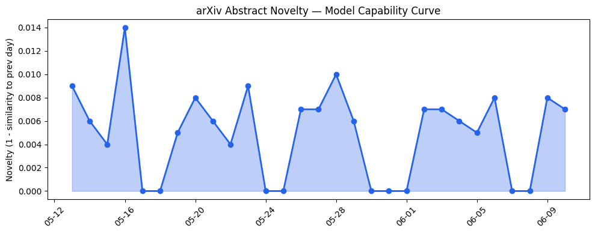
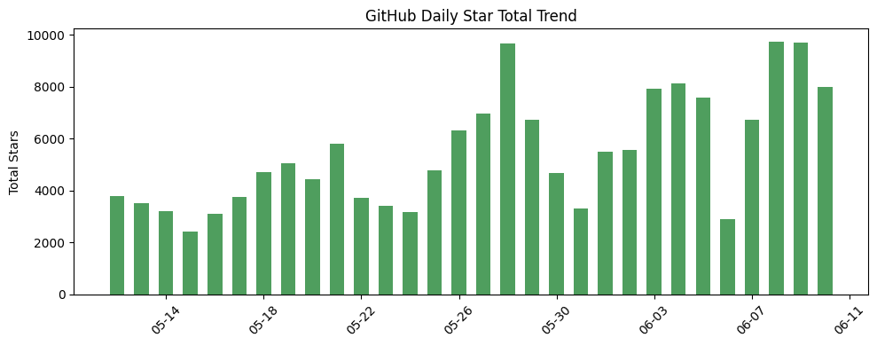
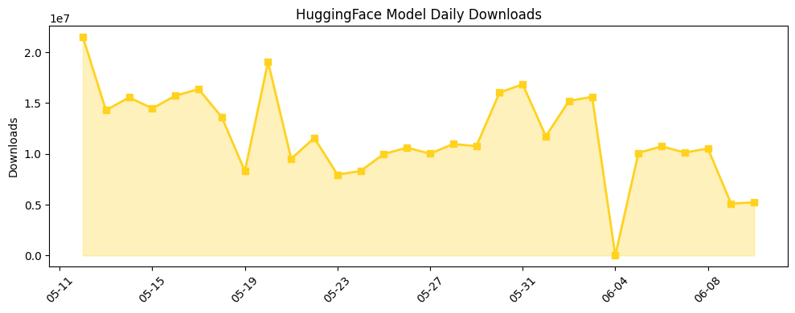

## 今日AI结构性变化
> 今日新增的AI信息表明，技术层面上有多项重要突破，包括新型LLM模型、多模态学习和推理策略的创新；基础设施层面上，推理成本和芯片/算力趋势继续优化；应用层面上，AI进入了新的行业和场景；资本层面上，融资方向和估值水平有所变化；风险层面上，监管/立法和伦理/安全问题引起关注。
今天最值得注意的结构性变化是技术层面的重大突破，包括新型LLM模型和多模态学习能力的提升，这些变化将对AI产业产生深远影响。同时，基础设施层面的渐进改善也为AI的发展提供了坚实的基础。应用层面的重大突破表明AI已经开始进入新的行业和场景，这将带来新的商业机会和挑战。资本层面的强信号表明投资者对AI的兴趣和信心仍然高涨，但风险层面的强信号也提醒我们需要关注监管/立法和伦理/安全问题。
📈 持续趋势：技术层面的创新和基础设施的改善。
🆕 新兴方向：多模态学习和推理策略的应用。
🔺 突然升温：监管/立法和伦理/安全问题的关注。
🔑 新关键词：LLM、多模态学习、推理策略、监管/立法、伦理/安全。
📉 消退关键词：AI安全、ChatGPT、GPT-5.5、HuggingFace、TechCrunch、伦理、医疗、推理成本、教育、数据中心。

## 技术层信号
🔴 重大突破

技术层面的重大突破包括新型LLM模型和多模态学习能力的提升，这些变化将对AI产业产生深远影响。新型LLM模型如 [Business World Model](https://arxiv.org/abs/2606.10044) 和 [From Senses to Decisions: The Information Flow of Auditory and Visual Perception in Multimodal LLMs](https://arxiv.org/abs/2606.10147) 表明了AI在处理复杂任务和多模态数据方面的能力。同时，推理策略和模型架构的创新也为AI的发展提供了新的方向。

## 产业资本信号
🔴 强信号

资本层面的强信号表明投资者对AI的兴趣和信心仍然高涨。融资方向和估值水平的变化表明投资者正在寻找新的机会和增长点。如 [Jedify](https://techcrunch.com/2026/06/10/jedify-raises-24m-to-help-companies-arm-ai-agents-with-context-on-their-business/) 获得2400万美元的融资，表明投资者对AI在企业中的应用的兴趣。

## 潜在拐点判断
今日的结构性变化可能标志着AI产业的一个重要拐点。技术层面的重大突破和基础设施的改善为AI的发展提供了坚实的基础，而应用层面的重大突破和资本层面的强信号则表明AI已经开始进入新的行业和场景。然而，风险层面的强信号也提醒我们需要关注监管/立法和伦理/安全问题，以确保AI的发展是可持续和负责任的。

## 明日观察点
1. 技术层面的创新是否会继续推动AI的发展。
2. 基础设施的改善是否会带来更好的性能和效率。
3. 应用层面的重大突破是否会带来新的商业机会和挑战。

## 长期趋势坐标
从月/季视角来看，AI产业的发展趋势仍然是向上的。技术层面的创新和基础设施的改善为AI的发展提供了坚实的基础，而应用层面的重大突破和资本层面的强信号则表明AI已经开始进入新的行业和场景。然而，风险层面的强信号也提醒我们需要关注监管/立法和伦理/安全问题，以确保AI的发展是可持续和负责任的。

## 数据洞察
### arXiv 摘要对比 — 模型能力提升曲线
今日的arXiv摘要对比数据表明，模型能力提升曲线仍然是向上的。新型LLM模型和多模态学习能力的提升为AI的发展提供了新的方向。
### GitHub Star 增速分析
GitHub Star增速分析数据表明，AI相关的仓库仍然是最受欢迎的。如 [maziyarpanahi/openmed](https://github.com/maziyarpanahi/openmed) 和 [alistaitsacle/free-llm-api-keys](https://github.com/alistaitsacle/free-llm-api-keys) 等仓库的Star数量迅速增加。
### HuggingFace 模型下载量变化
HuggingFace模型下载量变化数据表明，AI模型的下载量仍然是非常高的。如 [HauhauCS/Qwen3.6-35B-A3B-Uncensored-HauhauCS-Aggressive](https://huggingface.co/HauhauCS/Qwen3.6-35B-A3B-Uncensored-HauhauCS-Aggressive) 等模型的下载量迅速增加。
### 趋势图

## 参考来源
- [Business World Model](https://arxiv.org/abs/2606.10044) — arXiv
- [From Senses to Decisions: The Information Flow of Auditory and Visual Perception in Multimodal LLMs](https://arxiv.org/abs/2606.10147) — arXiv
- [Jedify](https://techcrunch.com/2026/06/10/jedify-raises-24m-to-help-companies-arm-ai-agents-with-context-on-their-business/) — TechCrunch
- [maziyarpanahi/openmed](https://github.com/maziyarpanahi/openmed) — GitHub
- [alistaitsacle/free-llm-api-keys](https://github.com/alistaitsacle/free-llm-api-keys) — GitHub
- [HauhauCS/Qwen3.6-35B-A3B-Uncensored-HauhauCS-Aggressive](https://huggingface.co/HauhauCS/Qwen3.6-35B-A3B-Uncensored-HauhauCS-Aggressive) — HuggingFace