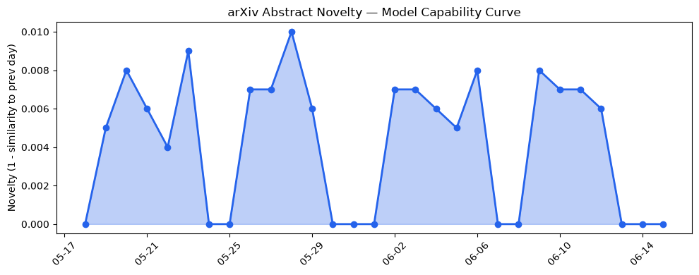
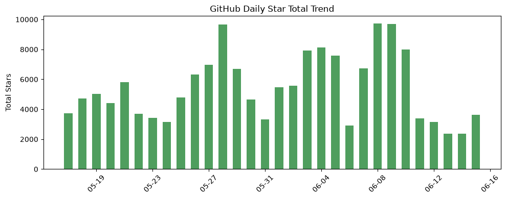
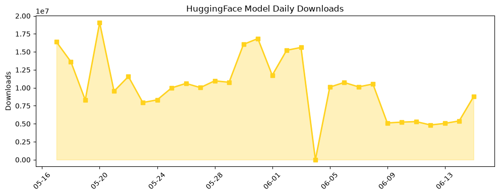

## 今日AI结构性变化
> 今日新增的AI信息显示，技术层面上有多个新论文发布，基础设施层面上有新硬件发布，应用层面上有新行业和新场景的应用，资本层面上有多笔投资和收购，风险层面上有监管和安全问题的讨论。
今天最值得注意的结构性变化是技术层面的重大突破，包括多个新论文的发布，如 [A Deep Reinforcement Learning (DRL)-Based Transformer Method for Solving the Open Shop Scheduling Problem](https://arxiv.org/abs/2606.13682) 和 [UP-NRPA: User Portrait based Nested Rollout Policy Adaptation for Planning with Large Language Models in Goal-oriented Dialogue Systems](https://arxiv.org/abs/2606.13683)。这些变化表明AI技术的快速发展和应用的扩展。
另外，趋势报告中显示，资本信号和风险信号的话题向量在最近8天内呈现持续增强趋势，表明这些方向正在持续升温。

## 技术层信号
🔴 重大突破

技术层面上的变化包括多个新论文的发布，如 [A Deep Reinforcement Learning (DRL)-Based Transformer Method for Solving the Open Shop Scheduling Problem](https://arxiv.org/abs/2606.13682) 和 [UP-NRPA: User Portrait based Nested Rollout Policy Adaptation for Planning with Large Language Models in Goal-oriented Dialogue Systems](https://arxiv.org/abs/2606.13683)。这些论文表明AI技术的快速发展和应用的扩展。另外，基础设施层面上的变化包括新硬件的发布，如 [Efficient On-Device Diffusion LLM Inference with Mobile NPU](https://arxiv.org/abs/2606.13740)。

## 产业资本信号
🔴 强信号

资本层面上的变化包括多笔投资和收购，如 [Salesforce收购Fin](https://techcrunch.com/2026/06/15/salesforce-acquires-ai-customer-service-platform-fin-for-3-6b/) 和 [Sarvam的$234 million funding round](https://techcrunch.com/2026/06/15/sarvam-becomes-indias-newest-ai-unicorn-with-234-million-funding-round-led-by-hcltech/)。这些变化表明AI产业的快速发展和资本的流入。

## 潜在拐点判断
根据趋势报告和数据洞察，潜在拐点包括技术层面的重大突破和资本层面的强信号。这些变化可能会导致AI产业的快速发展和应用的扩展。

## 明日观察点
1. 技术层面的新论文发布和基础设施层面的新硬件发布。
2. 资本层面的投资和收购。
3. 应用层面的新行业和新场景的应用。

## 长期趋势坐标
根据趋势报告和数据洞察，长期趋势坐标包括技术层面的快速发展和应用的扩展，资本层面的流入和产业的快速发展。

## 数据洞察
### arXiv 摘要对比 — 模型能力提升曲线
今日暂无数据。

### GitHub Star 增速分析
今日暂无数据。

### HuggingFace 模型下载量变化
今日暂无数据。

### 趋势图

## 参考来源
- [A Deep Reinforcement Learning (DRL)-Based Transformer Method for Solving the Open Shop Scheduling Problem](https://arxiv.org/abs/2606.13682)
- [UP-NRPA: User Portrait based Nested Rollout Policy Adaptation for Planning with Large Language Models in Goal-oriented Dialogue Systems](https://arxiv.org/abs/2606.13683)
- [Salesforce收购Fin](https://techcrunch.com/2026/06/15/salesforce-acquires-ai-customer-service-platform-fin-for-3-6b/)
- [Sarvam的$234 million funding round](https://techcrunch.com/2026/06/15/sarvam-becomes-indias-newest-ai-unicorn-with-234-million-funding-round-led-by-hcltech/)