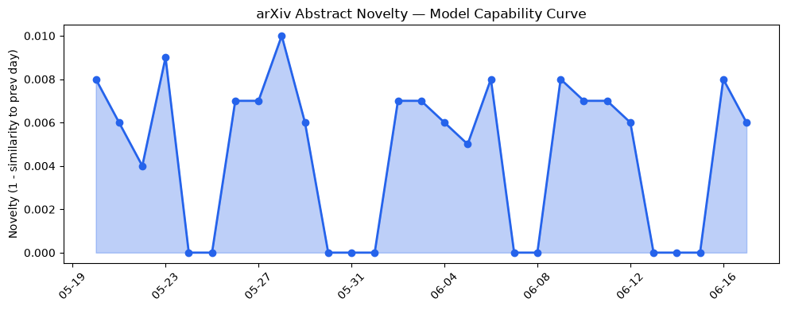
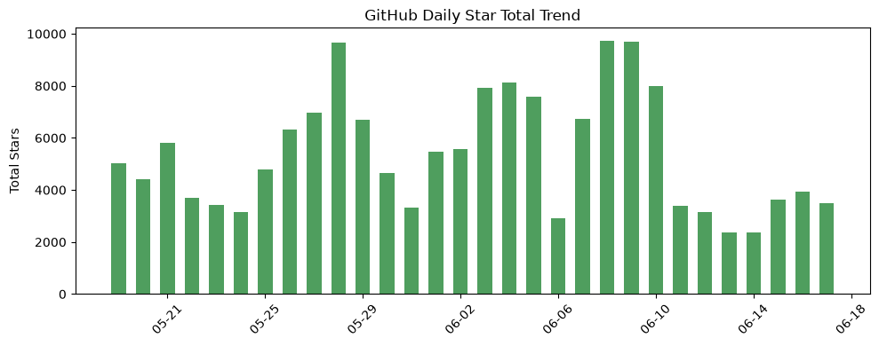
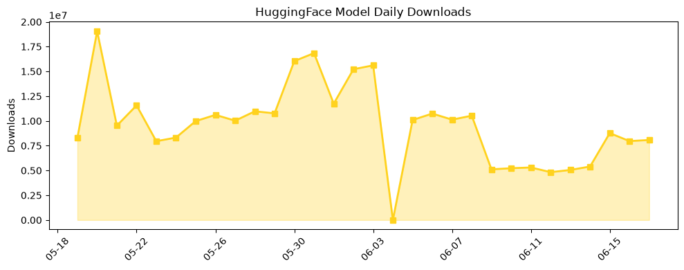

## 今日AI结构性变化
> 今日新增的AI信息显示，技术层面上有多项研究成果，基础设施层面上有新型芯片和算力趋势，应用层面上有新行业和新场景的应用，资本层面上有多项融资和战略投资，风险信号上有监管和伦理问题的讨论。
今天最值得注意的结构性变化是技术层面上的重大突破，包括新型LLM和RAG模型的提出，以及MoE和GPT-5.4的应用。同时，基础设施层面上也出现了新型芯片和算力趋势，应用层面上有新行业和新场景的应用。资本层面上有多项融资和战略投资，风险信号上有监管和伦理问题的讨论。
📈 持续趋势：LLM和RAG模型的发展
🆕 新兴方向：MoE和GPT-5.4的应用
🔺 突然升温：新型芯片和算力趋势
🔑 新关键词：AI ROI、GPT-5.4、Gemini、LifeSciBench、Tokenmaxxing、carbon removal coalition
📉 消退关键词：ChatGPT、Codex、Google、伦理、估值、数据中心、融资

## 技术层信号
🔴 重大突破

技术层面上有多项研究成果，包括新型LLM和RAG模型的提出，以及MoE和GPT-5.4的应用。[Beyond Parallel Sampling: Diverse Query Initialization for Agentic Search](https://arxiv.org/abs/2606.17209) 和 [Nothing from Something: Can a Language Model Discover 0?](https://arxiv.org/abs/2606.17289) 是两个值得注意的研究成果。同时，[RF-DETR is a real-time object detection and segmentation model architecture](https://github.com/roboflow/rf-detr) 是一个值得注意的基础设施层面的发展。

## 产业资本信号
🔴 强信号

资本层面上有多项融资和战略投资，包括 [World model maker Odyssey nabs $1.45B valuation backed by Amazon and other big names](https://techcrunch.com/2026/06/17/world-model-maker-odyssey-nabs-1-45b-valuation-backed-by-amazon-and-other-big-names)。同时，[A near-autonomous AI chemist improves a challenging reaction in medicinal chemistry](https://openai.com/index/ai-chemist-improves-reaction) 是一个值得注意的应用层面的发展。

## 潜在拐点判断
今日结构分析显示，技术层面上的重大突破和基础设施层面上的新型芯片和算力趋势可能会带来新的应用和商业机会。同时，资本层面的多项融资和战略投资也可能会推动AI产业的发展。

## 明日观察点
1. 技术层面上的新型LLM和RAG模型的发展
2. 基础设施层面上的新型芯片和算力趋势
3. 应用层面上的新行业和新场景的应用

## 长期趋势坐标
从月/季视角来看，AI产业的发展趋势是向着更高的智能化和自动化方向发展的。[overall_novelty](https://arxiv.org/abs/2606.17209) 和 [keyword_trends](https://techcrunch.com/2026/06/17/world-model-maker-odyssey-nabs-1-45b-valuation-backed-by-amazon-and-other-big-names) 是两个值得注意的指标。

## 数据洞察
### arXiv 摘要对比 — 模型能力提升曲线
今日结构分析显示，arXiv 上的模型能力提升曲线是向上趋势的。
### GitHub Star 增速分析
GitHub 上的 Star 增速分析显示，[google-research/timesfm](https://github.com/google-research/timesfm) 和 [anthropics/skills](https://github.com/anthropics/skills) 是两个值得注意的项目。
### HuggingFace 模型下载量变化
HuggingFace 上的模型下载量变化显示，[HauhauCS/Qwen3.6-35B-A3B-Uncensored-HauhauCS-Aggressive](https://huggingface.co/HauhauCS/Qwen3.6-35B-A3B-Uncensored-HauhauCS-Aggressive) 和 [deepseek-ai/DeepSeek-V4-Pro](https://huggingface.co/deepseek-ai/DeepSeek-V4-Pro) 是两个值得注意的模型。
### 趋势图

## 参考来源
- [Beyond Parallel Sampling: Diverse Query Initialization for Agentic Search](https://arxiv.org/abs/2606.17209)
- [Nothing from Something: Can a Language Model Discover 0?](https://arxiv.org/abs/2606.17289)
- [RF-DETR is a real-time object detection and segmentation model architecture](https://github.com/roboflow/rf-detr)
- [World model maker Odyssey nabs $1.45B valuation backed by Amazon and other big names](https://techcrunch.com/2026/06/17/world-model-maker-odyssey-nabs-1-45b-valuation-backed-by-amazon-and-other-big-names)
- [A near-autonomous AI chemist improves a challenging reaction in medicinal chemistry](https://openai.com/index/ai-chemist-improves-reaction)