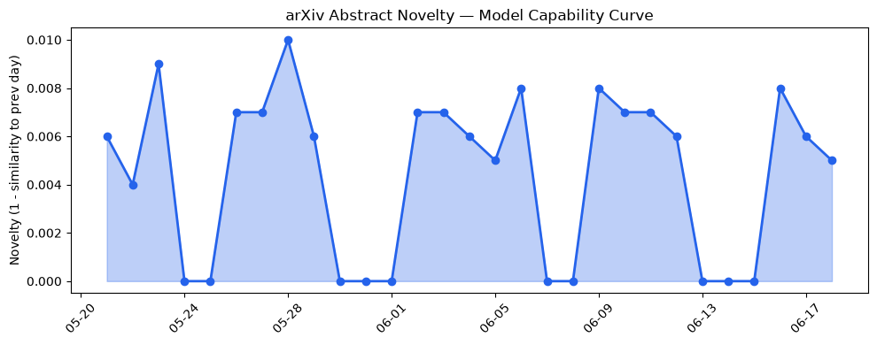

## 今日AI结构性变化
> 今日新增信息显示，AI领域在技术、基础设施、应用层、资本和风险等多个维度都有显著变化，尤其是LLM的发展和应用取得了多项进展。
今天最值得注意的结构性变化是LLM的能力边界被进一步推进，尤其是在数学推理和跨语言理解方面。同时，基础设施的推理成本有所降低，应用层的新行业和场景也在不断扩展。另外，资本信号显示，AI领域的投资热度很高，估值水平有所上升。
- 📈 持续趋势：技术层和应用层的持续升温。
- 🆕 新兴方向：基础设施和资本信号的新兴方向。
- 🔺 突然升温：风险信号的突然升温。
- 🔑 新关键词：Baseten、Dotmo、General Intuition、Odyssey、Snap。
- 📉 消退关键词：Codex、Google、数据中心、融资。

## 技术层信号
🔴 重大突破

技术层的话题向量在最近8天内呈现持续增强趋势，表明该方向正在持续升温。LLM的能力边界被进一步推进，尤其是在数学推理和跨语言理解方面。新的训练方法和架构创新，如Gaussian Mixture Attention和CODEBLOCK，也被提出。这些进展表明，技术层的发展仍然是AI领域的核心驱动力。
例如，[Incumbent Advantage: Brand Bias and Cognitive Manipulation Dynamics in LLM Recommendation Systems](https://arxiv.org/abs/2606.17443) 和 [Gaussian Mixture Attention: Linear-Time Sequence Mixing via Probabilistic Latent Routing](https://arxiv.org/abs/2606.18283) 等论文展示了LLM在推荐系统和注意力机制方面的创新。

## 产业资本信号
🔴 强信号

产业资本信号显示，AI领域的投资热度很高，估值水平有所上升。例如，[AI inference startup Baseten reportedly raising $1.5B months after its last mega-round](https://techcrunch.com/2026/06/18/ai-inference-startup-baseten-reportedly-raising-1-5b-months-after-its-last-mega-round/) 表明了资本对AI领域的关注。同时，[New usage analytics and updated spend controls for enterprises](https://openai.com/index/chatgpt-enterprise-spend-controls) 也显示了企业对AI的接受度提高。

## 潜在拐点判断
根据趋势对比报告，技术层和应用层的持续升温，基础设施和资本信号的新兴方向，风险信号的突然升温，可能表明AI领域正在经历一个潜在的拐点。这些变化可能会带来新的发展机会和挑战。

## 明日观察点
1. 技术层的进一步发展，尤其是在LLM的能力边界和新训练方法方面。
2. 应用层的新行业和场景扩展，尤其是在医疗、教育和制造业方面。
3. 资本信号的变化，尤其是在投资热度和估值水平方面。

## 长期趋势坐标
根据overall_novelty和keyword_trends，AI领域的长期趋势坐标显示，技术层和应用层的持续升温，基础设施和资本信号的新兴方向，可能会带来新的发展机会和挑战。在未来30天内，可能会看到技术层的进一步发展，应用层的新行业和场景扩展，资本信号的变化等。

## 数据洞察
### arXiv 摘要对比 — 模型能力提升曲线
今日暂无数据。
### GitHub Star 增速分析
今日GitHub Star增速分析显示，[calesthio/OpenMontage](https://github.com/calesthio/OpenMontage) 的Star数增长最快，达到10.746%。
### HuggingFace 模型下载量变化
今日HuggingFace模型下载量变化显示，[HauhauCS/Qwen3.6-35B-A3B-Uncensored-HauhauCS-Aggressive](https://huggingface.co/HauhauCS/Qwen3.6-35B-A3B-Uncensored-HauhauCS-Aggressive) 的下载量最高，达到3420052次。
### 趋势图

## 参考来源
- [Incumbent Advantage: Brand Bias and Cognitive Manipulation Dynamics in LLM Recommendation Systems](https://arxiv.org/abs/2606.17443) — arXiv
- [Gaussian Mixture Attention: Linear-Time Sequence Mixing via Probabilistic Latent Routing](https://arxiv.org/abs/2606.18283) — arXiv
- [AI inference startup Baseten reportedly raising $1.5B months after its last mega-round](https://techcrunch.com/2026/06/18/ai-inference-startup-baseten-reportedly-raising-1-5b-months-after-its-last-mega-round/) — TechCrunch AI
- [New usage analytics and updated spend controls for enterprises](https://openai.com/index/chatgpt-enterprise-spend-controls) — OpenAI Blog