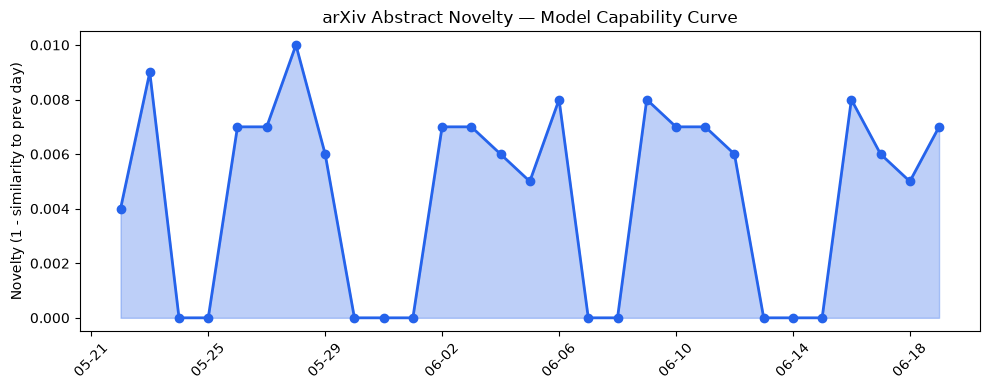
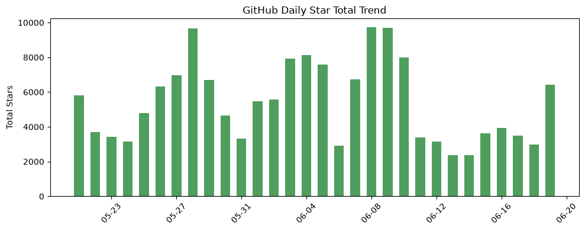
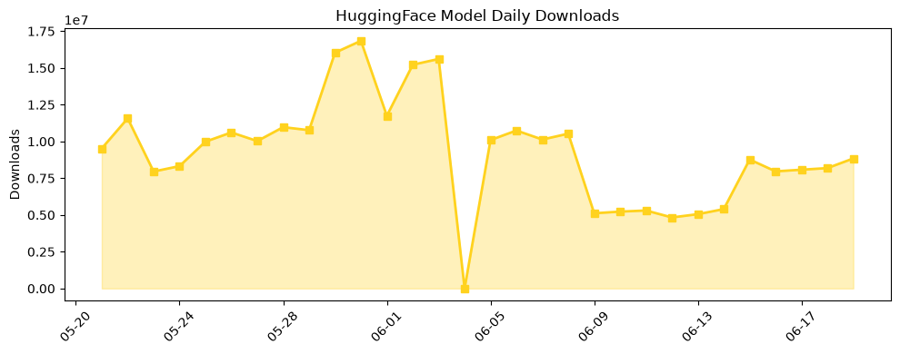

## 今日AI结构性变化
> 今日新增的 AI 信息显示，技术层面上有多项研究推进了大语言模型的能力边界和新范式，基础设施层面上有新的高效推理方案和芯片趋势，应用层面上 AI 进入了新行业和新场景，资本信号上有融资方向和估值变化，风险信号上有监管和伦理争议。
今天最值得注意的结构性变化是技术层面上的重大突破，包括 Diffusion Language Models 和新范式的提出，这些变化可能会对 AI 产业产生深远影响。同时，应用层面上的新兴方向和资本信号上的变化也值得关注。
* 📈 持续趋势：应用层面的 AI 进入新行业和新场景
* 🆕 新兴方向：技术层面的新范式和基础设施层面的高效推理方案
* 🔺 突然升温：资本信号上的融资方向和估值变化
* 🔑 新关键词：Diffusion Language Models、伦理争议、估值变化、芯片趋势、融资方向
* 📉 消退关键词：AI安全、Codex、Google、数据中心、融资

## 技术层信号
🔴 重大突破

技术层面上的重大突破包括多项研究推进了大语言模型的能力边界和新范式的提出，例如 [Diffusion Language Models](https://arxiv.org/abs/2606.19475) 和 [Emergent Alignment](https://arxiv.org/abs/2606.19527)。这些变化可能会对 AI 产业产生深远影响，推动 AI 技术的发展和应用。

## 产业资本信号
🔴 强信号

产业资本信号上的强信号包括融资方向和估值变化，例如 [Elastic 收购 Deductive AI](https://techcrunch.com/2026/06/18/source-elastic-agrees-to-buy-crv-backed-deductiveai-for-up-to-85m/) 和 [Reliance 将 AI 应用于每个电话、应用和家庭](https://techcrunch.com/2026/06/19/billionaire-ambani-wants-ai-in-every-call-app-and-home/)。这些变化可能会对 AI 产业的发展和应用产生重要影响，推动 AI 技术的落地和普及。

## 潜在拐点判断
根据今日的结构性变化和趋势信号，可能存在潜在的拐点，即技术层面的重大突破和应用层面的新兴方向可能会推动 AI 产业的快速发展和应用。同时，资本信号上的变化也可能会对 AI 产业的发展和应用产生重要影响。

## 明日观察点
1. 技术层面的新范式和基础设施层面的高效推理方案的发展和应用
2. 应用层面的新兴方向和资本信号上的变化的影响
3. 风险信号上的监管和伦理争议的发展和影响

## 长期趋势坐标
根据 overall_novelty 和 keyword_trends，长期趋势坐标可能包括技术层面的新范式和基础设施层面的高效推理方案的发展和应用，应用层面的新兴方向和资本信号上的变化的影响，风险信号上的监管和伦理争议的发展和影响。

## 数据洞察
### arXiv 摘要对比 — 模型能力提升曲线
今日的 arXiv 摘要对比显示，模型能力提升曲线呈现延续趋势，capability_score 为 0.009，mean_similarity 为 0.991。
### GitHub Star 增速分析
今日的 GitHub Star 增速分析显示，总 Star 数为 6426，repo_count 为 8，top_growth 为 [Lightricks/LTX-2, google-research/timesfm, chopratejas/headroom]。
### HuggingFace 模型下载量变化
今日的 HuggingFace 模型下载量变化显示，总下载量为 8842850，model_count 为 20，top_downloads 为 [HauhauCS/Qwen3.6-35B-A3B-Uncensored-HauhauCS-Aggressive, deepseek-ai/DeepSeek-V4-Pro, google/diffusiongemma-26B-A4B-it]。
### 趋势图

## 参考来源
- [Diffusion Language Models: An Experimental Analysis](https://arxiv.org/abs/2606.19475)
- [Emergent Alignment](https://arxiv.org/abs/2606.19527)
- [Pruning via Causal Attribution Preserves Reasoning Performance in Large Language Models](https://arxiv.org/abs/2606.19350)
- [The US says ASML’s top chip tool may be in China. ASML says it isn’t.](https://techcrunch.com/2026/06/19/the-us-says-asmls-top-chip-tool-may-be-in-china-asml-says-it-isnt/)
- [REVEAL++: Differentiable Phenotypic Grouping for Vision-Language Retinal Modeling of Alzheimer's Disease Risk](https://arxiv.org/abs/2606.19522)
- [‘Queer Eye’ life coach Karamo Brown launches Kē, a wellness app featuring his AI digital clone](https://techcrunch.com/2026/06/18/queer-eyes-life-coach-karamo-brown-launches-ke-a-wellness-app-featuring-his-ai-digital-clone/)
- [Source: Elastic agrees to buy CRV-backed Deductive AI for up to $85M](https://techcrunch.com/2026/06/18/source-elastic-agrees-to-buy-crv-backed-deductiveai-for-up-to-85m/)
- [Billionaire Ambani wants AI in every call, app, and home](https://techcrunch.com/2026/06/19/billionaire-ambani-wants-ai-in-every-call-app-and-home/)
- [Encryption, spyware, and now Mythos: History shows why cyber export control doesn’t work](https://techcrunch.com/2026/06/19/encryption-spyware-and-now-mythos-history-shows-why-cyber-export-control-doesnt-work/)
- [Almost half of US singles feel negatively about AI in dating, Match says](https://techcrunch.com/2026/06/18/almost-half-of-u-s-singles-feel-negatively-about-ai-in-dating-match-says/)