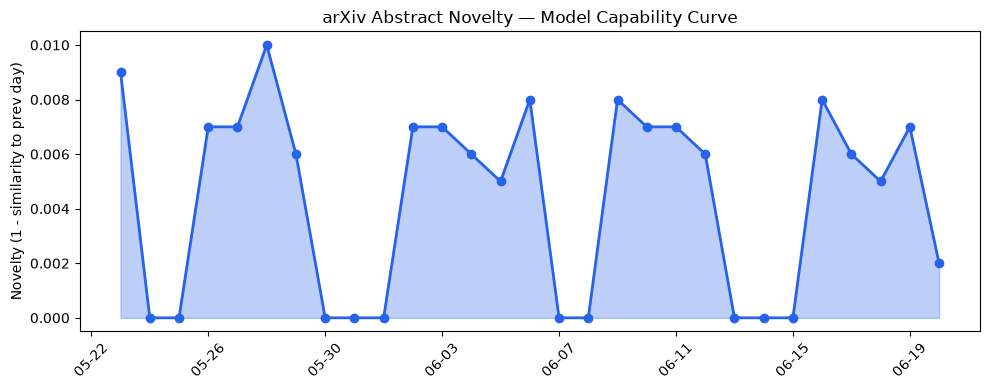

## 今日AI结构性变化
> 今日新增的AI信息显示，LLM和AI生态正在快速发展，涵盖了技术、基础设施、应用层、资本和风险等多个方面。
今日最值得注意的结构性变化是LLM和AI生态的快速发展，这意味着AI产业正在经历一次重大变革。这种变化不仅仅局限于技术层面，还涉及到基础设施、应用层、资本和风险等多个方面。同时，趋势报告中显示，应用层、技术层、基础设施和资本信号等方面都呈现出持续增强的趋势，表明这些方向正在持续升温。
- 📈 持续趋势：应用层、技术层、基础设施和资本信号等方面。
- 🆕 新兴方向：检索增强生成和大语言模型的应用。
- 🔺 突然升温：LLM和AI生态的快速发展。
- 🔑 新关键词：云计算、伦理、检索增强生成、深度学习、算力和芯片。
- 📉 消退关键词：AI安全、Codex、Google、IPO、TechCrunch、开源生态、数据中心和融资。

## 技术层信号
🔴 重大突破

模型能力边界被进一步推进，涵盖了新的模态和上下文长度。新的范式如检索增强生成和大语言模型的应用也正在兴起。例如，[Analyzing the Narration Gap in LLM-Solver Loops](https://arxiv.org/abs/2606.19588) 和 [Configurable Clinical Information Extraction with Agentic RAG](https://arxiv.org/abs/2606.19602) 等论文展示了LLM在不同领域的应用和发展。

## 产业资本信号
🔴 强信号

资本正在流向AI和LLM相关的领域，估值水平正在上升，大厂正在进行战略投资和收购。例如，[Nobel laureate John Jumper is leaving DeepMind for rival Anthropic](https://techcrunch.com/2026/06/20/nobel-laureate-john-jumper-is-leaving-deepmind-for-rival-anthropic/) 等新闻报道显示了资本对AI和LLM的关注和投入。

## 潜在拐点判断
随着LLM和AI生态的快速发展，潜在的拐点可能出现在技术层面上的重大突破，或者是资本和产业的战略性布局。例如，LLM在医疗和法律等领域的应用可能会带来新的商业模式和产业变革。

## 明日观察点
1. LLM在不同领域的应用和发展。
2. 资本和产业对AI和LLM的投入和布局。
3. 潜在的拐点和产业变革的可能性。

## 长期趋势坐标
从月/季视角来看，LLM和AI生态的快速发展将持续升温，技术层面上的重大突破和资本的战略性布局将成为长期趋势的坐标。同时，[overall_novelty](https://arxiv.org/abs/2606.19588) 和 [keyword_trends](https://techcrunch.com/2026/06/20/nobel-laureate-john-jumper-is-leaving-deepmind-for-rival-anthropic/) 等指标也将成为长期趋势的重要参考。

## 数据洞察
### arXiv 摘要对比 — 模型能力提升曲线
今日暂无数据。

### GitHub Star 增速分析
GitHub Star 增速分析显示，[chopratejas/headroom](https://github.com/chopratejas/headroom) 等仓库的Star数正在增长。

### HuggingFace 模型下载量变化
HuggingFace 模型下载量变化显示，[HauhauCS/Qwen3.6-35B-A3B-Uncensored-HauhauCS-Aggressive](https://huggingface.co/HauhauCS/Qwen3.6-35B-A3B-Uncensored-HauhauCS-Aggressive) 等模型的下载量正在增加。

### 趋势图

## 参考来源
- [Analyzing the Narration Gap in LLM-Solver Loops](https://arxiv.org/abs/2606.19588) — arXiv
- [Configurable Clinical Information Extraction with Agentic RAG](https://arxiv.org/abs/2606.19602) — arXiv
- [Nobel laureate John Jumper is leaving DeepMind for rival Anthropic](https://techcrunch.com/2026/06/20/nobel-laureate-john-jumper-is-leaving-deepmind-for-rival-anthropic/) — TechCrunch