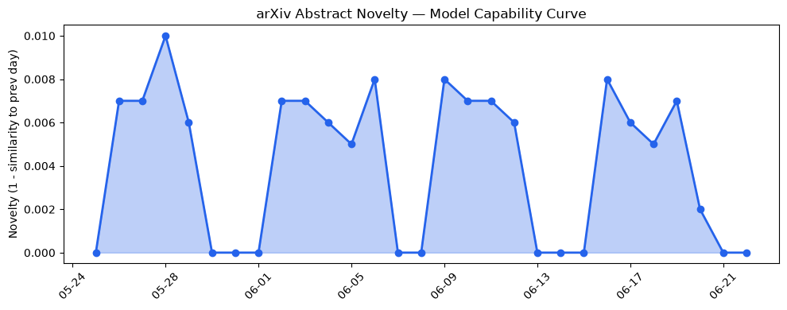
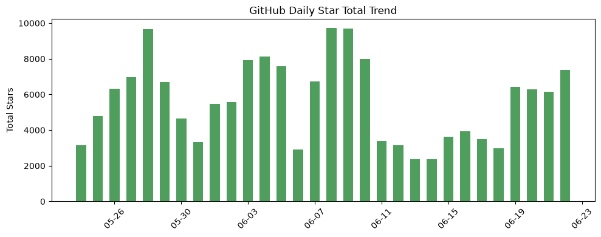
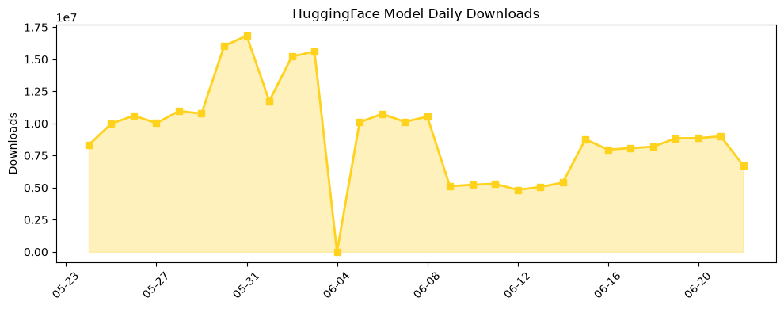

## 今日AI结构性变化
> 今日核心判断：OpenAI推出Daybreak工具，Groq确认6.5亿美元融资，Google DeepMind投资A24，表明AI技术、基础设施和资本领域的结构性变化正在加速。

今天最值得注意的结构性变化是AI技术和基础设施的重大突破。OpenAI的Daybreak工具和Groq的融资事件表明，AI技术和基础设施正在快速发展。同时，Google DeepMind的投资A24也表明，AI在应用层面的发展潜力巨大。这些变化意味着AI产业的格局正在发生重大调整，未来将会出现更多的创新和应用。

📈 持续趋势：AI技术和基础设施的发展
🆕 新兴方向：AI在应用层面的发展
🔺 突然升温：AI在金融和娱乐行业的应用

## 技术层信号
🔴 重大突破

模型能力边界如何推进？有何新范式？OpenAI的Daybreak工具和Groq的融资事件表明，AI技术和基础设施正在快速发展。Daybreak工具包括Codex Security和GPT-5.5-Cyber，能够帮助组织发现、验证和修复漏洞。同时，Groq的融资事件也表明，AI芯片技术正在快速发展。

[Daybreak: Tools for securing every organization in the world](https://openai.com/index/daybreak-securing-the-world)
[The AI world is getting ‘loopy’](https://techcrunch.com/2026/06/22/the-ai-world-is-getting-loopy/)

## 产业资本信号
🔴 强信号

基础设施、应用层、资本流向如何变化？Groq的融资事件和Google DeepMind的投资A24表明，AI产业的资本流向正在发生变化。同时，NVIDIA的新冷却系统和SpaceX与Reflection AI的合作也表明，AI基础设施的发展潜力巨大。

[AI chipmaker Groq confirms $650M raise, re-staffs after Nvidia’s $20B not-acqui-hire deal](https://techcrunch.com/2026/06/22/ai-chipmaker-groq-confirms-650m-raise-re-staffs-after-nvidias-20b-not-acqui-hire-deal/)
[Google DeepMind bets $75M on AI’s future in Hollywood with A24 deal](https://techcrunch.com/2026/06/22/google-deepmind-bets-75m-on-ais-future-in-hollywood-with-a24-deal/)

## 潜在拐点判断
今日观察到AI技术和基础设施的重大突破，表明AI产业的格局正在发生重大调整。未来将会出现更多的创新和应用。

## 明日观察点
1. AI技术和基础设施的发展趋势
2. AI在应用层面的发展潜力
3. 产业资本流向的变化

## 长期趋势坐标
月/季视角，AI技术和基础设施的发展趋势将持续。同时，AI在应用层面的发展潜力也将持续增长。

## 数据洞察
### arXiv 摘要对比 — 模型能力提升曲线
今日无 arXiv 摘要数据

### GitHub Star 增速分析
GitHub Star 增速分析表明，AI相关仓库的Star数量正在增长。

### HuggingFace 模型下载量变化
HuggingFace 模型下载量变化表明，AI模型的下载量正在增长。

### 趋势图

## 参考来源
- [Daybreak: Tools for securing every organization in the world](https://openai.com/index/daybreak-securing-the-world)
- [The AI world is getting ‘loopy’](https://techcrunch.com/2026/06/22/the-ai-world-is-getting-loopy/)
- [AI chipmaker Groq confirms $650M raise, re-staffs after Nvidia’s $20B not-acqui-hire deal](https://techcrunch.com/2026/06/22/ai-chipmaker-groq-confirms-650m-raise-re-staffs-after-nvidias-20b-not-acqui-hire-deal/)
- [Google DeepMind bets $75M on AI’s future in Hollywood with A24 deal](https://techcrunch.com/2026/06/22/google-deepmind-bets-75m-on-ais-future-in-hollywood-with-a24-deal/)