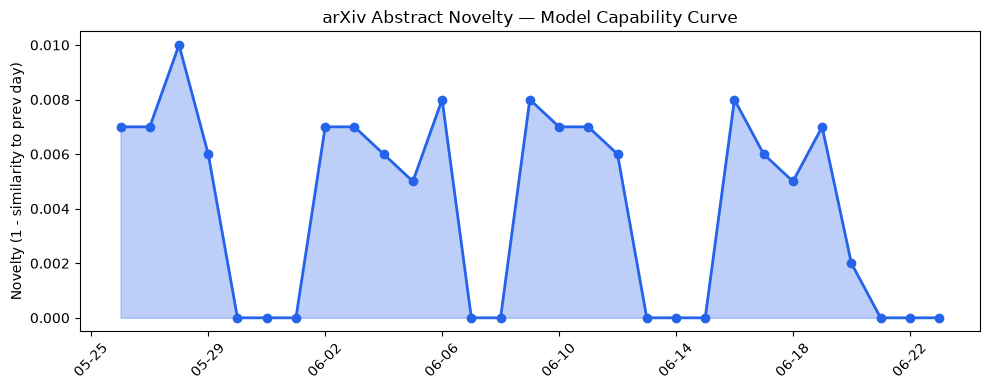
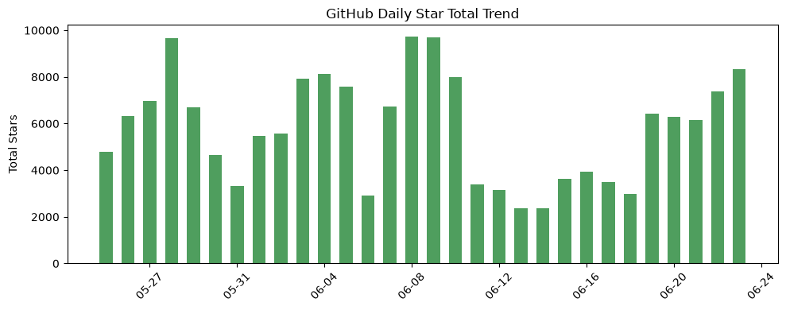
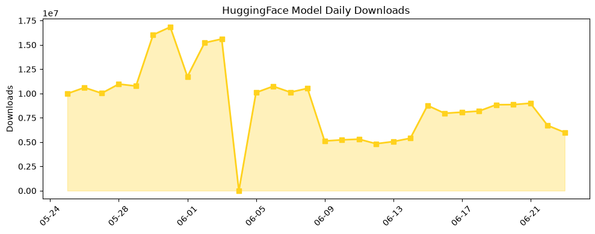

## 今日AI结构性变化
> 今日新增的AI信息显示，技术层面上有多项研究成果，基础设施层面上有新硬件和算力趋势，应用层面上有新行业和新场景的应用，资本层面上有新融资和战略投资，风险信号上有监管和伦理问题的讨论。
今日最值得注意的结构性变化是技术层面的重大突破和应用层面的新兴方向。技术层面的研究成果显示LLM在多个任务上取得了显著的性能提升，应用层面的新行业和新场景的应用表明LLM在实践中的应用前景广阔。
- 📈 持续趋势：LLM在多个任务上的性能提升。
- 🆕 新兴方向：LLM在新行业和新场景中的应用。
- 🔺 突然升温：资本信号的强烈程度。
- 🔑 新关键词：Claude Tag。
- 📉 消退关键词：AI安全、Google、HuggingFace、IPO、SpaceX、TechCrunch、数据中心、融资。

## 技术层信号
🔴 重大突破

技术层面的研究成果显示LLM在多个任务上取得了显著的性能提升，例如 [On the Identifiability of User Adaptation in Co-Adaptive Neural Interfaces](https://arxiv.org/abs/2606.20569) 和 [Beyond Fixed Budgets: Characterizing the Inelasticity and Limitations of Tree-of-Thought Reasoning Strategies](https://arxiv.org/abs/2606.20599)。这些研究成果表明LLM的能力边界正在被推进，新的范式和方法被提出。

## 产业资本信号
🔴 强信号

资本层面的新融资和战略投资表明AI startups的发展前景广阔，例如 [Menlo Ventures Raises $3B In New Funds To Back AI Startups Across Stages](https://news.crunchbase.com/venture/menlo-ventures-raise-ai-startup-funding-across-stages-anthropic/)。这些投资和战略举措将对AI产业的发展产生重要影响。

## 潜在拐点判断
根据趋势对比报告，应用层的话题向量在最近8天内呈现持续增强趋势，技术层出现全新话题，可能是一个新兴方向的早期信号。这些信号表明AI产业可能正在经历一个重要的拐点，新的技术和应用方向正在涌现。

## 明日观察点
1. 技术层面的新研究成果和LLM的性能提升。
2. 应用层面的新行业和新场景的应用。
3. 资本层面的新融资和战略投资。

## 长期趋势坐标
根据overall_novelty和keyword_trends，AI产业的长期趋势坐标显示，LLM的能力边界正在被推进，新的范式和方法被提出，应用层面的新行业和新场景的应用表明LLM在实践中的应用前景广阔。

## 数据洞察
### arXiv 摘要对比 — 模型能力提升曲线
今日的arXiv摘要对比显示，LLM的能力边界正在被推进，新的研究成果显示LLM在多个任务上取得了显著的性能提升。

### GitHub Star 增速分析
GitHub Star增速分析显示，LLM相关的仓库Star数正在增加，例如 [calesthio/OpenMontage](https://github.com/calesthio/OpenMontage) 和 [mukul975/Anthropic-Cybersecurity-Skills](https://github.com/mukul975/Anthropic-Cybersecurity-Skills)。

### HuggingFace 模型下载量变化
HuggingFace模型下载量变化显示，LLM相关的模型下载量正在增加，例如 [HauhauCS/Qwen3.6-35B-A3B-Uncensored-HauhauCS-Aggressive](https://huggingface.co/HauhauCS/Qwen3.6-35B-A3B-Uncensored-HauhauCS-Aggressive) 和 [yuxinlu1/gemma-4-12B-coder-fable5-composer2.5-v1-GGUF](https://huggingface.co/yuxinlu1/gemma-4-12B-coder-fable5-composer2.5-v1-GGUF)。

## 参考来源
- [On the Identifiability of User Adaptation in Co-Adaptive Neural Interfaces](https://arxiv.org/abs/2606.20569) — arXiv
- [Beyond Fixed Budgets: Characterizing the Inelasticity and Limitations of Tree-of-Thought Reasoning Strategies](https://arxiv.org/abs/2606.20599) — arXiv
- [Menlo Ventures Raises $3B In New Funds To Back AI Startups Across Stages](https://news.crunchbase.com/venture/menlo-ventures-raise-ai-startup-funding-across-stages-anthropic/) — Crunchbase News
- [Omio is building the future of conversational travel](https://openai.com/index/omio) — OpenAI Blog
- [aws / agent-toolkit-for-aws](https://github.com/aws/agent-toolkit-for-aws) — GitHub
- [The running list: major tech layoffs in 2026 where employers cited AI](https://techcrunch.com/2026/06/22/the-running-list-major-tech-layoffs-in-2026-where-employers-cited-ai/) — TechCrunch AI