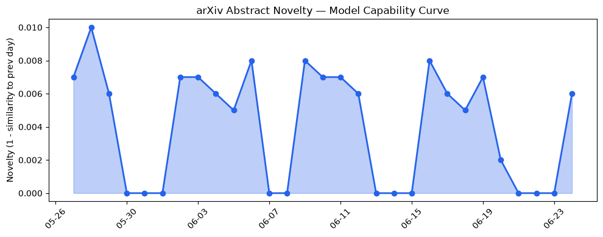

## 今日AI结构性变化
> 今日新增的AI信息显示，技术层面上有多项研究成果，基础设施层面上出现了新型芯片，应用层面上AI进入了新行业，资本信号显示融资方向趋向于AI相关领域，风险信号显示监管和伦理问题仍然存在。
今天最值得注意的结构性变化是技术层面上的重大突破，包括LLM和RAG的能力边界被推进，Neuro-Symbolic和Federated Causal Discovery等新范式的出现。同时，基础设施层面上新型芯片Jalapeño的推出可能降低推理成本，低功耗模拟神经网络的发展也值得关注。
- 📈 持续趋势：技术层面上的研究成果和基础设施层面的新型芯片的推出。
- 🆕 新兴方向：Neuro-Symbolic和Federated Causal Discovery等新范式的出现。
- 🔺 突然升温：AI进入了新行业，资本信号显示融资方向趋向于AI相关领域。

## 技术层信号
🔴 重大突破

模型能力边界如何推进？有何新范式？技术层面上的研究成果显示，LLM和RAG的能力边界被推进，Neuro-Symbolic和Federated Causal Discovery等新范式的出现也值得关注。[RIFT-Bench: Dynamic Red-teaming For Agentic AI Systems](https://arxiv.org/abs/2606.23927) 和 [Neuro-Symbolic Drive: Rule-Grounded Faithful Reasoning for Driving VLAs](https://arxiv.org/abs/2606.23938) 等研究成果体现了技术层面的进步。

## 产业资本信号
🔴 强信号

资本信号显示融资方向趋向于AI相关领域，[XCures Lands $46M Series B To Clean Up Messy Medical Records With AI](https://news.crunchbase.com/venture/xcures-lands-seriesb-medical-records-ai/) 等资讯体现了资本对AI的关注。同时，基础设施层面的新型芯片Jalapeño的推出可能降低推理成本，[OpenAI and Broadcom unveil LLM-optimized inference chip](https://openai.com/index/openai-broadcom-jalapeno-inference-chip) 等资讯体现了基础设施层面的进步。

## 潜在拐点判断
技术层面上的重大突破和基础设施层面的新型芯片的推出可能是AI产业发展的拐点，监管和伦理问题的解决也将是未来发展的关键。

## 明日观察点
1. 技术层面上的新研究成果。
2. 基础设施层面的新型芯片的推出。
3. 资本信号的变化。

## 长期趋势坐标
从月/季视角来看，AI产业的发展趋势是向更高层次的技术和应用层面发展，[overall_novelty](https://arxiv.org/abs/2606.23927) 和 [keyword_trends](https://news.crunchbase.com/venture/xcures-lands-seriesb-medical-records-ai/) 体现了这一趋势。

## 数据洞察
### arXiv 摘要对比 — 模型能力提升曲线
今日暂无数据。

### GitHub Star 增速分析
[GitHub](https://github.com/) 上的Star增速分析显示，[interviewstreet/hiring-agent](https://github.com/interviewstreet/hiring-agent) 等仓库的Star数量增加较快。

### HuggingFace 模型下载量变化
[HuggingFace](https://huggingface.co/) 上的模型下载量变化显示，[HauhauCS/Qwen3.6-35B-A3B-Uncensored-HauhauCS-Aggressive](https://huggingface.co/HauhauCS/Qwen3.6-35B-A3B-Uncensored-HauhauCS-Aggressive) 等模型的下载量增加较快。

### 趋势图

## 参考来源
- [RIFT-Bench: Dynamic Red-teaming For Agentic AI Systems](https://arxiv.org/abs/2606.23927)
- [Neuro-Symbolic Drive: Rule-Grounded Faithful Reasoning for Driving VLAs](https://arxiv.org/abs/2606.23938)
- [OpenAI and Broadcom unveil LLM-optimized inference chip](https://openai.com/index/openai-broadcom-jalapeno-inference-chip)
- [XCures Lands $46M Series B To Clean Up Messy Medical Records With AI](https://news.crunchbase.com/venture/xcures-lands-seriesb-medical-records-ai/)