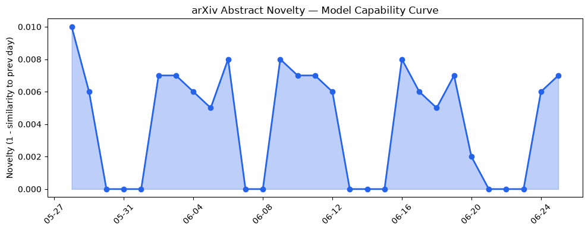
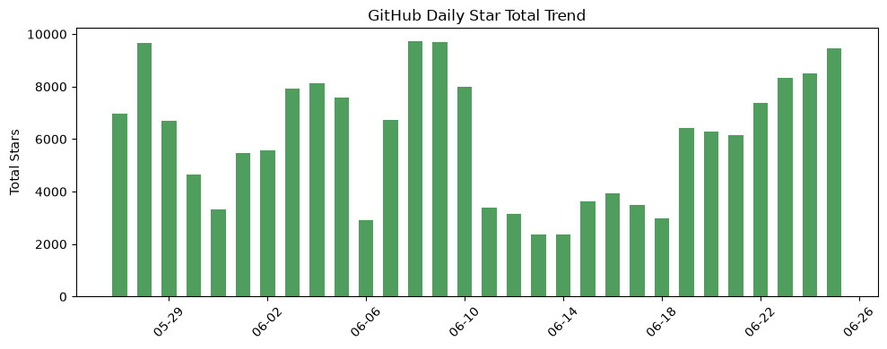
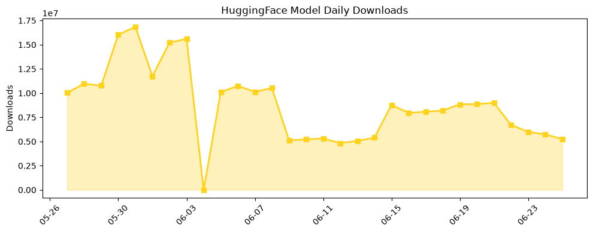

## 今日AI结构性变化
> 今日新增的AI信息显示，技术层面上有多项重要研究进展，基础设施层面上有新硬件和算力趋势，应用层面上AI进入新行业和新场景，资本信号显示融资方向和估值水平有变化，风险信号显示监管和伦理问题仍然存在。
今日最值得注意的结构性变化是技术层面上的重大突破，包括新的SOTA和上下文长度突破，以及基础设施层面的新硬件和算力趋势。这些变化表明AI技术正在快速发展，新的应用场景和行业也在不断涌现。
同时，资本信号显示融资方向和估值水平有变化，表明投资者对AI技术的信心和预期正在变化。风险信号显示监管和伦理问题仍然存在，需要持续关注和解决。
📈 持续趋势：技术层面上的重大突破和基础设施层面的新硬件和算力趋势。
🆕 新兴方向：AI进入新行业和新场景。
🔺 突然升温：资本信号显示融资方向和估值水平有变化。
🔑 新关键词：LLM、RAG、检索增强生成、大语言模型等。
📉 消退关键词：AI安全、GPT-5.5、Google、HuggingFace、IPO、SpaceX、数据中心、融资等。

## 技术层信号
🔴 重大突破

技术层面上的重大突破包括新的SOTA和上下文长度突破，以及新的训练方法和架构创新。这些进展表明AI技术正在快速发展，新的应用场景和行业也在不断涌现。
例如，[The Hitchhiker's Guide to Agentic AI: From Foundations to Systems](https://arxiv.org/abs/2606.24937) 和 [Project Auto-World: Towards Automated Benchmarking of Neural Relational Reasoners](https://arxiv.org/abs/2606.24965) 等论文展示了AI技术的最新进展。

## 产业资本信号
🔴 强信号

资本信号显示融资方向和估值水平有变化，表明投资者对AI技术的信心和预期正在变化。例如，[Patronus AI lands $50M to build ‘digital worlds’ that stress-test AI agents](https://techcrunch.com/2026/06/25/patronus-ai-lands-50m-to-build-digital-worlds-that-stress-test-ai-agents/) 和 [Anthropic’s Claude is winning over paid consumers, a market owned by ChatGPT](https://techcrunch.com/2026/06/25/anthropics-claude-is-winning-over-paid-consumers-a-market-owned-by-chatgpt/) 等报道显示了AI领域的最新融资动态。

## 潜在拐点判断
根据今日的结构性变化和技术层信号，我们可以判断潜在的拐点包括：
* AI技术的快速发展和新的应用场景的涌现。
* 投资者对AI技术的信心和预期的变化。
* 监管和伦理问题的解决。

## 明日观察点
1. AI技术的最新进展和应用场景。
2. 投资者对AI技术的信心和预期的变化。
3. 监管和伦理问题的解决进展。

## 长期趋势坐标
根据今日的结构性变化和技术层信号，我们可以判断长期趋势坐标包括：
* AI技术的快速发展和新的应用场景的涌现。
* 投资者对AI技术的信心和预期的变化。
* 监管和伦理问题的解决。

## 数据洞察
### arXiv 摘要对比 — 模型能力提升曲线
今日的arXiv摘要对比显示，模型能力提升曲线呈现延续趋势，表明AI技术的进展仍然在持续。
### GitHub Star 增速分析
今日的GitHub Star增速分析显示，[interviewstreet/hiring-agent](https://github.com/interviewstreet/hiring-agent) 和 [opendatalab/MinerU](https://github.com/opendatalab/MinerU) 等仓库的Star数量增长迅速，表明开发者对AI技术的兴趣和关注度在增加。
### HuggingFace 模型下载量变化
今日的HuggingFace模型下载量变化显示，[HauhauCS/Qwen3.6-35B-A3B-Uncensored-HauhauCS-Aggressive](https://huggingface.co/HauhauCS/Qwen3.6-35B-A3B-Uncensored-HauhauCS-Aggressive) 和 [yuxinlu1/gemma-4-12B-coder-fable5-composer2.5-v1-GGUF](https://huggingface.co/yuxinlu1/gemma-4-12B-coder-fable5-composer2.5-v1-GGUF) 等模型的下载量增长迅速，表明开发者对AI技术的需求和应用在增加。
### 趋势图

## 参考来源
- [The Hitchhiker's Guide to Agentic AI: From Foundations to Systems](https://arxiv.org/abs/2606.24937)
- [Project Auto-World: Towards Automated Benchmarking of Neural Relational Reasoners](https://arxiv.org/abs/2606.24965)
- [Patronus AI lands $50M to build ‘digital worlds’ that stress-test AI agents](https://techcrunch.com/2026/06/25/patronus-ai-lands-50m-to-build-digital-worlds-that-stress-test-ai-agents/)
- [Anthropic’s Claude is winning over paid consumers, a market owned by ChatGPT](https://techcrunch.com/2026/06/25/anthropics-claude-is-winning-over-paid-consumers-a-market-owned-by-chatgpt/)