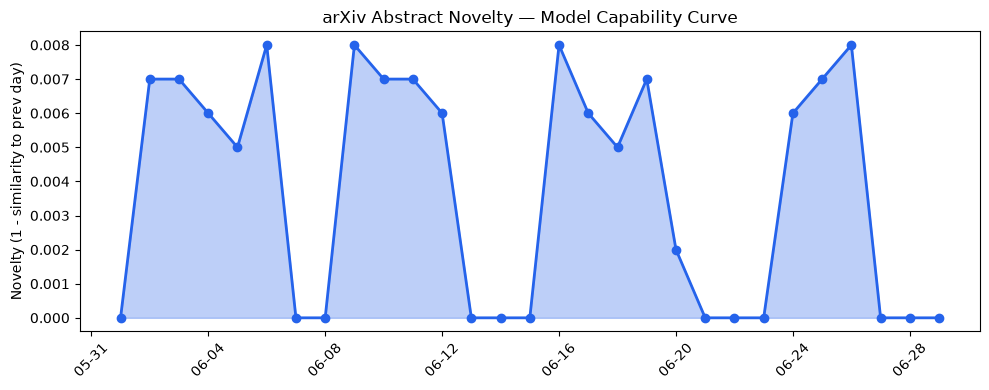
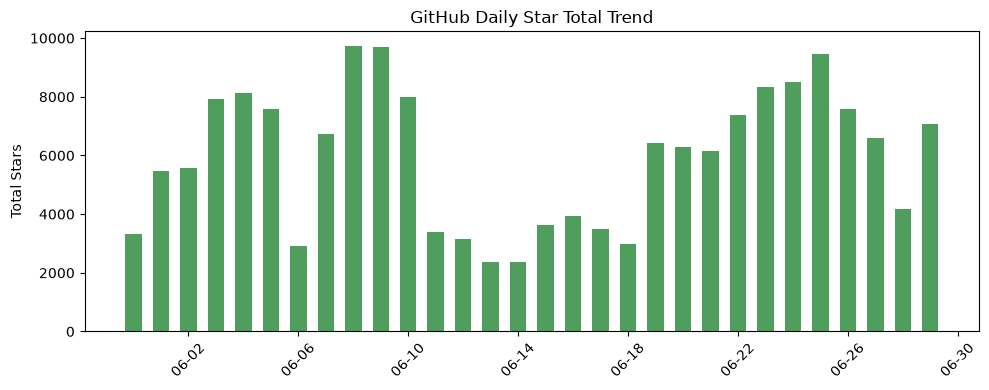
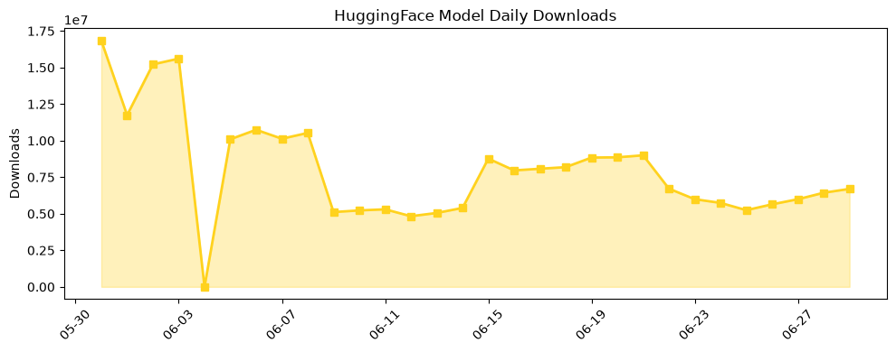

## 今日AI结构性变化
> 今日新增的AI信息显示，技术层面上有多项研究成果，基础设施层面上有芯片和算力趋势的变化，应用层面上有新行业和新场景的进入，资本信号上有多项投资和合作，风险信号上有监管和伦理方面的讨论。
今日最值得注意的结构性变化是技术层面上LLM的能力边界被推进，包括新范式、上下文长度突破等。同时，基础设施层面上推理成本有所降低，新硬件和算力趋势被提出。应用层面上有新行业和新场景被提及，包括医疗、法律、教育、制造等。
📈 持续趋势：技术层面上的LLM能力边界推进、基础设施层面的推理成本降低。
🆕 新兴方向：应用层面的新行业和新场景进入。
🔺 突然升温：资本信号上的多项投资和合作。
🔑 新关键词：Graph、Omen AI、TIDAL、Time Series Forecasting。
📉 消退关键词：ChatGPT、Codex、Google、HuggingFace、IPO、SpaceX、数据中心。

## 技术层信号
🔴 重大突破

技术层面上的LLM能力边界被推进，包括新范式、上下文长度突破等。新范式如Internalizing the Future、Odyssey等被提出。[AI-Model Network: Concept, Current State and Future](https://arxiv.org/abs/2606.27382) 和 [Internalizing the Future: A Unified Agentic Training Paradigm for World Model Planning](https://arxiv.org/abs/2606.27483) 等研究成果显示了技术层面的重大突破。

## 产业资本信号
🔴 强信号

资本信号上有多项投资和合作，包括OpenAI、Anthropic、Omen AI等。[HP Inc. launches Frontier strategic partnership with OpenAI](https://openai.com/index/hp-frontier-partnership) 等新闻显示了资本信号上的强信号。

## 潜在拐点判断
有潜在拐点：技术层面上的LLM能力边界被推进，基础设施层面的推理成本降低，应用层面的新行业和新场景进入，资本信号上的多项投资和合作，风险信号上的监管和伦理方面的讨论。这些变化可能会导致AI领域的结构性变化，推动AI技术的发展和应用。

## 明日观察点
1. 技术层面上的LLM能力边界推进。
2. 基础设施层面的推理成本降低。
3. 应用层面的新行业和新场景进入。

## 长期趋势坐标
从月/季视角来看，AI领域的结构性变化将继续推动AI技术的发展和应用。[overall_novelty](https://arxiv.org/abs/2606.27382) 和 [keyword_trends](https://arxiv.org/abs/2606.27483) 等数据显示了AI领域的长期趋势坐标。

## 数据洞察
### arXiv 摘要对比 — 模型能力提升曲线
arXiv Capability 数据显示，今日的模型能力提升曲线与历史数据有所不同，可能是新范式的早期信号。
### GitHub Star 增速分析
GitHub Star 数据显示，今日的Star增速与历史数据有所不同，可能是新项目的早期信号。
### HuggingFace 模型下载量变化
HuggingFace 模型下载量数据显示，今日的下载量与历史数据有所不同，可能是新模型的早期信号。
### 趋势图

## 参考来源
- [AI-Model Network: Concept, Current State and Future](https://arxiv.org/abs/2606.27382)
- [Internalizing the Future: A Unified Agentic Training Paradigm for World Model Planning](https://arxiv.org/abs/2606.27483)
- [HP Inc. launches Frontier strategic partnership with OpenAI](https://openai.com/index/hp-frontier-partnership)
- [South Korean tech giants commit over $550B to ease ‘RAMageddon’](https://techcrunch.com/2026/06/29/south-korean-tech-giants-commit-over-550b-to-ease-ramageddon/)
- [Gemini’s personalized AI image generation is now free for US users](https://techcrunch.com/2026/06/29/geminis-personalized-ai-image-generation-is-now-free-for-u-s-users/)
- [TIDAL cracks down on AI music by cutting off monetization](https://techcrunch.com/2026/06/29/tidal-cracks-down-on-ai-music-by-cutting-off-monetization/)