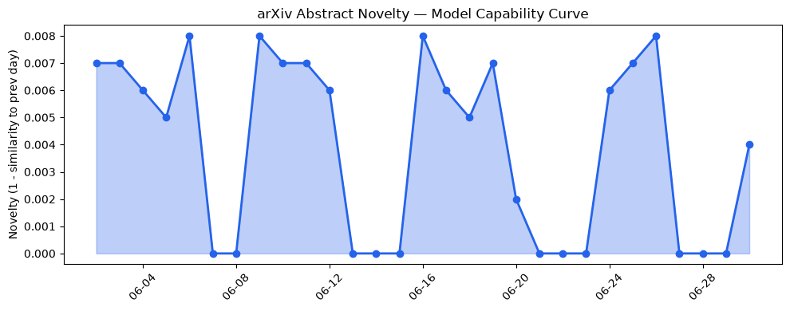
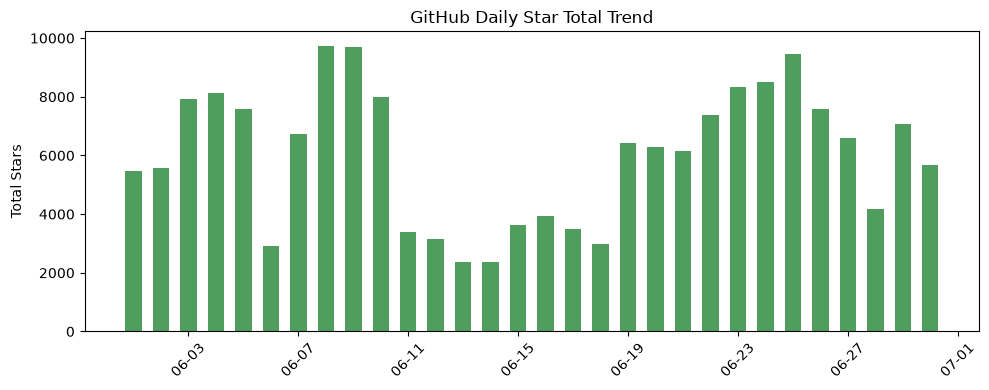
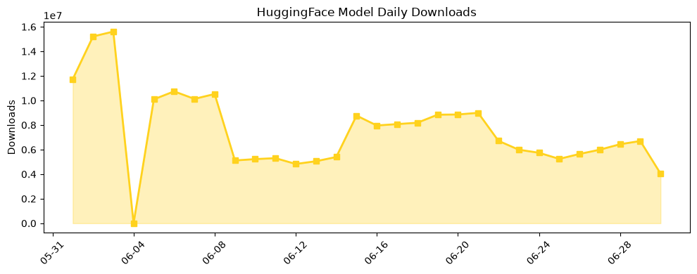

## 今日AI结构性变化
> 今日新增的AI信息显示，技术层面上有多项重要突破，基础设施层面上推理成本和芯片/算力趋势有所变化，应用层面上AI进入了新行业和新场景，资本信号显示融资方向和估值水平有所变化，风险信号显示监管/立法和伦理/安全领域有新动向。
今天最值得注意的结构性变化是技术层面上的突破，例如ATOD、NormAct、RelBall等新模型和算法的提出，推进了AI模型的能力边界。同时，基础设施层面上推理成本的降低和芯片/算力趋势的变化，也为AI的发展提供了有利条件。
- 📈 持续趋势：技术层面上的突破和基础设施层面的改善。
- 🆕 新兴方向：AI进入了新行业和新场景。
- 🔺 突然升温：资本信号显示融资方向和估值水平有所变化。
- 🔑 新关键词：ATOD、Acti、Claude Science等。
- 📉 消退关键词：Codex、Google等。

## 技术层信号
🔴 重大突破

技术层面上的突破是今天最值得注意的变化，例如ATOD、NormAct、RelBall等新模型和算法的提出，推进了AI模型的能力边界。同时，Lifted Causal Inference等新的范式的出现，也推动了AI技术的发展。这些变化表明，AI技术正在不断进步和演化，未来可能会带来更多的创新和应用。
例如，[ATOD: Annealed Turn-aware On-policy Distillation for Multi-turn Autonomous Agents](https://arxiv.org/abs/2606.27814) 提出了一个新的多回合自主代理的蒸馏方法，提高了代理的性能和稳定性。

## 产业资本信号
🔴 强信号

资本信号显示融资方向和估值水平有所变化，例如Etched的估值达到50亿美元，这表明AI领域的投资热度不减。同时，大厂战略投资/收购有所动向，例如Amazon的FDE组织，也表明了AI领域的竞争和创新。
例如，[Nvidia competitor Etched hits $5B valuation, $1B in sales for AI chip](https://techcrunch.com/2026/06/30/nvidia-competitor-etched-hits-5b-valuation-1b-in-sales-for-ai-chip/) 报道了Etched的估值和销售额，表明了AI芯片市场的增长和竞争。

## 潜在拐点判断
今天的变化表明，AI技术和产业正在经历一个快速发展的阶段，未来可能会带来更多的创新和应用。同时，监管/立法和伦理/安全领域的新动向，也表明了AI的社会影响和责任。
例如，[We Need To Save Venture Capital From Bad Data](https://news.crunchbase.com/venture/data-funding-solutions-ai-landgren-gilion/) 报道了风险投资中的数据问题和AI的应用，表明了AI在风险投资中的重要性和挑战。

## 明日观察点
1. 技术层面上的新突破和应用。
2. 资本信号的变化和影响。
3. 监管/立法和伦理/安全领域的新动向。

## 长期趋势坐标
从月/季视角来看，AI技术和产业正在经历一个快速发展的阶段，未来可能会带来更多的创新和应用。同时，监管/立法和伦理/安全领域的新动向，也表明了AI的社会影响和责任。
例如，overall_novelty 的值为 0.745，表明了 AI 领域的新颖性和创新性。

## 数据洞察
### arXiv 摘要对比 — 模型能力提升曲线
arxiv_capability 的数据显示，模型能力提升曲线呈现延续趋势，capability_score 为 0.008，mean_similarity 为 0.992。
### GitHub Star 增速分析
github_stars 的数据显示，GitHub Star 增速呈现增长趋势，total_stars_today 为 5688，repo_count 为 10。
### HuggingFace 模型下载量变化
huggingface_downloads 的数据显示，HuggingFace 模型下载量呈现增长趋势，total_downloads 为 4044708，model_count 为 20。
### 趋势图

## 参考来源
- [ATOD: Annealed Turn-aware On-policy Distillation for Multi-turn Autonomous Agents](https://arxiv.org/abs/2606.27814)
- [Nvidia competitor Etched hits $5B valuation, $1B in sales for AI chip](https://techcrunch.com/2026/06/30/nvidia-competitor-etched-hits-5b-valuation-1b-in-sales-for-ai-chip/)
- [We Need To Save Venture Capital From Bad Data](https://news.crunchbase.com/venture/data-funding-solutions-ai-landgren-gilion/)