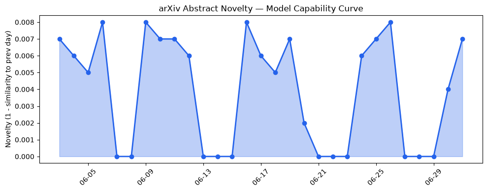
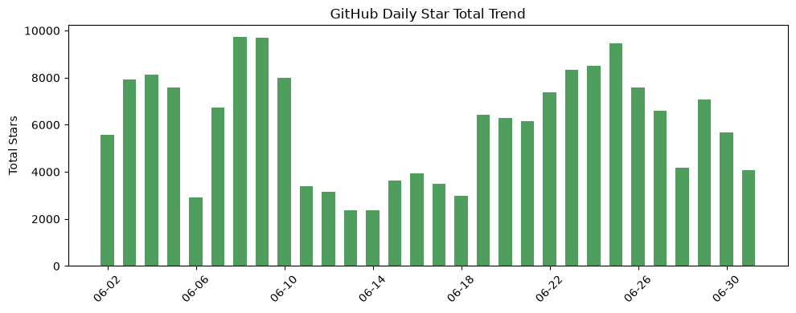
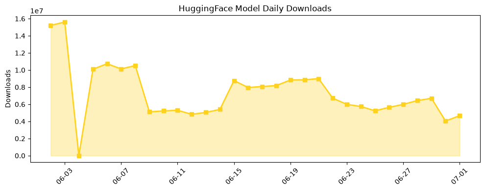

## 今日AI结构性变化
> 今日AI行业结构性变化的核心判断是：AI技术、基础设施和应用层面均呈现出重大突破和升温的趋势，这意味着AI产业的发展速度正在加快，新兴技术和应用场景的出现将进一步推动AI的深入发展。
今天最值得注意的结构性变化是技术层和基础设施的重大突破，尤其是在模型能力和推理成本方面的进展，这些变化有望进一步降低AI应用的门槛和成本。同时，应用层面也出现了新的发展方向，如医疗、法律和教育等行业的AI应用，这将使AI技术更加深入地融入到各个行业中。
- 📈 持续趋势：技术层和基础设施的重大突破。
- 🆕 新兴方向：AI应用扩展到新的行业，如医疗、法律和教育。
- 🔺 突然升温：资本信号和风险信号的强烈升温。

## 技术层信号
🔴 重大突破

技术层面上，研究人员提出新的模型和训练方法来提高LLM的性能和鲁棒性，例如Hierarchical Global Attention (HGA)和Revocable Learned State等，这些进展有望进一步提高AI模型的能力和可靠性。同时，基础设施方面也出现了新的发展，如Gradient Smoothing等方法来降低推理成本，这将使AI应用更加经济和高效。
例如，[Contrastive Reflection for Iterative Prompt Optimization](https://arxiv.org/abs/2606.30840)和[Hierarchical Global Attention (HGA)](https://arxiv.org/abs/2606.30709)等论文提出新的模型和训练方法来提高LLM的性能和鲁棒性。

## 产业资本信号
🔴 强信号

产业资本信号方面，AI领域的投资热潮持续升温，各大厂商和投资机构都在积极布局AI技术和应用，这将为AI行业的发展提供强有力的资金支持。同时，AI公司的估值水平也在不断上升，这表明资本市场对AI行业的发展前景充满信心。
例如，[Venice AI becomes a unicorn with $65M Series A](https://techcrunch.com/2026/07/01/venice-ai-becomes-a-unicorn-with-65m-series-a-as-its-privacy-first-ai-platform-takes-off/)和[Wayve launches $85M employee tender offer at $8.5B valuation](https://techcrunch.com/2026/06/30/wayve-launches-85m-employee-tender-offer-at-8-5b-valuation/)等新闻报道表明AI领域的投资热潮和估值上升。

## 潜在拐点判断
根据今日的结构性变化和信号，AI行业可能面临的一个潜在拐点是：技术层面和基础设施的重大突破可能会使AI应用更加普遍和深入，这将带来新的商业机会和挑战。同时，资本信号和风险信号的强烈升温也可能使AI行业面临新的监管和伦理挑战。

## 明日观察点
1. 技术层面上新的模型和训练方法的提出。
2. 基础设施方面的新发展，如推理成本的降低。
3. 产业资本信号的变化，如AI领域的投资热潮和估值上升。

## 长期趋势坐标
从月度和季度的视角来看，AI行业的发展趋势是持续向上的，技术层面和基础设施的进展将推动AI应用的深入发展，产业资本信号的强烈升温也将为AI行业的发展提供资金支持。同时，风险信号的升温也提醒我们需要关注AI行业的监管和伦理挑战。

## 数据洞察
### arXiv 摘要对比 — 模型能力提升曲线
今日的arXiv摘要对比数据显示，模型能力提升曲线呈现出持续上升的趋势，这意味着AI模型的能力和鲁棒性正在不断提高。
### GitHub Star 增速分析
GitHub Star的增速分析显示，AI相关的仓库Star数呈现出快速增长的趋势，这意味着AI技术和应用的开发者社区正在迅速扩张。
### HuggingFace 模型下载量变化
HuggingFace模型下载量变化数据显示，AI模型的下载量呈现出快速增长的趋势，这意味着AI模型的应用和部署正在迅速扩张。
### 趋势图

## 参考来源
- [Contrastive Reflection for Iterative Prompt Optimization](https://arxiv.org/abs/2606.30840)
- [Hierarchical Global Attention (HGA)](https://arxiv.org/abs/2606.30709)
- [Venice AI becomes a unicorn with $65M Series A](https://techcrunch.com/2026/07/01/venice-ai-becomes-a-unicorn-with-65m-series-a-as-its-privacy-first-ai-platform-takes-off/)
- [Wayve launches $85M employee tender offer at $8.5B valuation](https://techcrunch.com/2026/06/30/wayve-launches-85m-employee-tender-offer-at-8-5b-valuation/)