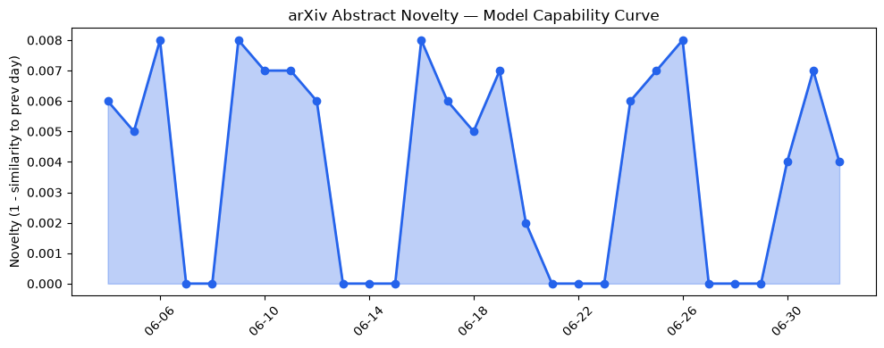
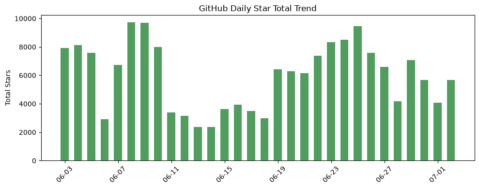
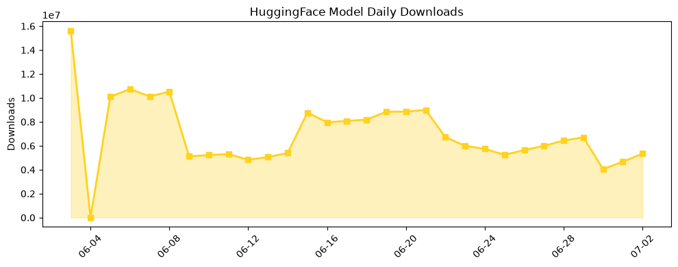

## 今日AI结构性变化

> 今日AI行业结构性变化信号主要体现在技术层面的创新和资本层面的投资热潮，特别是大语言模型和AI芯片领域的进展和投资活动。
今日最值得注意的结构性变化是大语言模型能力边界的推进和AI芯片领域的重大突破，这些进展将对AI行业的发展产生深远影响。同时，资本层面的投资热潮也在持续升温，特别是在AI领域的投资活动。这些变化表明AI行业正在经历快速的发展和创新。

*   📈 持续趋势：大语言模型和AI芯片领域的进展和投资活动。
*   🆕 新兴方向：AI进入了新行业或新场景，如医疗、法律和教育领域。
*   🔺 突然升温：AI部署和AI融资成为新的热点。
*   🔑 新关键词：AI融资、AI部署。
*   📉 消退关键词：Codex、Google DeepMind、IPO、SpaceX、机器学习、深度学习、监管、自然语言处理、融资、计算机视觉。

## 技术层信号

🔴 重大突破

技术层面的创新是今日结构性变化的主要驱动力，大语言模型和AI芯片领域的进展为AI行业的发展提供了新的动力。新的训练方法和架构创新不断涌现，推动了大语言模型能力边界的推进。同时，AI芯片领域的重大突破也使得AI的计算效率和成本得到显著改善。

例如，[Constructive Alignment: Governing Preference Dynamics in Human-AI Interaction](https://arxiv.org/abs/2607.00001) 和 [From Signals to Structure: How Memory Architecture Drives Language Emergence in LLM Agents](https://arxiv.org/abs/2607.00233) 等研究成果展示了大语言模型的能力边界被推进和新的范式的出现。

## 产业资本信号

🔴 强信号

资本层面的投资热潮是今日结构性变化的另一个重要方面，特别是在AI领域的投资活动。AI相关公司的估值有所变化，特别是Meta和Microsoft在AI领域的布局。同时，[Crunchbase Data: Global Startup Investment Hit Record $510B In H1 2026 As AI Boom Accelerates Funding And Exits](https://news.crunchbase.com/venture/global-startup-exits-ipo-ma-soar-ai-q2-h1-2026/) 和 [Microsoft launches its own AI deployment company with $2.5 billion commitment](https://techcrunch.com/2026/07/02/microsoft-launches-its-own-ai-deployment-company-with-2-5-billion-commitment/) 等新闻报道展示了资本层面的投资热潮。

## 潜在拐点判断

今日结构性变化中，我们观察到大语言模型和AI芯片领域的进展和投资活动，这些进展和活动可能会成为AI行业发展的拐点。同时，资本层面的投资热潮也可能会推动AI行业的快速发展和创新。

## 明日观察点

1.  大语言模型和AI芯片领域的进展和投资活动。
2.  AI进入了新行业或新场景，如医疗、法律和教育领域。
3.  资本层面的投资热潮，特别是在AI领域的投资活动。

## 长期趋势坐标

从月/季视角来看，AI行业的发展趋势仍然是快速发展和创新。特别是大语言模型和AI芯片领域的进展和投资活动，这些进展和活动将对AI行业的发展产生深远影响。同时，资本层面的投资热潮也将推动AI行业的快速发展和创新。

## 数据洞察

### arXiv 摘要对比 — 模型能力提升曲线

今日结构性变化中，我们观察到大语言模型能力边界的推进，这些进展将对AI行业的发展产生深远影响。

### GitHub Star 增速分析

今日结构性变化中，我们观察到GitHub Star的增速，特别是在AI相关仓库中的Star增长。

### HuggingFace 模型下载量变化

今日结构性变化中，我们观察到HuggingFace模型的下载量变化，特别是在AI相关模型中的下载量增长。

### 趋势图

## 参考来源

*   [Constructive Alignment: Governing Preference Dynamics in Human-AI Interaction](https://arxiv.org/abs/2607.00001)
*   [From Signals to Structure: How Memory Architecture Drives Language Emergence in LLM Agents](https://arxiv.org/abs/2607.00233)
*   [Crunchbase Data: Global Startup Investment Hit Record $510B In H1 2026 As AI Boom Accelerates Funding And Exits](https://news.crunchbase.com/venture/global-startup-exits-ipo-ma-soar-ai-q2-h1-2026/)
*   [Microsoft launches its own AI deployment company with $2.5 billion commitment](https://techcrunch.com/2026/07/02/microsoft-launches-its-own-ai-deployment-company-with-2-5-billion-commitment/)