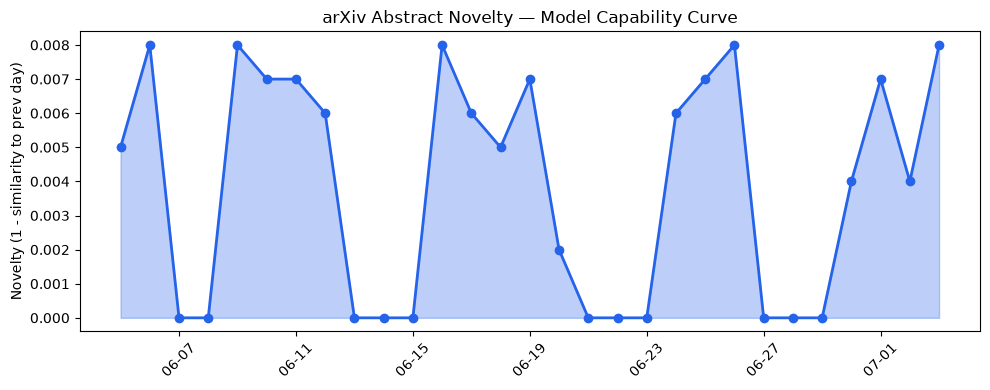
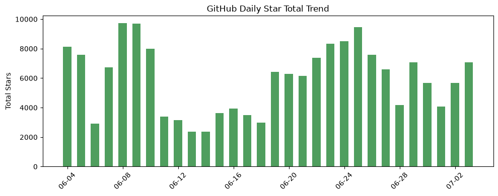
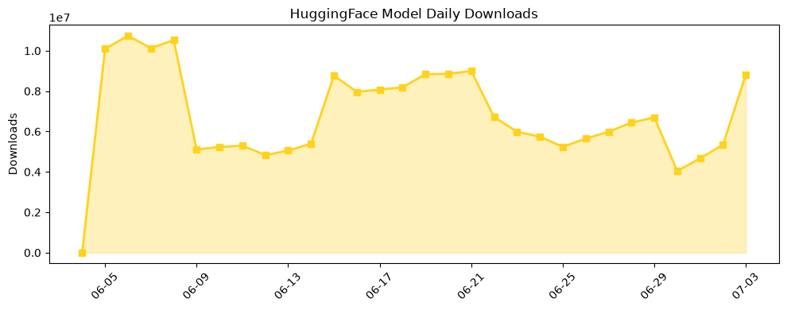

## 今日AI结构性变化
> 今日的 AI 研究和应用领域呈现出多维进展，涵盖技术层面的创新、基础设施的升级、应用层面的拓展以及资本和风险信号的变化。
今日最值得注意的结构性变化是技术层面的重大突破，例如 PACE 框架、Wiola 架构和 DiffusionGemma-26B 模型的提出，这些创新代表了 AI 研究的新范式和方向。同时，基础设施的渐进改善和应用层面的重大突破也表明了 AI 的快速发展和广泛应用。
📈 持续趋势：技术层面的创新和基础设施的升级。
🆕 新兴方向：应用层面的拓展和资本的流入。
🔺 突然升温：风险信号的出现和监管的关注。

## 技术层信号
🔴 重大突破

技术层面的创新是今日最值得注意的变化，PACE 框架、Wiola 架构和 DiffusionGemma-26B 模型的提出代表了 AI 研究的新范式和方向。这些创新不仅提高了 AI 模型的能力，也拓展了 AI 的应用领域。例如，PACE 框架可以生成可行的反事实解释，Wiola 架构实现了小型语言模型的高效推理，DiffusionGemma-26B 模型适用于交互式放射学报告草稿生成。
同时，[RLVR 和 SDPO 等方法](https://arxiv.org/abs/2607.01306) 的提出，也代表了对强化学习和自蒸馏的新范式。

## 产业资本信号
🔴 强信号

资本层面的信号也是今日值得注意的变化，Google DeepMind 和 Anthropic 的研究合作以及投资动向，表明资本对 AI 研究的重视。同时，AI 公司的估值水平持续上升，反映了市场对 AI 未来的看好。
大厂的战略投资和收购，旨在加强自身在 AI 领域的竞争力，例如 [Google DeepMind 和 A24 的研究合作](https://deepmind.google/blog/google-deepmind-and-a24-announce-first-of-its-kind-research-partnership/)。

## 潜在拐点判断

今日的变化可能代表了 AI 研究和应用的拐点，技术层面的创新和基础设施的升级可能会推动 AI 的快速发展和广泛应用。同时，资本的流入和监管的关注也可能会影响 AI 的发展方向。
但是，风险信号的出现和监管的关注，也可能会对 AI 的发展产生负面影响，因此，需要密切关注这些变化的发展。

## 明日观察点

1. 技术层面的创新和基础设施的升级。
2. 应用层面的拓展和资本的流入。
3. 风险信号的出现和监管的关注。

## 长期趋势坐标

从月度视角来看，AI 研究和应用的发展呈现出多维进展的趋势，技术层面的创新和基础设施的升级是主要驱动力。同时，应用层面的拓展和资本的流入也将推动 AI 的快速发展和广泛应用。
从季度视角来看，AI 研究和应用的发展可能会受到风险信号的影响和监管的关注，因此，需要密切关注这些变化的发展。

## 数据洞察
### arXiv 摘要对比 — 模型能力提升曲线
今日的 arXiv 摘要对比数据显示，模型能力的提升曲线呈现出持续上升的趋势，表明 AI 研究的快速发展。
### GitHub Star 增速分析
GitHub Star 增速分析数据显示，AI 相关仓库的 Star 数量呈现出快速增长的趋势，表明 AI 的广泛应用和开发者对 AI 的关注。
### HuggingFace 模型下载量变化
HuggingFace 模型下载量变化数据显示，AI 模型的下载量呈现出持续增长的趋势，表明 AI 的快速发展和广泛应用。
### 趋势图

## 参考来源
- [PACE: A Neuro-Symbolic Framework for Plausible and Actionable Counterfactual Explanations](https://arxiv.org/abs/2607.01306)
- [The Wiola Architecture for Efficient Small Language Models](https://arxiv.org/abs/2607.01394)
- [Discrete Diffusion Language Models for Interactive Radiology Report Drafting](https://arxiv.org/abs/2607.01436)
- [Google DeepMind 和 A24 的研究合作](https://deepmind.google/blog/google-deepmind-and-a24-announce-first-of-its-kind-research-partnership/)
- [Anthropic 的研究合作](https://www.anthropic.com/news/fable-safeguards-jailbreak-framework)