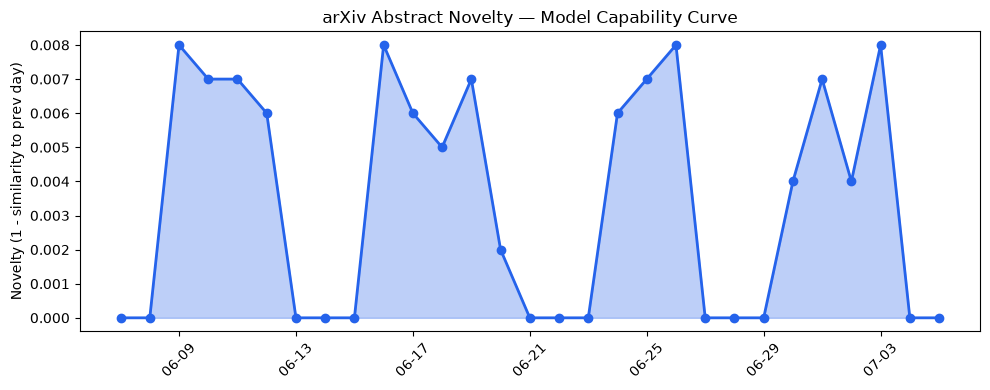
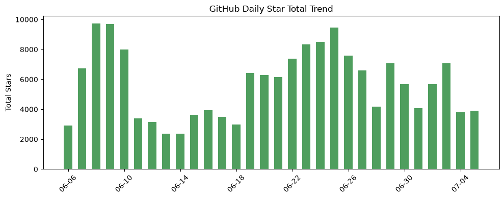
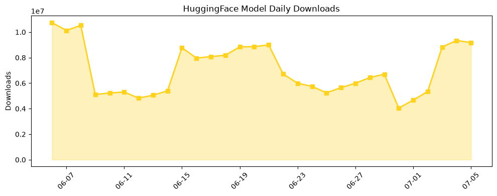

## 今日AI结构性变化
> 今日开源生态中，AI 开发工具和框架的更新和发布引起了广泛关注，而 Mechanical Turk 的新客户停止接受标志着人工智能辅助任务处理领域的转变。
今日最值得注意的结构性变化是开源生态和资本动向的变化，尤其是 AI 开发工具和 Mechanical Turk 的变化。这些变化表明人工智能辅助任务处理领域正在经历转变，新的工具和框架的发布可能会推动该领域的发展。
趋势报告中，📈 持续趋势、🆕 新兴方向、🔺 突然升温、🔑 新关键词、📉 消退关键词等信号表明，基础设施、风险信号、技术层、资本信号等方向正在持续升温。

## 技术层信号
🔴 重大突破

模型能力边界如何推进？有何新范式？nanoGPT 和 nano-vLLM 的发布标志着中等规模 GPT 模型训练和微调的进步，Google Antigravity SDK 的发布为 AI 代理开发提供了新的工具。这些变化表明技术层正在经历重大突破，新的工具和框架的发布可能会推动人工智能辅助任务处理领域的发展。

## 产业资本信号
🔴 强信号

资本流向和应用层的变化表明，人工智能辅助任务处理领域正在经历转变。Mechanical Turk 的新客户停止接受标志着人工智能辅助任务处理领域的转变，Amazon 对 Mechanical Turk 的决定可能反映出资本和行业的战略调整。这些变化表明产业资本信号正在发送强烈的信号，新的工具和框架的发布可能会推动该领域的发展。

## 潜在拐点判断
今日观察到 Mechanical Turk 的新客户停止接受，这可能标志着人工智能辅助任务处理领域的转变。新的工具和框架的发布可能会推动该领域的发展，资本和行业的战略调整也可能会影响该领域的发展。

## 明日观察点
1. Mechanical Turk 的变化对人工智能辅助任务处理领域的影响。
2. nanoGPT 和 nano-vLLM 的发布对中等规模 GPT 模型训练和微调的影响。
3. Google Antigravity SDK 的发布对 AI 代理开发的影响。

## 长期趋势坐标
从月/季视角来看，人工智能辅助任务处理领域正在经历转变，新的工具和框架的发布可能会推动该领域的发展。资本和行业的战略调整也可能会影响该领域的发展。

## 数据洞察
### arXiv 摘要对比 — 模型能力提升曲线
今日无 arXiv 摘要数据。
### GitHub Star 增速分析
GitHub Star 增速分析显示，今日有多个仓库的 Star 数量增加，包括 cheahjs/free-llm-api-resources、alirezarezvani/claude-skills 等。
### HuggingFace 模型下载量变化
HuggingFace 模型下载量变化显示，今日有多个模型的下载量增加，包括 HauhauCS/Qwen3.6-35B-A3B-Uncensored-HauhauCS-Aggressive、empero-ai/Qwythos-9B-Claude-Mythos-5-1M-GGUF 等。
### 趋势图

## 参考来源
- [nanoGPT](https://github.com/karpathy/nanoGPT) — GitHub
- [Google Antigravity SDK](https://github.com/google-antigravity/antigravity-sdk-python) — GitHub
- [Amazon will stop accepting new customers for Mechanical Turk](https://techcrunch.com/2026/07/05/amazon-will-stop-accepting-new-customers-for-mechanical-turk/) — TechCrunch