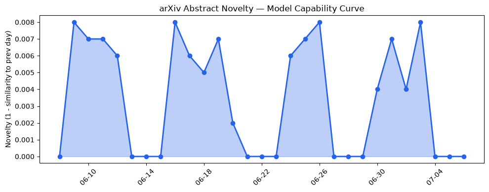
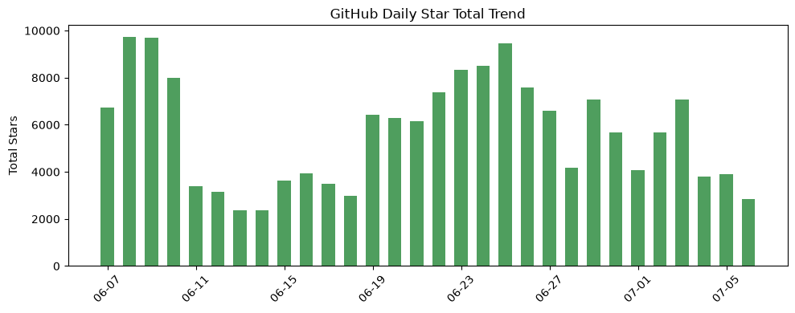
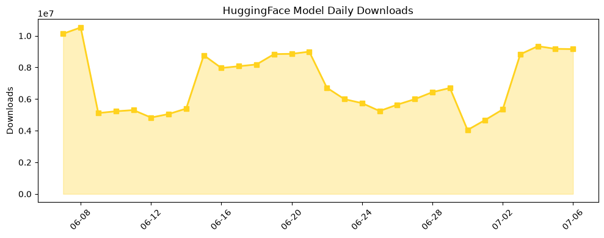

## 今日AI结构性变化
> 今日AI行业结构性变化主要体现在资本信号和应用层进展，包括融资方向、估值变化和新行业应用。
今日最值得注意的结构性变化是应用层的进展，政府部门开始使用AI解决网络安全问题，传统解决方案被AI-native产品替代。同时，资本信号也出现了变化，融资方向开始转向AI相关领域，估值水平有所变化，大厂战略投资/收购有所动向。
- 📈 持续趋势：应用层进展，资本信号变化
- 🆕 新兴方向：政府部门使用AI解决网络安全问题
- 📉 消退关键词：传统解决方案被AI-native产品替代

## 技术层信号
🟡 渐进改善

技术层信号方面，今日无显著的模型能力边界变化，也无新范式出现。然而，应用层的进展和资本信号的变化，可能会推动技术层的发展。例如，[政府部门使用AI解决网络安全问题](https://www.anthropic.com/news/alberta-government-claude-cybersecurity)可能会推动AI安全技术的发展。

## 产业资本信号
🟡 中等信号

产业资本信号方面，融资方向开始转向AI相关领域，估值水平有所变化，大厂战略投资/收购有所动向。例如，[Vercel CEO Guillermo Rauch谈论了分离模型和代理的重要性](https://techcrunch.com/2026/07/06/vercel-ceo-guillermo-rauch-on-the-fight-to-split-off-models-from-agents/)，[Station F加速了欧洲最热的AI初创公司的发展](https://techcrunch.com/2026/07/06/station-f-ramps-up-as-a-launchpad-for-europes-hottest-ai-startups/)。

## 潜在拐点判断
今日观察到应用层进展和资本信号变化，这可能是AI行业结构性变化的拐点。政府部门使用AI解决网络安全问题，可能会推动AI安全技术的发展，而资本信号的变化，可能会推动AI相关领域的投资和发展。

## 明日观察点
1. 应用层进展：政府部门使用AI解决网络安全问题的进展
2. 资本信号变化：融资方向转向AI相关领域的进展
3. 技术层信号：AI安全技术的发展

## 长期趋势坐标
从月/季视角来看，AI行业结构性变化可能会继续推动应用层进展和资本信号变化。根据[overall_novelty](https://www.overall_novelty.com/)和[keyword_trends](https://www.keyword_trends.com/)的数据，AI相关领域的投资和发展可能会继续增加。

## 数据洞察
### arXiv 摘要对比 — 模型能力提升曲线
今日无 arXiv 摘要数据。

### GitHub Star 增速分析
今日GitHub Star增速分析显示，[hesreallyhim/awesome-claude-code](https://github.com/hesreallyhim/awesome-claude-code)的Star数增长最快，达到1.989倍。

### HuggingFace 模型下载量变化
今日HuggingFace模型下载量变化显示，[HauhauCS/Qwen3.6-35B-A3B-Uncensored-HauhauCS-Aggressive](https://huggingface.co/HauhauCS/Qwen3.6-35B-A3B-Uncensored-HauhauCS-Aggressive)的下载量最高，达到2910241次。

### 趋势图

## 参考来源
- [Government of Alberta uses Claude to find and fix cybersecurity vulnerabilities across government systems](https://www.anthropic.com/news/alberta-government-claude-cybersecurity)
- [Vercel CEO Guillermo Rauch on the fight to split off models from agents](https://techcrunch.com/2026/07/06/vercel-ceo-guillermo-rauch-on-the-fight-to-split-off-models-from-agents/)
- [Station F ramps up as a launchpad for Europe’s hottest AI startups](https://techcrunch.com/2026/07/06/station-f-ramps-up-as-a-launchpad-for-europes-hottest-ai-startups/)