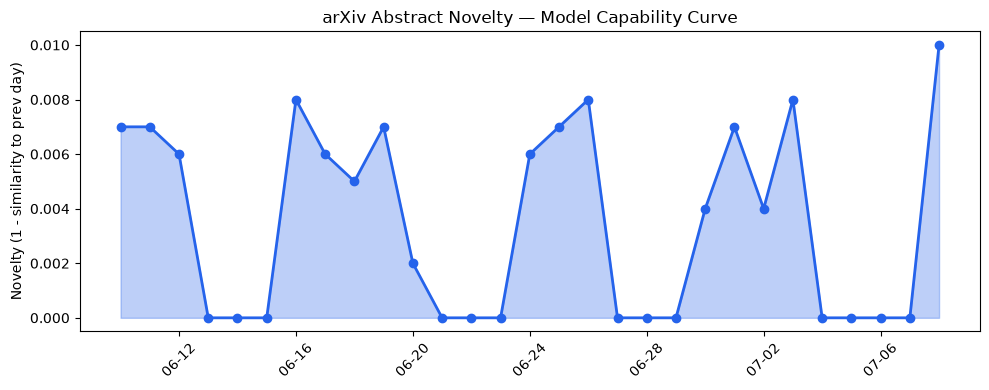
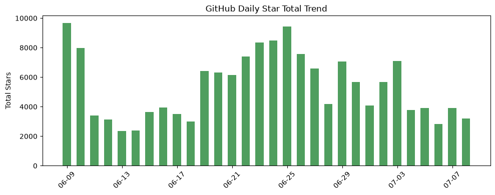
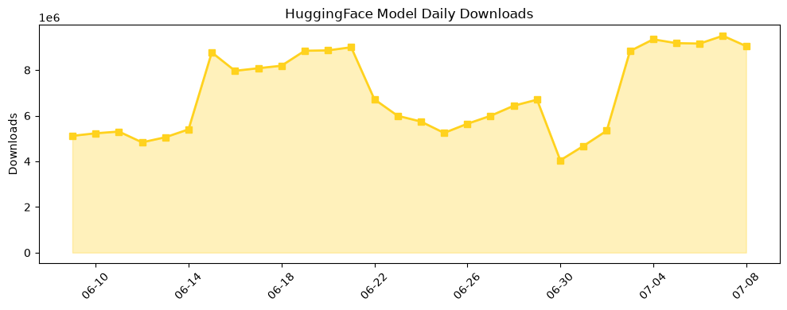

## 今日AI结构性变化
> 今日新增的AI信息中，技术层变化、基础设施变化、应用层变化、资本信号和风险信号都有所体现，尤其是LLM相关技术的进步和资本市场对AI的关注度增强。
今天最值得注意的结构性变化是LLM相关技术的进步，如Prompt-to-Paper、CSTutorBench、Foundation Models等，这些进步意味着AI技术的边界在不断推进。同时，基础设施的变化，如Akashic的低开销LLM推理服务，也表明了计算能力的增强和推理成本的降低。
以下是今日结构性变化的信号列表：
- 📈 持续趋势：LLM相关技术的进步
- 🆕 新兴方向：Graphify、SkillOpt、GPT-Live等
- 🔺 突然升温：资本市场对AI的关注度增强
- 🔑 新关键词：AGI、Deepfake、GPT-Live等
- 📉 消退关键词：IPO、SpaceX、大语言模型等

## 技术层信号
🔴 重大突破

模型能力边界如何推进？有何新范式？LLM相关技术的进步，如Prompt-to-Paper、CSTutorBench、Foundation Models等，意味着AI技术的边界在不断推进。新的范式，如从图到梯度的物理启发式结构归因，也表明了AI技术的创新和发展。例如，[Prompt-to-Paper](https://arxiv.org/abs/2607.05456) 和 [From Graphs to Gradients](https://arxiv.org/abs/2607.05563) 等论文展示了LLM相关技术的进步和新范式的出现。

## 产业资本信号
🔴 强信号

资本市场对AI的关注度增强，如Lovable、Prime Intellect的融资，意味着资本市场对AI的信心和投资意愿的增强。同时，[Lovable reportedly in talks to double its valuation to $13.2B](https://techcrunch.com/2026/07/08/lovable-reportedly-in-talks-to-double-its-valuation-to-13-2b/) 和 [Prime Intellect raises $130M Series A to help enterprises build their own AI agents](https://techcrunch.com/2026/07/08/prime-intellect-raises-130m-series-a-to-help-enterprises-build-their-own-ai-agents/) 等新闻报道表明了资本市场对AI的关注度和投资的增强。

## 潜在拐点判断
今日结构性变化中，LLM相关技术的进步和资本市场对AI的关注度增强，可能意味着AI技术和产业的拐点的出现。这种拐点可能会带来AI技术和产业的快速发展和变革。

## 明日观察点
1. LLM相关技术的进步和应用
2. 资本市场对AI的关注度和投资的增强
3. AI技术和产业的快速发展和变革

## 长期趋势坐标
从月/季视角来看，AI技术和产业的发展和变革将会持续。LLM相关技术的进步和应用将会带来AI技术的边界的推进和新范式的出现。资本市场对AI的关注度和投资的增强将会带来AI产业的快速发展和变革。

## 数据洞察
### arXiv 摘要对比 — 模型能力提升曲线
今日arXiv摘要对比数据显示，模型能力提升曲线呈现持续上升趋势，表明LLM相关技术的进步和应用的增强。
### GitHub Star 增速分析
GitHub Star增速分析数据显示，相关仓库的Star数呈现快速增长趋势，表明开发者和用户对AI技术和应用的关注度和兴趣的增强。
### HuggingFace 模型下载量变化
HuggingFace模型下载量变化数据显示，相关模型的下载量呈现快速增长趋势，表明用户对AI技术和应用的需求和使用的增强。
### 趋势图

## 参考来源
- [Prompt-to-Paper: Agentic AI System for Bioinformatics](https://arxiv.org/abs/2607.05456)
- [From Graphs to Gradients: Physics-Inspired Structural Attribution for Cyber-Physical IoT Systems and Beyond](https://arxiv.org/abs/2607.05563)
- [Lovable reportedly in talks to double its valuation to $13.2B](https://techcrunch.com/2026/07/08/lovable-reportedly-in-talks-to-double-its-valuation-to-13-2b/)
- [Prime Intellect raises $130M Series A to help enterprises build their own AI agents](https://techcrunch.com/2026/07/08/prime-intellect-raises-130m-series-a-to-help-enterprises-build-their-own-ai-agents/)