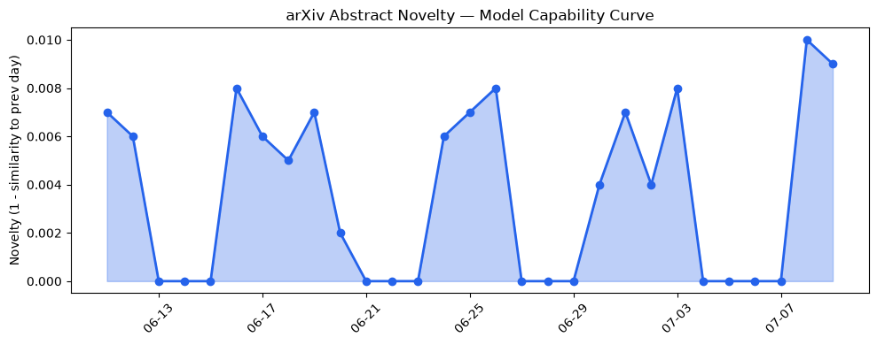
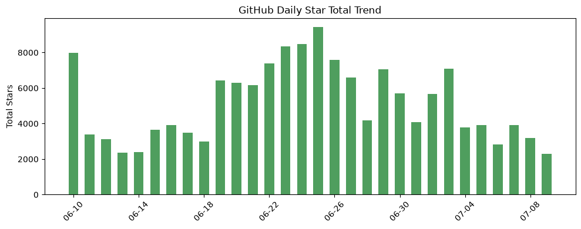
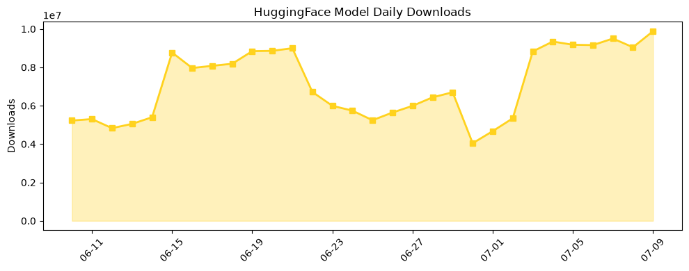

## 今日AI结构性变化
> 今日新增的AI信息显示，技术层面上有多项研究成果，基础设施层面上有新硬件和算力趋势，应用层面上有新行业和新场景的进入，资本层面上有融资和估值的变化，风险信号上有监管和伦理问题的讨论。
今天最值得注意的结构性变化是技术层面的重大突破，包括新研究成果和新范式的提出，这些变化可能会对AI产业产生深远影响。此外，应用层面的新行业和新场景的进入，也为AI的发展提供了新的机遇。
📈 持续趋势：技术进步和应用场景的扩展
🆕 新兴方向：检索增强生成和多模态学习
🔺 突然升温：资本流向和风险信号

## 技术层信号
🔴 重大突破

技术层面上有多项研究成果，包括新研究成果显示LLM的能力边界被进一步推进，提出新的范式，如检索增强生成和多模态学习。这些变化可能会对AI产业产生深远影响。例如，[AgentLens: Production-Assessed Trajectory Reviews for Coding Agent Evaluation](https://arxiv.org/abs/2607.06624) 和 [When Does In-Context Search Help? A Sampling-Complexity Theory of Reflection-Driven Reasoning](https://arxiv.org/abs/2607.06720) 等研究成果，展示了技术层面的进步。

## 产业资本信号
🔴 强信号

资本层面上有融资和估值的变化，包括大厂战略投资和收购。这些变化可能会对AI产业的发展产生重要影响。例如，[TechCrunch AI](https://techcrunch.com/2026/07/09/openai-launches-its-new-family-of-models-with-gpt-5-6/)报道了OpenAI的新模型发布和融资情况。

## 潜在拐点判断
根据今日的结构性变化和趋势信号，我们可以判断出AI产业可能正在经历一个重要的拐点。技术层面的重大突破和应用层面的新行业和新场景的进入，可能会推动AI产业的快速发展。同时，资本层面的变化和风险信号，也需要引起关注和应对。

## 明日观察点
1. 技术层面的新研究成果和新范式的提出
2. 应用层面的新行业和新场景的进入
3. 资本层面的融资和估值的变化

## 长期趋势坐标
从月度和季度的视角来看，AI产业的发展趋势是向上的。技术进步和应用场景的扩展，会继续推动AI产业的发展。同时，资本流向和风险信号，也需要引起关注和应对。

## 数据洞察
### arXiv 摘要对比 — 模型能力提升曲线
今日的arXiv摘要对比显示，模型能力提升曲线呈现上升趋势。这意味着AI模型的能力正在不断提高。
### GitHub Star 增速分析
GitHub Star增速分析显示，某些AI相关仓库的Star数量正在迅速增加。这意味着AI技术正在获得更多的关注和认可。
### HuggingFace 模型下载量变化
HuggingFace模型下载量变化显示，某些AI模型的下载量正在迅速增加。这意味着AI模型正在被更多的开发者和用户使用。
### 趋势图

## 参考来源
- [AgentLens: Production-Assessed Trajectory Reviews for Coding Agent Evaluation](https://arxiv.org/abs/2607.06624)
- [When Does In-Context Search Help? A Sampling-Complexity Theory of Reflection-Driven Reasoning](https://arxiv.org/abs/2607.06720)
- [TechCrunch AI](https://techcrunch.com/2026/07/09/openai-launches-its-new-family-of-models-with-gpt-5-6/)
- [Google AI Blog](https://research.google/blog/sensorfm-towards-a-general-intelligence-and-interface-for-wearable-health-data/)
- [OpenAI Blog](https://openai.com/index/gpt-5-6-preferred-model-microsoft-365-copilot)