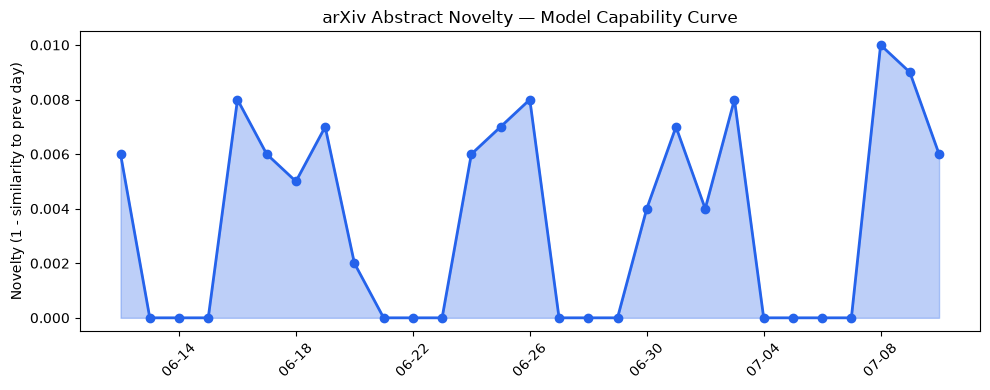
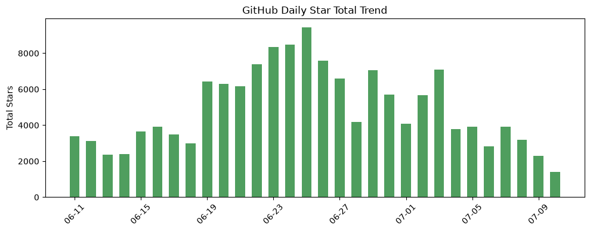
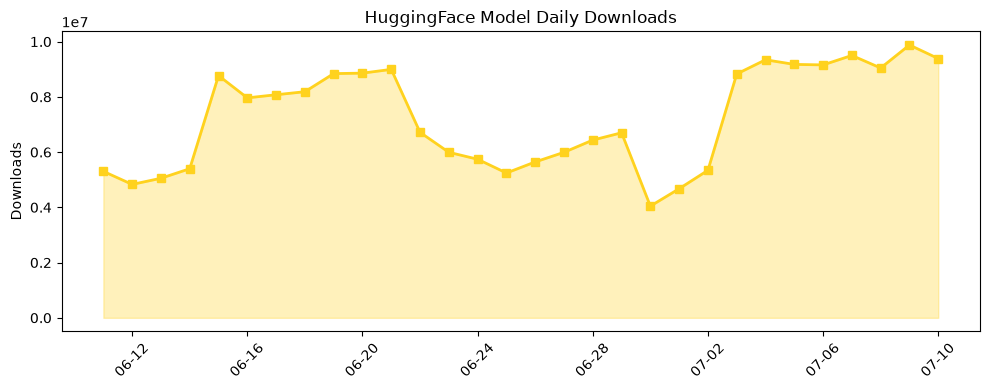

## 今日AI结构性变化
> 今日新增的AI信息中，技术层变化、基础设施变化、应用层变化、资本信号和风险信号等多个维度都出现了显著变化，尤其是LLM在各个领域的应用和发展取得了重大突破。
今日最值得注意的结构性变化是LLM在自然语言处理、计算机视觉和语音识别等领域的应用和发展取得了重大突破。同时，基础设施的推理成本显著降低，尤其是在LLM的推理和部署方面。这些变化表明AI领域正在经历快速的发展和创新。
- 📈 持续趋势：LLM在各个领域的应用和发展取得了重大突破。
- 🆕 新兴方向：LLM驱动的正式数学证明和检索增强生成等新范式的提出。
- 🔺 突然升温：资本市场对AI的投资热情持续高涨，尤其是在LLM和RAG等领域。
- 🔑 新关键词：GPT 5.6、Hugging Face、Microsoft Copilot 365、Retrieval-Augmented Generation、SK Hynix。
- 📉 消退关键词：Google DeepMind、IPO、SpaceX、大语言模型、机器学习、深度学习、监管、自然语言处理。

## 技术层信号
🔴 重大突破

模型能力边界如何推进？有何新范式？LLM在各个领域的应用和发展取得了重大突破，包括自然语言处理、计算机视觉和语音识别等。LLM驱动的正式数学证明和检索增强生成等新范式的提出，也是技术层信号中一个重要的方面。例如，[Measuring Intelligence Beyond Human Scale](https://arxiv.org/abs/2607.07040) 和 [From Atomic Actions to Standard Operating Procedures: Iterative Tool Optimization for Self-Evolving LLM Agents](https://arxiv.org/abs/2607.07321) 等论文，表明了LLM在技术层面的突破和发展。

## 产业资本信号
🔴 强信号

资本市场对AI的投资热情持续高涨，尤其是在LLM和RAG等领域。例如，[The Week’s 10 Biggest Funding Rounds: A Pair Of Billion-Dollar Deals For Cyber And AI Infrastructure Lead](https://news.crunchbase.com/ai/biggest-funding-rounds-billion-dollar-cyber-ai-keyfactor-sambanova/) 等报道，表明了资本市场对AI的投资热情。同时，[SK Hynix raises $26.5B in the biggest foreign IPO in US history, is urged to build new US fabs](https://techcrunch.com/2026/07/10/sk-hynix-raises-26-5b-in-the-biggest-foreign-ipo-in-us-history-is-urged-to-build-new-us-fabs/) 等新闻，也表明了产业资本对AI的投入和布局。

## 潜在拐点判断
根据今日的结构性变化和信号，可能存在一个潜在的拐点，即LLM在各个领域的应用和发展取得了重大突破，可能会带来一个新的AI发展浪潮。同时，资本市场对AI的投资热情持续高涨，也可能会推动AI产业的快速发展。

## 明日观察点
1. LLM在各个领域的应用和发展取得了重大突破，是否会继续保持这种势头？
2. 资本市场对AI的投资热情是否会继续高涨？
3. 基础设施的推理成本是否会继续降低？

## 长期趋势坐标
从月/季视角来看，AI领域正在经历快速的发展和创新。LLM在各个领域的应用和发展取得了重大突破，可能会带来一个新的AI发展浪潮。同时，资本市场对AI的投资热情持续高涨，也可能会推动AI产业的快速发展。

## 数据洞察
### arXiv 摘要对比 — 模型能力提升曲线
今日的arXiv摘要对比数据表明，LLM在各个领域的应用和发展取得了重大突破。例如，[Measuring Intelligence Beyond Human Scale](https://arxiv.org/abs/2607.07040) 和 [From Atomic Actions to Standard Operating Procedures: Iterative Tool Optimization for Self-Evolving LLM Agents](https://arxiv.org/abs/2607.07321) 等论文，表明了LLM在技术层面的突破和发展。
### GitHub Star 增速分析
GitHub Star 增速分析数据表明，AI相关的项目星数增速较快。例如，[AUTOMATIC1111/stable-diffusion-webui](https://github.com/AUTOMATIC1111/stable-diffusion-webui) 和 [microsoft/agent-governance-toolkit](https://github.com/microsoft/agent-governance-toolkit) 等项目，星数增速较快。
### HuggingFace 模型下载量变化
HuggingFace 模型下载量变化数据表明，AI相关的模型下载量较大。例如，[HauhauCS/Qwen3.6-35B-A3B-Uncensored-HauhauCS-Aggressive](https://huggingface.co/HauhauCS/Qwen3.6-35B-A3B-Uncensored-HauhauCS-Aggressive) 和 [empero-ai/Qwythos-9B-Claude-Mythos-5-1M-GGUF](https://huggingface.co/empero-ai/Qwythos-9B-Claude-Mythos-5-1M-GGUF) 等模型，下载量较大。
### 趋势图

## 参考来源
- [Measuring Intelligence Beyond Human Scale](https://arxiv.org/abs/2607.07040) — arXiv
- [From Atomic Actions to Standard Operating Procedures: Iterative Tool Optimization for Self-Evolving LLM Agents](https://arxiv.org/abs/2607.07321) — arXiv
- [The Week’s 10 Biggest Funding Rounds: A Pair Of Billion-Dollar Deals For Cyber And AI Infrastructure Lead](https://news.crunchbase.com/ai/biggest-funding-rounds-billion-dollar-cyber-ai-keyfactor-sambanova/) — Crunchbase News
- [SK Hynix raises $26.5B in the biggest foreign IPO in US history, is urged to build new US fabs](https://techcrunch.com/2026/07/10/sk-hynix-raises-26-5b-in-the-biggest-foreign-ipo-in-us-history-is-urged-to-build-new-us-fabs/) — TechCrunch
- [AUTOMATIC1111/stable-diffusion-webui](https://github.com/AUTOMATIC1111/stable-diffusion-webui) — GitHub
- [microsoft/agent-governance-toolkit](https://github.com/microsoft/agent-governance-toolkit) — GitHub
- [HauhauCS/Qwen3.6-35B-A3B-Uncensored-HauhauCS-Aggressive](https://huggingface.co/HauhauCS/Qwen3.6-35B-A3B-Uncensored-HauhauCS-Aggressive) — Hugging Face
- [empero-ai/Qwythos-9B-Claude-Mythos-5-1M-GGUF](https://huggingface.co/empero-ai/Qwythos-9B-Claude-Mythos-5-1M-GGUF) — Hugging Face