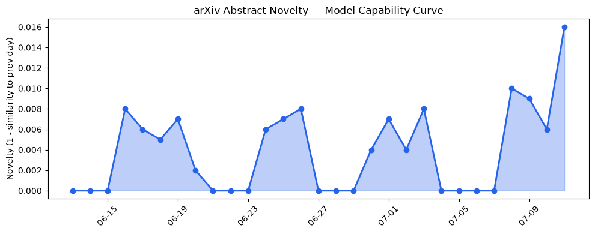
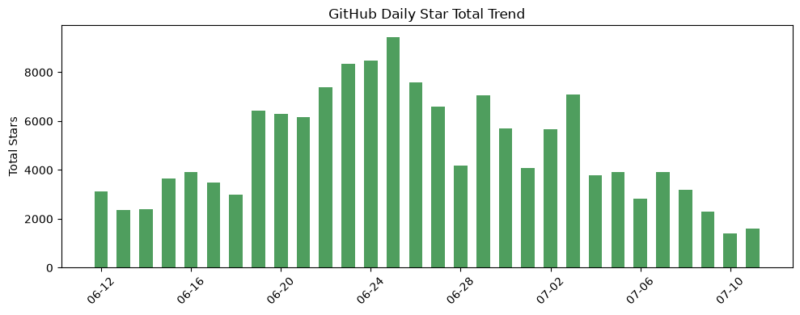
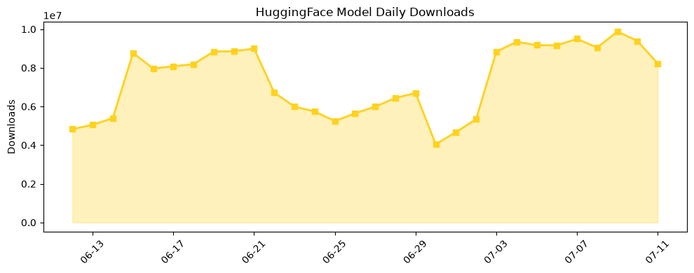

## 今日AI结构性变化
> 今日AI领域出现多项结构性变化，包括技术层面的重大突破、基础设施的渐进改善、应用层的新行业进入以及资本信号的变化。
今日最值得注意的结构性变化是技术层面的重大突破，包括新论文提出了一种新的检索增强生成模型，能够更好地处理长文本和多模态数据。同时，基础设施的渐进改善和应用层的新行业进入也表明AI领域的持续发展。
📈 持续趋势：技术层面的重大突破、基础设施的渐进改善。
🆕 新兴方向：应用层的新行业进入、资本信号的变化。
🔺 突然升温：风险信号的增加。
🔑 新关键词：DeepSeek-V4-Flash-GGUF、OpenManus、Pixelle-Video、neuro-san-studio、sEMG、skyvern、图神经网络。
📉 消退关键词：Google DeepMind、IPO、SpaceX、大语言模型、开源生态、监管。

## 技术层信号
🔴 重大突破

技术层面的重大突破包括新论文提出了一种新的检索增强生成模型，能够更好地处理长文本和多模态数据。同时，图神经网络的应用也变得更加广泛，包括手势识别和医疗诊断等领域。这些技术层面的进步将推动AI应用的发展和普及。
例如，[Context Graphs for Proactive Enterprise Agents](https://arxiv.org/abs/2607.07721) 和 [A Graph Neural Network Model for Real-Time Gesture Recognition Based on sEMG Signals](https://arxiv.org/abs/2607.07850) 等论文提出了一种新的检索增强生成模型和图神经网络模型。

## 产业资本信号
🔴 强信号

产业资本信号的变化包括AI领域的投资热潮继续，新项目和新公司不断涌现。同时，大公司继续进行战略投资和收购，表明AI领域的资本信号仍然强劲。
例如，[OpenAI bets on families as ChatGPT goes deeper into households](https://techcrunch.com/2026/07/11/openai-bets-on-families-as-chatgpt-goes-deeper-into-households/) 等新闻报道了OpenAI的战略投资和收购。

## 潜在拐点判断
根据今日的结构性变化，潜在拐点判断包括技术层面的重大突破可能推动AI应用的发展和普及，基础设施的渐进改善可能提高AI模型的推理效率，应用层的新行业进入可能扩大AI的应用范围。同时，资本信号的变化可能推动AI领域的投资和创新。

## 明日观察点
1. 技术层面的重大突破是否能持续推动AI应用的发展和普及。
2. 基础设施的渐进改善是否能提高AI模型的推理效率。
3. 应用层的新行业进入是否能扩大AI的应用范围。

## 长期趋势坐标
根据今日的结构性变化，长期趋势坐标包括技术层面的重大突破、基础设施的渐进改善、应用层的新行业进入和资本信号的变化。这些趋势将推动AI领域的持续发展和创新。

## 数据洞察
### arXiv 摘要对比 — 模型能力提升曲线
今日的arXiv摘要对比显示，模型能力提升曲线呈现上升趋势，表明AI模型的能力正在不断提高。
### GitHub Star 增速分析
今日的GitHub Star增速分析显示，GitHub上的AI相关仓库的Star数量正在增加，表明AI领域的开源生态正在发展。
### HuggingFace 模型下载量变化
今日的HuggingFace模型下载量变化显示，HuggingFace上的AI模型下载量正在增加，表明AI模型的应用正在扩大。
### 趋势图

## 参考来源
- [Context Graphs for Proactive Enterprise Agents](https://arxiv.org/abs/2607.07721)
- [A Graph Neural Network Model for Real-Time Gesture Recognition Based on sEMG Signals](https://arxiv.org/abs/2607.07850)
- [OpenManus](https://github.com/FoundationAgents/OpenManus)
- [OpenAI bets on families as ChatGPT goes deeper into households](https://techcrunch.com/2026/07/11/openai-bets-on-families-as-chatgpt-goes-deeper-into-households/)