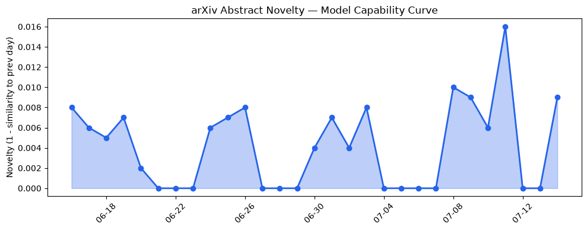
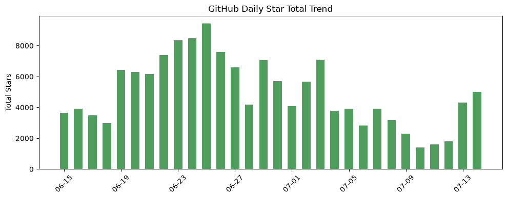
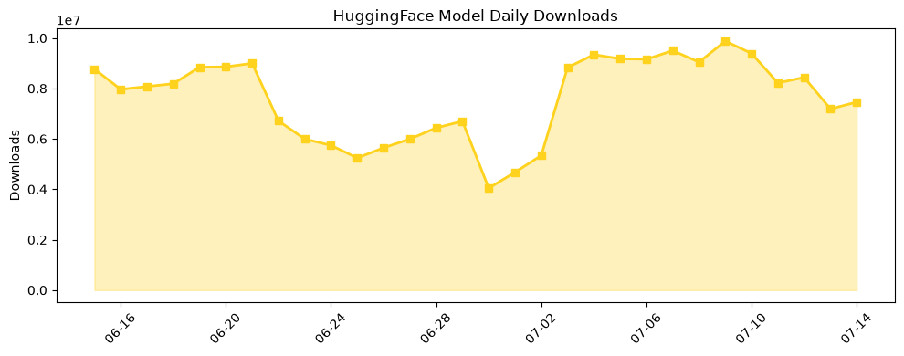

## 今日AI结构性变化
> 今日新增的AI信息中，技术层面上出现了多项创新，包括新模型的提出、推理成本的优化以及芯片/算力的进步；应用层面上，AI开始进入新的行业和场景，如医疗、金融等；资本信号上，融资方向出现了集中趋势，估值水平有所变化；风险信号上，监管/立法层面有新动向，伦理/安全/对齐领域有新争议。
今日最值得注意的结构性变化是技术层面的突破和应用层面的扩张，这意味着AI的边界正在不断推进。同时，资本信号的变化和风险信号的出现也表明AI产业的发展正在面临新的挑战和机遇。
📈 持续趋势：技术层面的创新和应用层面的扩张
🆕 新兴方向：医疗、金融等行业的AI应用
🔺 突然升温：监管/立法层面的新动向和伦理/安全/对齐领域的争议
🔑 新关键词：LLM、RAG、推理成本、芯片/算力、医疗、金融
📉 消退关键词：Apple、ChatGPT、Google DeepMind、Meta、大语言模型、开源生态

## 技术层信号
🔴 重大突破

技术层面上的突破是今日AI结构性变化的主要特征。新模型的提出，如Format Sensitivity Index、Boltzmann MapReduce等，推理成本的优化，如MawForge等，芯片/算力的进步，如Google的新硬件发布等，都表明AI技术的边界正在不断推进。这些突破不仅能够提高AI模型的性能，也能够降低其成本和提高其安全性。
例如，[From ML Predictions to Informed Diagnostic Assistance Using the Toulmin Model of Argumentation](https://arxiv.org/abs/2607.09664) 和 [Format Sensitivity Index: Token-Controlled Prompt Wrapper Robustness and Schema Compliance in LLM Benchmarking](https://arxiv.org/abs/2607.09665) 等论文，展示了AI技术在医疗和金融等行业的应用潜力。

## 产业资本信号
🔴 强信号

资本信号是今日AI结构性变化的另一个重要方面。融资方向的集中趋势，如Overtone获得1800万美元融资等，估值水平的变化，如 Anthropic 的估值等，大厂战略动向，如Google的新硬件发布等，都表明AI产业的发展正在面临新的机遇和挑战。
例如，[The founder of Hinge raised $18M to build a new AI dating service, Overtone](https://techcrunch.com/2026/07/14/the-founder-of-hinge-raised-18m-to-build-a-new-ai-dating-service-overtone) 和 [DeepMind CEO calls for an independent standards body to regulate frontier AI](https://techcrunch.com/2026/07/14/deepmind-ceo-calls-for-an-independent-standards-body-to-regulate-frontier-ai) 等报道，展示了AI产业的资本信号和风险信号。

## 潜在拐点判断
今日AI结构性变化中，技术层面的突破和应用层面的扩张可能是AI产业发展的拐点。这些变化可能会带来新的机遇和挑战，例如监管/立法层面的新动向和伦理/安全/对齐领域的争议等。

## 明日观察点
1. 技术层面的进一步突破和应用层面的扩张
2. 资本信号的变化和风险信号的出现
3. 监管/立法层面的新动向和伦理/安全/对齐领域的争议

## 长期趋势坐标
从月/季视角来看，AI产业的发展正在面临新的机遇和挑战。技术层面的突破和应用层面的扩张可能会带来新的增长点，而资本信号的变化和风险信号的出现可能会带来新的挑战。同时，监管/立法层面的新动向和伦理/安全/对齐领域的争议等，也会对AI产业的发展产生影响。

## 数据洞察
### arXiv 摘要对比 — 模型能力提升曲线
今日的arXiv摘要对比数据显示，模型能力的提升曲线正在延续。这种趋势可能会继续下去，带来新的技术层面的突破和应用层面的扩张。
### GitHub Star 增速分析
GitHub Star的增速分析显示，AI相关的仓库正在获得更多的关注和认可。这种趋势可能会继续下去，带来新的应用层面的扩张和资本信号的变化。
### HuggingFace 模型下载量变化
HuggingFace模型的下载量变化显示，AI模型的下载量正在增加。这种趋势可能会继续下去，带来新的应用层面的扩张和技术层面的突破。
### 趋势图

## 参考来源
- [From ML Predictions to Informed Diagnostic Assistance Using the Toulmin Model of Argumentation](https://arxiv.org/abs/2607.09664) — arXiv
- [Format Sensitivity Index: Token-Controlled Prompt Wrapper Robustness and Schema Compliance in LLM Benchmarking](https://arxiv.org/abs/2607.09665) — arXiv
- [The founder of Hinge raised $18M to build a new AI dating service, Overtone](https://techcrunch.com/2026/07/14/the-founder-of-hinge-raised-18m-to-build-a-new-ai-dating-service-overtone) — TechCrunch AI
- [DeepMind CEO calls for an independent standards body to regulate frontier AI](https://techcrunch.com/2026/07/14/deepmind-ceo-calls-for-an-independent-standards-body-to-regulate-frontier-ai) — TechCrunch AI