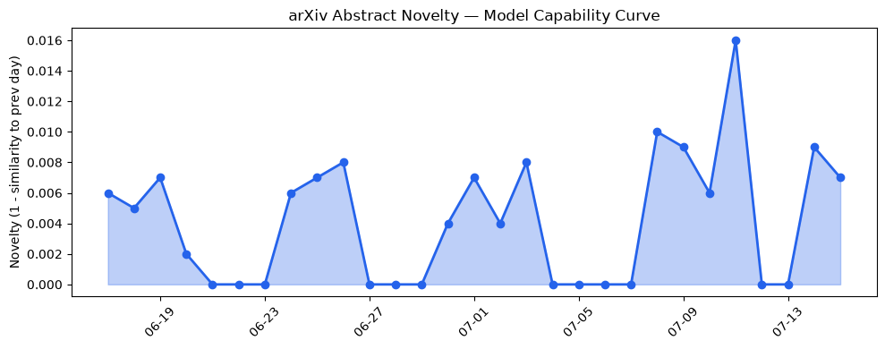
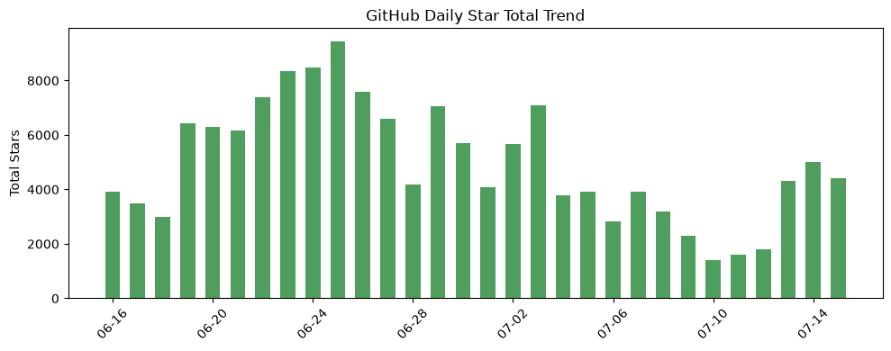
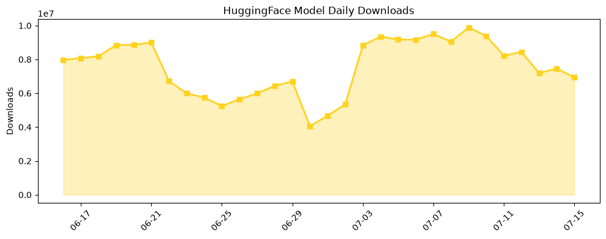

## 今日AI结构性变化
> 今日新增信息表明，AI 领域的技术层、基础设施、应用层、资本信号和风险信号都有所变化，尤其是在技术层和资本信号方面有较明显的变化。
今天最值得注意的结构性变化是技术层的重大突破，例如 GPT-Red 的出现，这标志着模型能力边界的推进。同时，资本信号也呈现出强烈的信号，例如 Anthropic 和 Ode 的融资动向，这可能预示着 AI 产业的新一轮发展。
主要变化包括：
📈 持续趋势：技术层的重大突破和资本信号的强烈信号。
🆕 新兴方向：基础设施、应用层和风险信号的变化。
🔺 突然升温：GPT-Red 和 Ode 的出现。
🔑 新关键词：GPT-Red、Ode、RAG、机器学习、自然语言处理。
📉 消退关键词：Apple、ChatGPT、Google DeepMind、Meta AI、Transformer、大语言模型。

## 技术层信号
🔴 重大突破

技术层的重大突破是今日结构分析的重点，例如 GPT-Red 的出现，这标志着模型能力边界的推进。同时，新范式的出现，例如 OmniPMNet，也是技术层信号的重要组成部分。这些变化预示着 AI 技术的进一步发展和应用。
[AGM-like Paraconsistent Partial Meet Abductive Expansion Operation](https://arxiv.org/abs/2607.09729) 和 [Coresets Before Score Sets: Evaluation-Unsupervised Prompt Subset Selection for LLM Benchmarks](https://arxiv.org/abs/2607.09739) 是技术层信号的重要参考资料。

## 产业资本信号
🔴 强信号

产业资本信号呈现出强烈的信号，例如 Anthropic 和 Ode 的融资动向，这可能预示着 AI 产业的新一轮发展。同时，基础设施和应用层的变化也反映出产业资本的调整和布局。这些变化预示着 AI 产业的进一步发展和应用。
[Anthropic, Blackstone bet the next trillion-dollar AI business is implementation, not models](https://techcrunch.com/2026/07/15/anthropic-blackstone-bet-the-next-trillion-dollar-ai-business-is-implementation-not-models/) 和 [Stripe’s Acquisition Pace Has Accelerated In The Past Five Years, But Nothing Comes Close To Its Reported $53B PayPal Bet](https://news.crunchbase.com/ma/stripe-acquisition-pace-accelerates-paypal/) 是产业资本信号的重要参考资料。

## 潜在拐点判断
今日结构分析中，技术层和资本信号的变化可能预示着 AI 产业的新一轮发展。这些变化可能会带来新的机会和挑战，企业和投资者需要密切关注这些变化，并做出相应的调整和布局。

## 明日观察点
1. 技术层的进一步发展和应用。
2. 产业资本信号的持续性和强度。
3. 基础设施和应用层的变化和调整。

## 长期趋势坐标
从月度和季度视角来看，AI 产业的发展呈现出持续性和强度。技术层的重大突破和资本信号的强烈信号预示着 AI 产业的进一步发展和应用。同时，基础设施和应用层的变化和调整也反映出产业的持续性和强度。

## 数据洞察
### arXiv 摘要对比 — 模型能力提升曲线
今日结构分析中，arXiv 摘要对比显示出模型能力提升曲线的变化，这预示着技术层的进一步发展和应用。

### GitHub Star 增速分析
GitHub Star 增速分析显示出 AI 相关项目的 Star 数量和增速，这预示着 AI 产业的发展和应用。

### HuggingFace 模型下载量变化
HuggingFace 模型下载量变化显示出 AI 模型的下载量和变化，这预示着 AI 产业的发展和应用。

## 参考来源
- [AGM-like Paraconsistent Partial Meet Abductive Expansion Operation](https://arxiv.org/abs/2607.09729)
- [Coresets Before Score Sets: Evaluation-Unsupervised Prompt Subset Selection for LLM Benchmarks](https://arxiv.org/abs/2607.09739)
- [Anthropic, Blackstone bet the next trillion-dollar AI business is implementation, not models](https://techcrunch.com/2026/07/15/anthropic-blackstone-bet-the-next-trillion-dollar-ai-business-is-implementation-not-models/)
- [Stripe’s Acquisition Pace Has Accelerated In The Past Five Years, But Nothing Comes Close To Its Reported $53B PayPal Bet](https://news.crunchbase.com/ma/stripe-acquisition-pace-accelerates-paypal/)