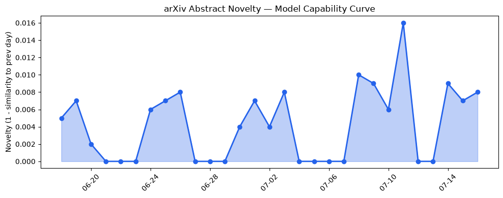

## 今日AI结构性变化
> 今日新增信息显示，AI 领域技术层面有多项重要进展，基础设施层面推理成本和芯片趋势有所变化，应用层面进入新行业和新场景，资本信号显示融资方向有所集中，风险信号显示监管和伦理问题仍然存在。
今日最值得注意的结构性变化是技术层面和应用层面的突破，这意味着 AI 的能力边界正在扩展，进入新的行业和场景。同时，资本信号的集中和风险信号的存在也表明 AI 产业的发展需要谨慎和规范。
- 📈 持续趋势：基础设施层面的推理成本和芯片趋势持续升温。
- 🆕 新兴方向：应用层面进入新行业和新场景，如医疗、法律、教育等。
- 🔺 突然升温：技术层面的突破，如 OriginBlame、SPINE 等。
- 🔑 新关键词：RAG、机器学习、自然语言处理、计算机视觉、语音识别等。
- 📉 消退关键词：Apple、Meta AI、Transformer、大语言模型等。

## 技术层信号
🔴 重大突破

技术层面的突破是今日最值得注意的变化，多项研究推进了 AI 模型的能力边界，如 [OriginBlame](https://arxiv.org/abs/2607.13037) 和 [SPINE](https://arxiv.org/abs/2607.13049) 等。这些突破意味着 AI 的能力边界正在扩展，能够处理更加复杂的任务和问题。同时，新范式如 [Probabilistic Extension of Neuro-Symbolic AGI Robots](https://arxiv.org/abs/2607.13038) 和 [Self-Improvements in Modern Agentic Systems](https://arxiv.org/abs/2607.13039) 等也在不断涌现，推动 AI 的发展和应用。

## 产业资本信号
🔴 强信号

资本信号的集中是今日最值得注意的变化，融资方向有所集中，如 AI 和生物技术领域。同时，大厂战略投资和收购有所动向，如 [Apple Intelligence](https://techcrunch.com/2026/07/16/apple-intelligence-approved-for-launch-in-china-with-alibabas-qwen-ai/) 在中国的合作等。这些信号意味着 AI 产业的发展需要资本的支持和推动，同时也需要谨慎和规范。

## 潜在拐点判断
今日观察到技术层面和应用层面的突破，这可能是 AI 产业发展的拐点。同时，资本信号的集中和风险信号的存在也表明 AI 产业的发展需要谨慎和规范。因此，需要密切关注 AI 产业的发展和变化，及时调整和应对。

## 明日观察点
1. 技术层面的突破是否能够持续。
2. 应用层面的新行业和新场景是否能够得到进一步发展。
3. 资本信号的集中是否能够带来 AI 产业的进一步发展。

## 长期趋势坐标
从月/季视角来看，AI 产业的发展趋势是向上升的，技术层面和应用层面的突破将推动 AI 产业的发展和应用。同时，资本信号的集中和风险信号的存在也表明 AI 产业的发展需要谨慎和规范。因此，需要密切关注 AI 产业的发展和变化，及时调整和应对。

## 数据洞察
### arXiv 摘要对比 — 模型能力提升曲线
今日暂无数据。

### GitHub Star 增速分析
今日 GitHub Star 增速分析显示，[PostHog/posthog](https://github.com/PostHog/posthog) 的增长率最高，达到 2.65。

### HuggingFace 模型下载量变化
今日 HuggingFace 模型下载量变化显示，[HauhauCS/Qwen3.6-35B-A3B-Uncensored-HauhauCS-Aggressive](https://huggingface.co/HauhauCS/Qwen3.6-35B-A3B-Uncensored-HauhauCS-Aggressive) 的下载量最高，达到 2328315。

### 趋势图

## 参考来源
- [OriginBlame: Record- and Token-Level Data Provenance for AI Training Datasets](https://arxiv.org/abs/2607.13037)
- [SPINE: Bridging the Cyber-Physical Gap with Agentic AI](https://arxiv.org/abs/2607.13049)
- [Apple Intelligence approved for launch in China with Alibaba's Qwen AI](https://techcrunch.com/2026/07/16/apple-intelligence-approved-for-launch-in-china-with-alibabas-qwen-ai/)
- [The Billion-Dollar Seed Isn’t The Deal You Think It Is](https://news.crunchbase.com/venture/billion-dollar-seed-ai-biotech-mcdonald-bison/)
- [The agent security gap: 54% of enterprises have already had an AI agent incident, and most still let agents share credentials](https://venturebeat.com/ai/the-agent-security-gap-54-of-enterprises-have-already-had-an-ai-agent-incident-and-most-still-let-agents-share-credentials)