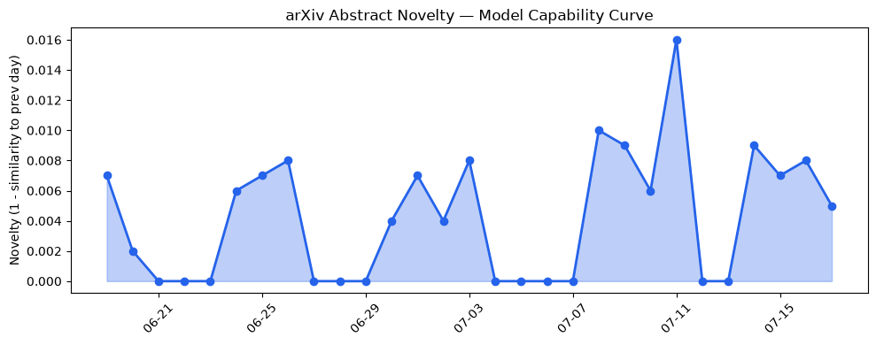
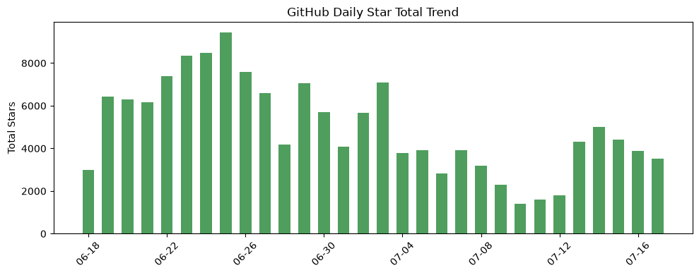
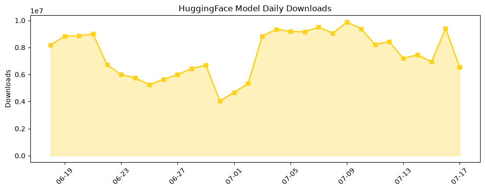

## 今日AI结构性变化
> 今日新增的AI信息显示，技术层面上有多项研究成果，基础设施层面上推理成本和芯片趋势有所变化，应用层面上AI进入新行业，资本信号显示融资方向和估值水平有所变化，风险信号显示监管和伦理问题日益受到关注。
今日最值得注意的结构性变化是技术层面的重大突破和应用层面的新兴方向。技术层面的新研究成果显示LLM和VLM的能力边界被推进，新范式如QNLP和EZSMTV3的提出。应用层面上AI进入新行业如保险和交通，AI替代传统解决方案。
趋势报告中有以下信号：
- 📈 持续趋势：应用层的话题向量在最近8天内呈现持续增强趋势。
- 🆕 新兴方向：应用层出现全新话题，可能是一个新兴方向的早期信号。
- 🆕 新兴方向：风险信号出现全新话题，可能是一个新兴方向的早期信号。

## 技术层信号
🔴 重大突破

技术层面的新研究成果显示LLM和VLM的能力边界被推进，新范式如QNLP和EZSMTV3的提出。例如，[AI-Native Insurance for Agentic AI: Pricing, Underwriting, and End-to-End Automation](https://arxiv.org/abs/2607.13230) 和 [Theory-Level Autoformalization: From Isolated Statements to Unified Formal Knowledge Bases](https://arxiv.org/abs/2607.13292) 等论文显示了技术层面的重大突破。

## 产业资本信号
🔴 强信号

资本信号显示融资方向和估值水平有所变化，[Databricks hits $188B valuation, extending its run as AI’s favorite second act](https://techcrunch.com/2026/07/17/databricks-hits-188b-valuation-extending-its-run-as-ais-favorite-second-act/) 和 [The Week’s 10 Biggest Funding Rounds: No Summer Doldrums As Dollars Still Flow To AI](https://news.crunchbase.com/venture/biggest-funding-rounds-ai-defense-fintech-robotics/) 等新闻显示了资本层面的强信号。

## 潜在拐点判断
今日结构分析显示，技术层面的重大突破和应用层面的新兴方向可能是AI产业结构的潜在拐点。监管和伦理问题日益受到关注，也可能是AI产业结构的潜在拐点。

## 明日观察点
1. 技术层面的新研究成果是否会继续推进LLM和VLM的能力边界。
2. 应用层面的新兴方向是否会继续扩展到更多行业。
3. 资本信号是否会继续显示融资方向和估值水平的变化。

## 长期趋势坐标
从月/季视角来看，AI产业结构的长期趋势坐标显示技术层面的持续进步，应用层面的扩展和资本层面的强信号。[arXiv](https://arxiv.org/) 和 [GitHub](https://github.com/) 等平台的数据显示了AI技术的快速发展和应用。

## 数据洞察
### arXiv 摘要对比 — 模型能力提升曲线
今日结构分析显示，arXiv上的新研究成果显示LLM和VLM的能力边界被推进。

### GitHub Star 增速分析
GitHub上的Star增速显示了AI相关项目的热度。

### HuggingFace 模型下载量变化
HuggingFace上的模型下载量显示了AI模型的使用情况。

## 参考来源
- [AI-Native Insurance for Agentic AI: Pricing, Underwriting, and End-to-End Automation](https://arxiv.org/abs/2607.13230) — arXiv
- [Theory-Level Autoformalization: From Isolated Statements to Unified Formal Knowledge Bases](https://arxiv.org/abs/2607.13292) — arXiv
- [Databricks hits $188B valuation, extending its run as AI’s favorite second act](https://techcrunch.com/2026/07/17/databricks-hits-188b-valuation-extending-its-run-as-ais-favorite-second-act/) — TechCrunch
- [The Week’s 10 Biggest Funding Rounds: No Summer Doldrums As Dollars Still Flow To AI](https://news.crunchbase.com/venture/biggest-funding-rounds-ai-defense-fintech-robotics/) — Crunchbase News