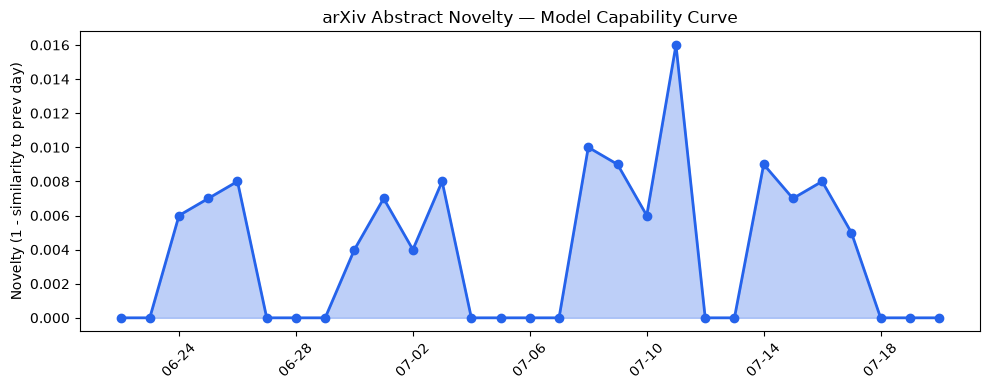
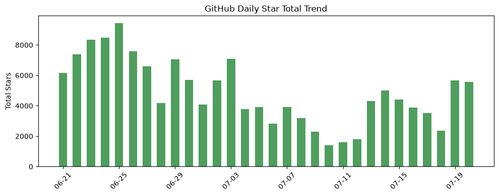
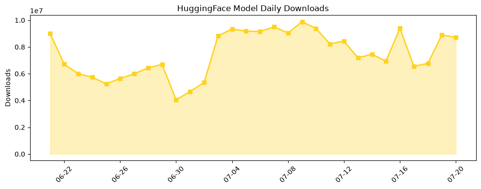

## 今日AI结构性变化
> 今日新增的AI信息显示，技术层面上有多项重大突破，包括GraphDx、Causal-Audit、Cura 1T等新模型和方法的提出，基础设施层面上Google正在研发新AI芯片，应用层面上AI在医疗、法律、教育等领域的应用不断扩展，资本信号上Mexico的创业公司获得大量投资，风险信号上监管和伦理问题日益受到关注。
今天最值得注意的结构性变化是技术层面上的重大突破，这些突破包括GraphDx、Causal-Audit、Cura 1T等新模型和方法的提出，这些新模型和方法的提出将会对AI技术的发展产生重大影响。同时，基础设施层面上Google正在研发新AI芯片，这将会提高AI推理效率。应用层面上AI在医疗、法律、教育等领域的应用不断扩展，这将会使AI技术更加普及。资本信号上Mexico的创业公司获得大量投资，这将会促进AI技术的发展。风险信号上监管和伦理问题日益受到关注，这将会对AI技术的发展产生一定的影响。
📈 持续趋势：技术层面上的重大突破
🆕 新兴方向：GraphDx、Causal-Audit、Cura 1T等新模型和方法的提出
🔺 突然升温：Google正在研发新AI芯片
🔑 新关键词：GraphDx、Causal-Audit、Cura 1T、Google AI芯片
📉 消退关键词：Meta AI、Transformer、大语言模型、深度学习、监管

## 技术层信号
🔴 重大突破

技术层面上的重大突破包括GraphDx、Causal-Audit、Cura 1T等新模型和方法的提出，这些新模型和方法的提出将会对AI技术的发展产生重大影响。GraphDx是一个知识增强多智能体框架，Causal-Audit是一个审计和可解释性框架，Cura 1T是一个医疗AI模型。这些新模型和方法的提出将会提高AI技术的能力和应用范围。

## 产业资本信号
🔴 强信号

资本信号上Mexico的创业公司获得大量投资，这将会促进AI技术的发展。Mexico的创业公司获得大量投资将会使得AI技术更加普及和应用广泛。同时，基础设施层面上Google正在研发新AI芯片，这将会提高AI推理效率。

## 潜在拐点判断
潜在拐点判断是技术层面上的重大突破将会对AI技术的发展产生重大影响。这些新模型和方法的提出将会提高AI技术的能力和应用范围，这将会使得AI技术更加普及和应用广泛。

## 明日观察点
1. 技术层面上的重大突破是否会继续
2. 基础设施层面上Google新AI芯片的研发进展
3. 应用层面上AI在医疗、法律、教育等领域的应用扩展情况

## 长期趋势坐标
技术层面上的重大突破将会对AI技术的发展产生重大影响，这将会使得AI技术更加普及和应用广泛。同时，基础设施层面上Google正在研发新AI芯片，这将会提高AI推理效率。

## 数据洞察
### arXiv 摘要对比 — 模型能力提升曲线
今日暂无数据

### GitHub Star 增速分析
今日GitHub Star增速分析显示，AstrBotDevs/AstrBot、Canner/WrenAI、tirth8205/code-review-graph等仓库的Star数增长迅速。

### HuggingFace 模型下载量变化
今日HuggingFace模型下载量变化显示，baidu/Unlimited-OCR、empero-ai/Qwythos-9B-Claude-Mythos-5-1M-GGUF等模型的下载量增长迅速。

### 趋势图

## 参考来源
- [GraphDx: A Cost-Aware Knowledge-Enhanced Multi-Agent Framework for Sequential Diagnosis](https://arxiv.org/abs/2607.15280)
- [Causal-Audit: Explicit and Auditable Graph-based Reasoning via Target-Aware Causal Chain Construction](https://arxiv.org/abs/2607.15281)
- [Google is working on a new AI chip designed to make Gemini more efficient](https://techcrunch.com/2026/07/20/google-is-working-on-a-new-ai-chip-designed-to-make-gemini-more-efficient/)
- [Cura 1T: Specialized Model for Agentic Healthcare](https://arxiv.org/abs/2607.15314)
- [AI Trading: Evaluating Large Language Models for Technical Market Analysis](https://arxiv.org/abs/2607.15414)
- [Mexico Extends Its Venture Lead Over Brazil As More Global VCs Enter Latin America](https://news.crunchbase.com/venture/mexico-leads-latin-america-funding-q2-2026/)
- [OpenAI is scared of open-weight models. Should the US be?](https://techcrunch.com/2026/07/20/openai-is-scared-of-open-weight-models-should-the-us-be/)